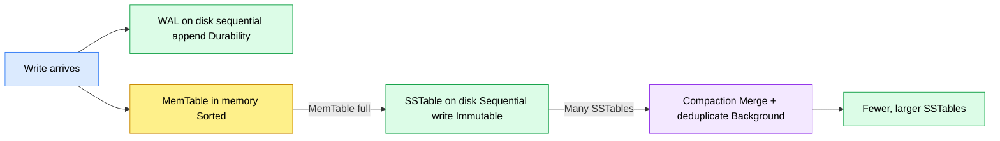

# LSM Tree (Log-Structured Merge Tree)

---

## The Problem B+ Tree Has at Extreme Write Rates

You're building a system that tracks every location ping from Uber drivers. 1 million drivers, each sending GPS coordinates every 5 seconds. That's 200,000 writes per second, constantly, forever.

With a B+ Tree index, every single write must go to the **exact right position** in the tree to keep it sorted:

```
New ping arrives → find correct leaf node → insert in sorted position
                → maybe split → update parent → maybe split again
```

That correct leaf node could be **anywhere on disk**. Every write is a **random disk I/O** — jumping to a different location on disk each time.

Random disk I/O is slow. Even on SSDs, random writes are significantly slower than sequential writes. At 200,000 writes per second, you're doing 200,000 random disk jumps per second. That's the bottleneck.

The opposite of random writes is **sequential writes** — writing to disk one after another in order, no jumping around. Sequential writes are dramatically faster — on SSDs, up to 10x. On spinning disks, the difference is even more extreme.

The question: can you design an index where **every write is sequential**, no matter what key you're inserting? That's exactly what LSM Tree does.

---

## The Core Idea — Write to Memory First

Instead of writing to disk immediately, every write first goes into **memory**. Fast, no disk I/O. You only flush to disk periodically in one big sequential batch.

```
200,000 writes/sec → all go to memory first
                   → accumulate
                   → flush to disk in one sequential write
                   → repeat
```

But memory is volatile — a power cut loses everything.

---

## Step 1 — WAL (Write-Ahead Log) for Durability

Before going into memory, every write is **appended to a log file on disk**. Appending is always sequential — you never jump around, you just add to the end.

```
Write arrives:
→ Step 1: append to WAL on disk   ← sequential write, very fast, durable
→ Step 2: insert into MemTable    ← memory, instant
→ done ✓
```

Power cuts:
```
Memory lost   ✗
WAL on disk   ✓ → on restart, replay WAL → memory restored ✓
```

Durability without random I/O. This is the "Log-Structured" part of the name.

---

## Step 2 — MemTable (In-Memory Buffer)

The **MemTable** is the in-memory data structure that holds all incoming writes. It keeps entries sorted in memory — sorting in memory is cheap, no disk involved.

```
Writes accumulating in MemTable:
  ping: driver_99,  13:00:05
  ping: driver_1,   13:00:03
  ping: driver_450, 13:00:04
```

When the MemTable fills up, it's time to flush to disk.

---

## Step 3 — SSTable (Sorted String Table)

When the MemTable is full, sort it and flush the entire thing to disk in one sequential write. This creates an **SSTable** — an immutable, sorted file on disk.

```
Sort MemTable → flush to disk as one sequential write:

SSTable 1:
  driver_1,   13:00:03  → location A
  driver_1,   13:00:05  → location B
  driver_450, 13:00:04  → location X
  driver_99,  13:00:05  → location Y

→ clear MemTable → start filling again
```

One big sequential write. No random I/O. Fast.

Over time, multiple SSTables accumulate:

```
SSTable 1: driver_1→A, driver_1→B, driver_450→X
SSTable 2: driver_1→C, driver_2→Z           ← driver_1 appears again
SSTable 3: driver_1→D, driver_99→Y          ← and again
```

Driver_1 is sending pings every 5 seconds. Each MemTable flush captures whatever writes happened during that window — so driver_1's data ends up spread across multiple SSTables over time.

---

## Reading — Search Newest to Oldest

SSTables are created in order — SSTable 1 is older, SSTable 3 is newest. For a read, search from newest to oldest and return the first match:

```
Query: "where is driver_1 right now?"

Step 1 → check MemTable first  (most recent, still in memory)
Step 2 → check SSTable 3       (most recent flush)
Step 3 → check SSTable 2
Step 4 → check SSTable 1       (oldest)
→ stop as soon as you find it ✓
```

This works well for "latest value" queries. But if you need driver_1's full route for the day — all entries across all SSTables — you have to scan every file. That's expensive. LSM Tree is optimised for writes and recent reads, not full historical scans.

---

## Step 4 — Compaction (The "Merge Tree" Part)

Over time, hundreds of SSTables accumulate on disk. Searching through 100 files for every read is slow. The fix — **Compaction**.

Periodically in the background, the database merges multiple SSTables into one bigger sorted SSTable:

```
Before compaction:
  SSTable 1: driver_1→A, driver_1→B, driver_450→X
  SSTable 2: driver_1→C, driver_2→Z
  SSTable 3: driver_1→D, driver_99→Y

After compaction:
  SSTable merged: driver_1→D, driver_2→Z, driver_450→X, driver_99→Y
                  (only latest entry per key kept, duplicates removed)
```

Two benefits:
```
1. Fewer SSTables   → fewer places to search on reads
2. Duplicates gone  → driver_1 had entries in 3 files, now just 1 (the latest)
```

Compaction runs in the background — it doesn't block reads or writes.

---

## The Full Picture



```
Write path:
  write → WAL (durability, sequential) → MemTable (memory) → SSTable (disk, sequential)

Read path:
  MemTable → newest SSTable → older SSTables → stop at first match

Background:
  Compaction → merge SSTables → fewer files, remove duplicates
```

The name explains the structure:
```
Log-Structured  → WAL, append-only sequential writes
Merge Tree      → compaction merges SSTables periodically
```

---

## LSM Tree vs B+ Tree vs Hash Index

```
Hash Index  → O(1) exact lookups, no range queries
              use when: simple key-value lookups only

B+ Tree     → O(log n) lookups + range queries
              random disk I/O on writes
              use when: general purpose — default in all SQL databases

LSM Tree    → sequential writes, extremely high write throughput
              slower reads (check MemTable + multiple SSTables)
              use when: write-heavy workloads
```

> [!info] LSM Tree is used in **Cassandra, RocksDB, LevelDB, HBase** — any system with extreme write throughput requirements. Cassandra uses it specifically because write throughput is more important than read speed for time-series and event data.

> [!important] LSM Tree trades read performance for write performance. Reads must check multiple SSTables. Compaction helps but adds background I/O. It's the right choice when writes vastly outnumber reads and write latency is the bottleneck — not when you need fast complex queries.
