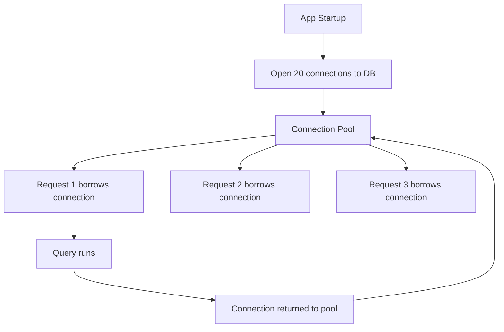
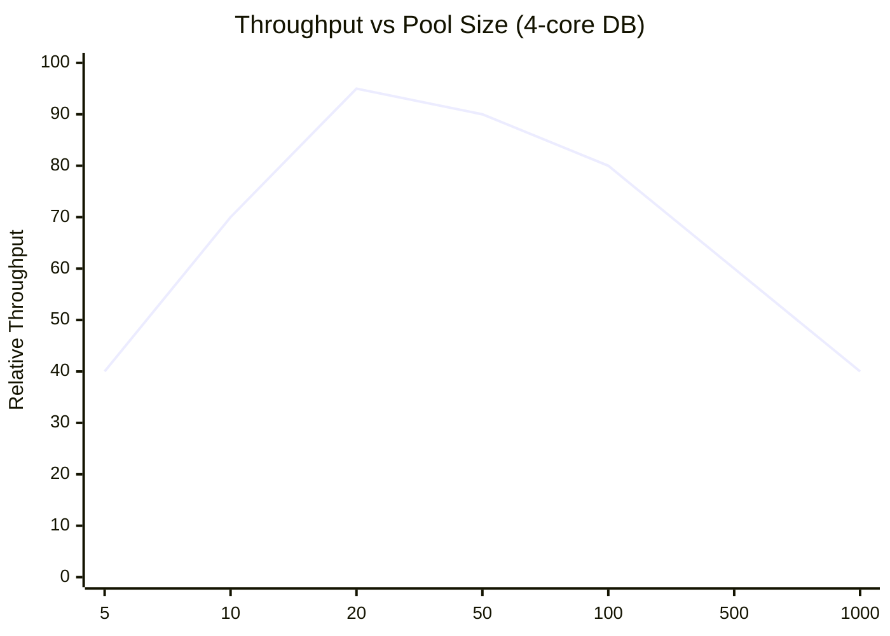
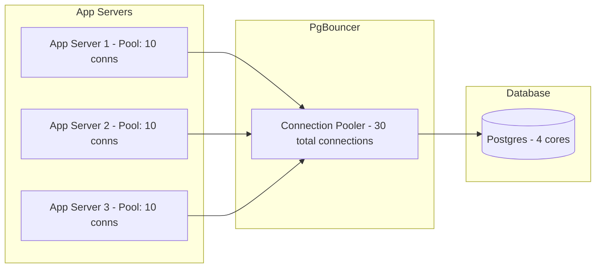

# Connection Pool

## The fix — open connections once, reuse them forever

The insight is simple: the expensive part is *opening* a connection, not *using* one. So open a fixed set of connections at startup, keep them alive, and hand them out to requests as needed.

This is a **connection pool**.



The TCP handshake, TLS negotiation, DB auth, and memory allocation all happen **once at startup** for each pooled connection. Every request after that goes straight to running the query — zero setup overhead.

---

## What happens under load

Say the pool has 20 connections and 100 requests arrive simultaneously:

```
Pool: [conn1][conn2]...[conn20]  (20 available)

Request 1-20:   each borrows a connection → query runs immediately
Request 21-100: wait in queue

conn1 finishes in 5ms → returned to pool
Request 21 borrows conn1 → runs immediately
...
```

The queue is fine in practice. Queries take milliseconds, so connections cycle back quickly. A request waits perhaps 5-10ms instead of paying 6-10ms of fresh connection overhead.

> [!important] The key insight
> You're not reducing work — you're amortising the setup cost. Instead of 10,000 requests each paying 8ms of connection overhead, 20 connections pay 8ms once, and 10,000 requests share them.

---

## What happens if the pool is too small

```
Pool size: 5 connections
Incoming: 1,000 requests/second
Each query takes: 20ms

Max throughput = 5 connections × (1000ms / 20ms) = 250 requests/second
```

750 requests per second are queued. Queue grows faster than it drains. Response times spike. Requests timeout. Users see errors.

**Fix: increase pool size — but carefully.**

---

## What happens if the pool is too large

Feels like more connections = more throughput. But no.

Your DB server has a fixed number of CPU cores. Say 4 cores — at any moment, only 4 queries can physically run in parallel.

With a pool of 1,000 connections:
```
4 queries running on CPUs
996 Postgres processes sitting idle, waiting their turn
OS context-switching between 1,000 processes constantly
→ CPU cycles burned on process management, not query execution
→ actual query throughput drops
```

With a pool of 20 connections:
```
4 queries running on CPUs
16 processes waiting — OS switches between 20 total
Near-zero context-switching overhead
→ almost all CPU time goes to running queries
```

Same hardware. Same queries. 20 connections outperforms 1,000 connections.



---

## How to size the pool

A reliable rule of thumb:

```
Pool size per app server = DB CPU cores × 2
```

The `×2` accounts for queries that aren't pure CPU work — when a query waits on disk I/O, another query can use that core. But beyond 2× the core count, you're just adding overhead.

```
DB server: 4 cores
→ Pool size: 8-10 connections per app server

DB server: 16 cores
→ Pool size: 32-40 connections per app server
```

If you have multiple app servers, each maintains its own pool. Total connections to DB = pool size × number of app servers. Keep this within the DB's comfortable connection limit (usually a few hundred).

---

## Tools

| Tool | Use case |
|---|---|
| **PgBouncer** | Postgres — sits as a proxy between app and DB, pools connections at the infrastructure level |
| **HikariCP** | Java apps — connection pool library, extremely low overhead |
| **RDS Proxy** | AWS managed — sits in front of RDS/Aurora, handles pooling automatically |

PgBouncer is particularly powerful because it pools at the infrastructure level — even if your app doesn't implement pooling, PgBouncer intercepts connections and reuses them.

---

## The complete picture



1,000 app threads share 30 DB connections. The DB sees 30 steady, warm connections — not 1,000 fresh ones. Query throughput is maximised.

> [!tip] Interview framing
> "Under high concurrency, raw DB connections become the bottleneck — each one costs TCP handshake, TLS, auth, and ~8MB of RAM on the DB server. I'd use a connection pool like PgBouncer — open a fixed set of connections at startup, reuse them across requests. Pool size ≈ DB CPU cores × 2. This keeps the DB focused on running queries instead of managing connection overhead."
