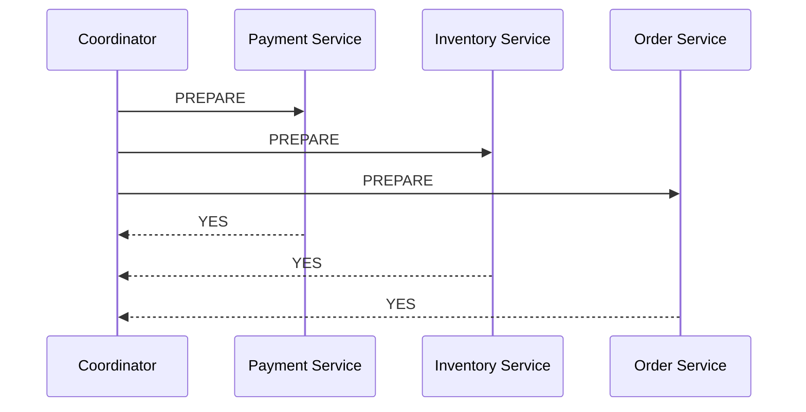
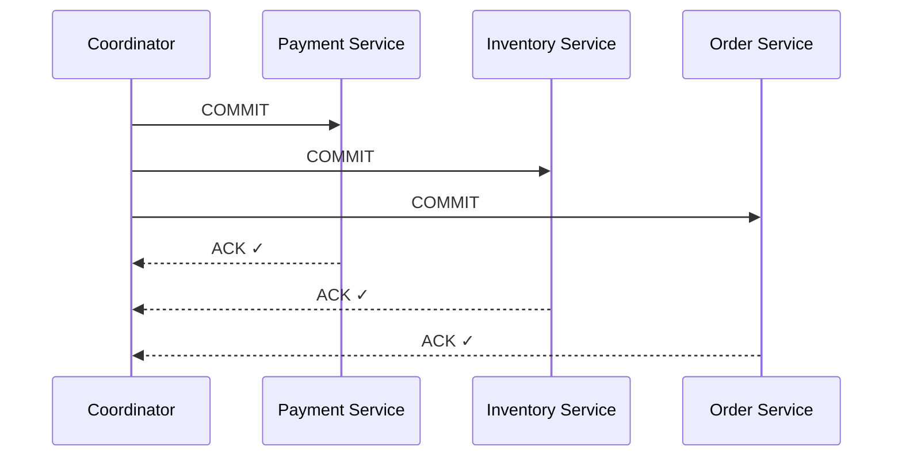
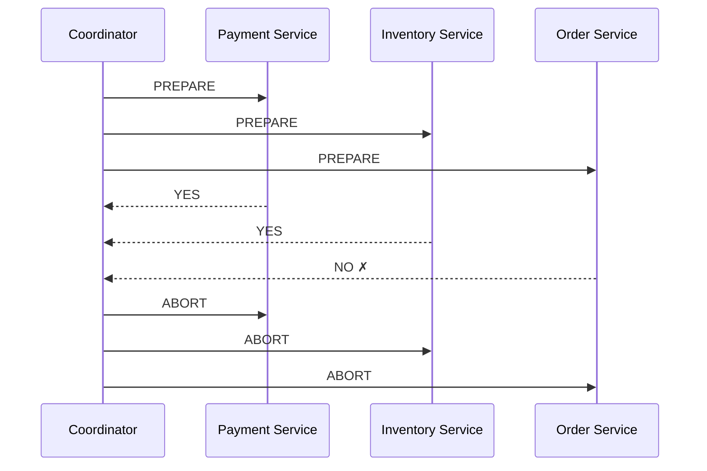

# 2PC — How It Works

> [!info] Plain-English definition
> Two-Phase Commit (2PC) is a protocol that coordinates multiple services to either all commit or all rollback a transaction. A central coordinator asks every participant "are you ready?" before anyone commits — ensuring no partial commits.

---

## The core idea

You are the **coordinator** — the one responsible for making sure all three services commit or rollback together. You can't just send "commit" to all three simultaneously and hope for the best — one might fail mid-way. So you split the process into two phases:

1. **Ask everyone if they're ready** — collect votes
2. **Based on the votes — commit or abort**

---

## Phase 1 — Prepare

The coordinator sends a `PREPARE` message to all participants. Each service:

- Locks the resources it needs (the row it's about to update)
- Writes its intention to its local WAL (so it can recover if it crashes)
- Replies **YES** (ready to commit) or **NO** (something went wrong)

All three said YES. The coordinator now knows every participant is ready and has locked their resources.

---

## Phase 2 — Commit

Since all participants voted YES, the coordinator sends `COMMIT` to everyone. Each service commits its local transaction and releases its locks.

All three committed. The distributed transaction succeeded atomically.

---

## What if one participant votes NO?

If **any** participant votes NO during Phase 1 — the coordinator sends `ABORT` to everyone. All participants rollback their local transaction and release their locks.

Clean rollback. Nobody committed. The system stays consistent.

---

## The happy path looks perfect

In the happy path, 2PC gives you true atomicity across multiple databases. No partial commits. Either all three commit or none do.

But there is a serious problem hiding in this protocol — what happens when things go wrong. That's covered in the next file.

> [!important] 2PC requires two network round trips
> Even in the happy path, every distributed transaction requires at least two round trips across the network — one for PREPARE, one for COMMIT. This adds latency to every single operation. At high throughput, this becomes a bottleneck.
