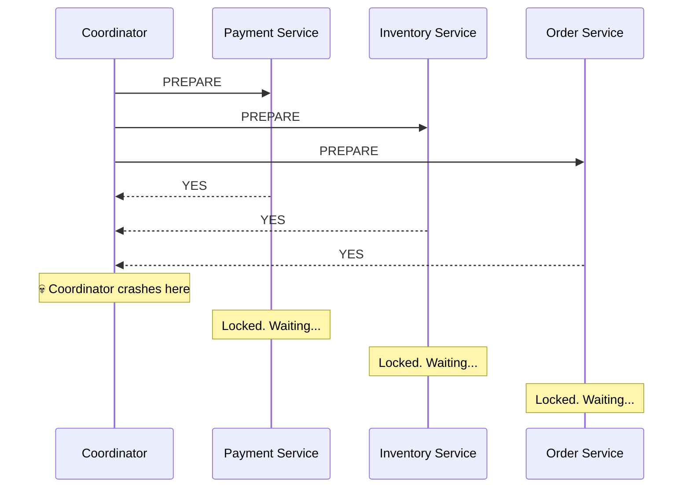
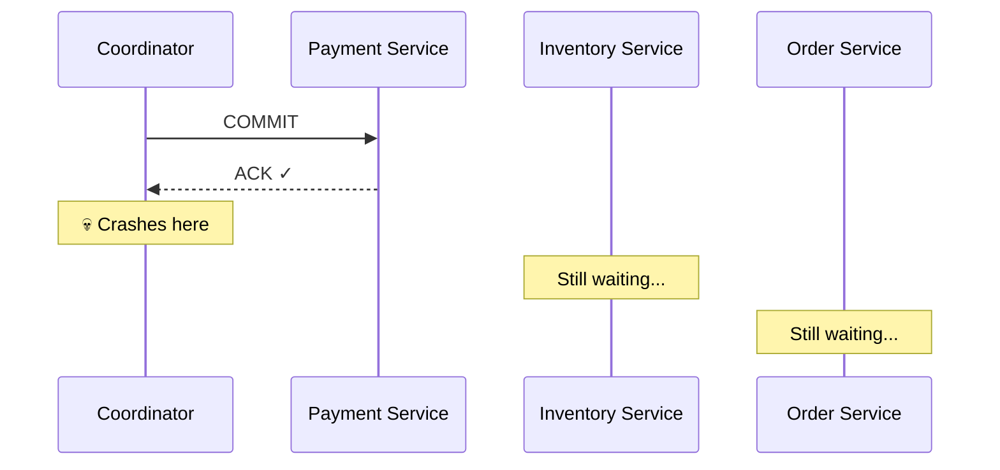

# 2PC — Failure Scenarios

## The fatal flaw — coordinator crash

2PC looks clean in the happy path. The problems surface when things go wrong. The most dangerous scenario: the coordinator crashes after Phase 1 but before completing Phase 2.

All participants voted YES and are now holding their locks, waiting for the coordinator's final decision.



The participants are stuck. They cannot proceed because they don't know what the coordinator decided. They cannot rollback on their own either — here's why.

---

## Why participants can't rollback on their own

The obvious question: "why don't the participants just rollback after a timeout?"

The problem is **partial commits**. The coordinator might have sent COMMIT to Payment Service successfully, then crashed before reaching Inventory and Order:



Payment Service already committed — money is deducted. If Inventory and Order now rollback on their own — the system is permanently inconsistent. The user got charged but no order exists, and there's no way to fix it automatically.

The participants have no way of knowing how far the coordinator got before crashing. So they cannot safely rollback. They must wait for the coordinator to recover.

> [!danger] The in-doubt transaction problem
> When the coordinator crashes mid-Phase 2, participants are left in an **in-doubt state** — they don't know whether to commit or rollback. They hold their locks indefinitely until the coordinator recovers. This is called a **blocking protocol**.

---

## The locking problem — even without crashes

Even in the happy path, 2PC is expensive because participants hold locks for the **entire duration of both phases** — across two network round trips.

```
Phase 1 starts → Payment locks user's account row
                  Inventory locks item's stock row
                  Order locks order table
    ↓
network round trip (PREPARE messages)
    ↓
network round trip (COMMIT messages)
    ↓
locks released
```

During this entire time, any other transaction trying to touch those same rows must wait. At high traffic — thousands of orders per second — this becomes a severe bottleneck. Locks pile up, transactions queue, latency spikes.

---

## Summary — 2PC's problems

| Problem | What happens |
|---|---|
| Coordinator crash after Phase 1 | Participants hold locks indefinitely — blocking protocol |
| Partial commit before crash | Cannot rollback safely — system may be permanently inconsistent |
| High latency even in happy path | Two network round trips + locks held across both phases |
| Coordinator is SPOF | Single point of failure — if coordinator is unavailable, no transactions proceed |

> [!important] When is 2PC acceptable?
> 2PC makes sense when you need true atomicity and can afford the latency — financial ledgers, stock trades, banking systems with low throughput. Google Spanner uses a variant of 2PC with TrueTime to bound the uncertainty window. For high-throughput systems like food delivery or ride-hailing — 2PC is too slow and too fragile. Use Saga instead.
