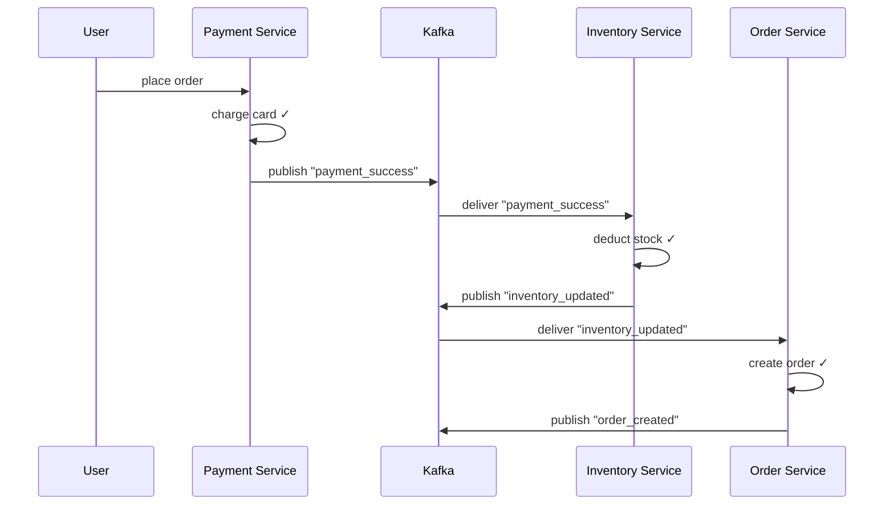
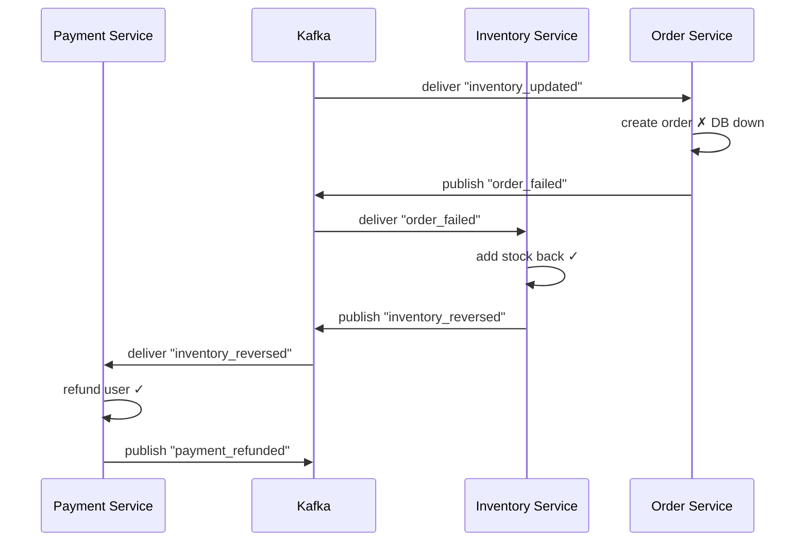
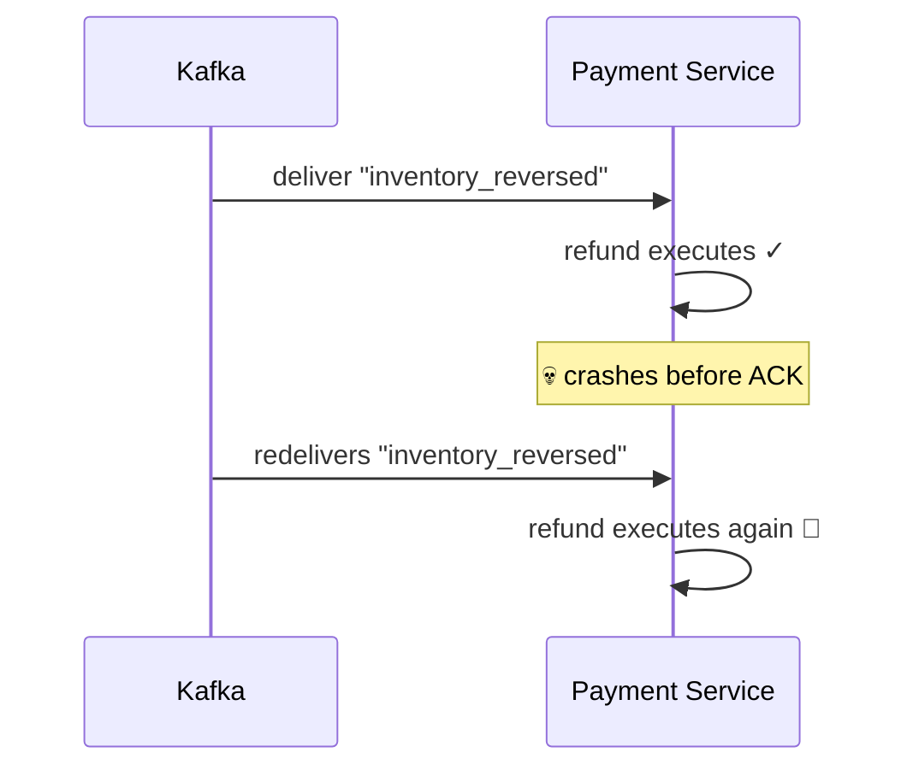

# Saga — Choreography

> [!info] Plain-English definition
> In choreography, there is no central brain. Each service listens to Kafka, reacts to events by doing its local work, and publishes its own events for the next service to pick up. Services coordinate by reacting to each other — like dancers following the music, not a conductor.

---

## The happy path — Swiggy order

A user places an order. Three services need to act in sequence.



No coordinator. Each service:
1. Does its local work
2. Publishes a success event
3. The next service picks it up and continues

---

## The failure path — Order Service crashes

Order Service fails. Now the saga needs to unwind.



Each service listens to **both success and failure events**. On failure, it runs its compensating transaction and publishes a reversal event for the previous service to pick up. The saga unwinds itself automatically.

---

## The ACK crash scenario — double refund risk

What if Payment Service consumes `"inventory_reversed"`, runs the refund successfully, but crashes before sending the ACK back to Kafka?



Kafka redelivers the message because it never got an ACK. The refund runs twice — user gets double refunded.

Fix — idempotency check before acting:

```python
if payment.status != "refunded":
    process_refund()
    payment.status = "refunded"
    db.save(payment)
# second delivery → status already "refunded" → skip
```

---

## The debugging problem

Six months later, a bug is reported — an order got charged but never refunded. Where do you start?

In choreography, the full flow is **spread across multiple services and multiple Kafka topics**:

```
payment_success       → Payment Service logs
inventory_updated     → Inventory Service logs
order_failed          → Order Service logs
inventory_reversed    → Inventory Service logs
payment_refunded      → Payment Service logs (missing?)
```

You have to trace through Kafka logs across 3 different services to reconstruct what happened to order 123. There is no single place that shows you the full picture.

This is choreography's biggest operational weakness — **distributed observability**. You need distributed tracing (e.g. Jaeger, Zipkin) and correlation IDs on every event just to follow one order through the system.

---

## Choreography — trade-offs

| Strength | Weakness |
|---|---|
| No single point of failure | Hard to debug — flow is spread across services |
| Fully decentralised | Each service must implement idempotency independently |
| Services are loosely coupled | Easy to lose track of the overall saga state |
| Simple to add new steps — just listen to an event | No single place to see "what happened to order 123" |
