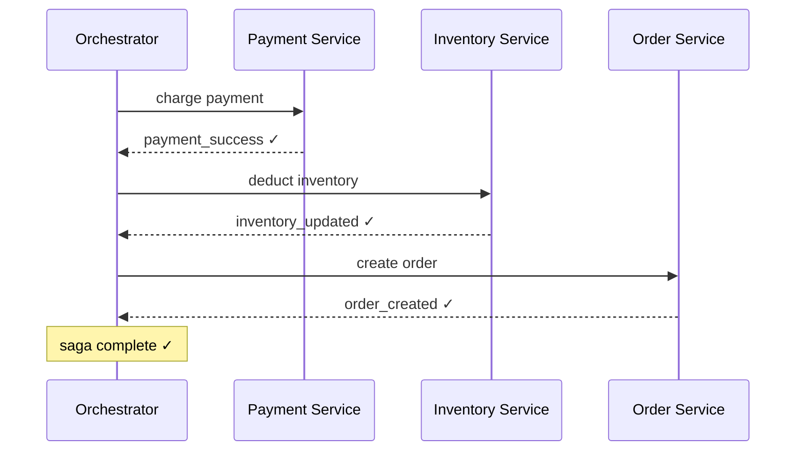
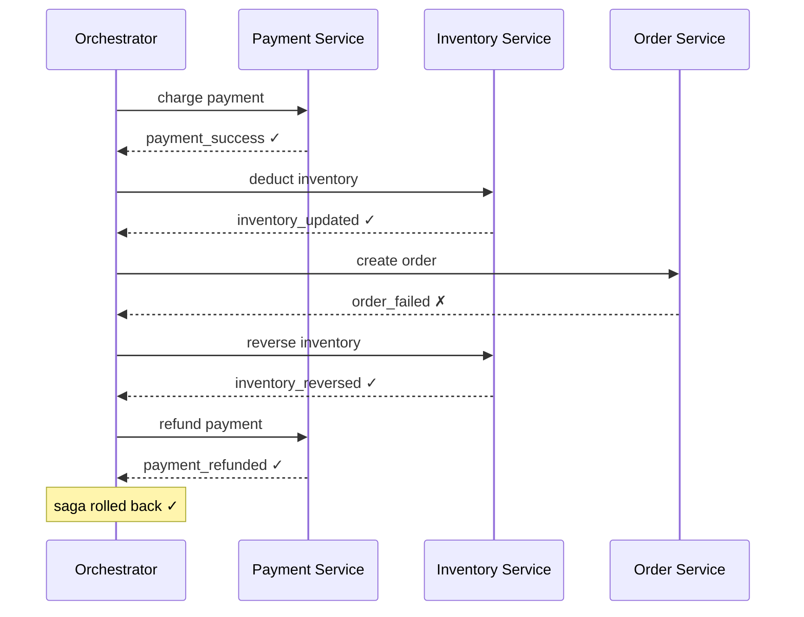
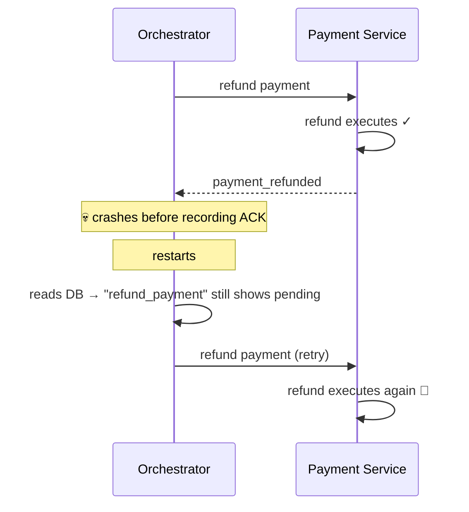

# Saga — Orchestration

> [!info] Plain-English definition
> In orchestration, a central **saga orchestrator** knows the entire flow and tells each service what to do next — step by step. Services don't talk to each other directly. They only talk to the orchestrator. The full story of every saga lives in one place.

---

## The happy path — Swiggy order



One brain. The orchestrator drives every step. The full flow of the saga lives in the orchestrator's state — not scattered across Kafka topics and service logs.

---

## The failure path — Order Service fails



When Order Service fails, the orchestrator knows exactly which steps succeeded and triggers compensating transactions in reverse — without anyone else needing to know about the failure.

---

## Debugging is trivial

Six months later, a bug is reported for order 123. You open the orchestrator's state for that order:

```
order_id: 123
step 1 → charge_payment     → SUCCESS  (10:01:32)
step 2 → deduct_inventory   → SUCCESS  (10:01:33)
step 3 → create_order       → FAILED   (10:01:34) ← here
step 4 → reverse_inventory  → SUCCESS  (10:01:35)
step 5 → refund_payment     → FAILED   (10:01:36) ← and here
```

The full picture in one place. You instantly see that the refund failed — you know exactly where to look.

This is orchestration's biggest operational advantage — **centralised observability**.

---

## Orchestrator crash scenario

The orchestrator itself can crash. What happens?



Same double-execution problem as choreography. The fix is two-sided:

**Orchestrator side** — persist every state change to its own database **before** sending a command:

```
Orchestrator writes to DB: step=refund_payment, status=in_progress
    ↓
Orchestrator sends "refund payment" to Payment Service
    ↓
Payment Service ACKs
    ↓
Orchestrator writes to DB: step=refund_payment, status=completed
```

On restart, the orchestrator reads its DB, sees where it left off, and resumes from there.

**Service side** — Payment Service still needs idempotency:

```python
if payment.status != "refunded":
    process_refund()
    payment.status = "refunded"
    db.save(payment)
```

Because the orchestrator might retry a command after a crash — even if the service already executed it. Both sides must be fault-tolerant independently.

> [!important] Idempotency is required in both choreography and orchestration
> The difference is scope. In choreography, every service coordinates retries with every other service — harder to reason about. In orchestration, only the orchestrator retries — services just need to handle duplicate commands from one place.

---

## Orchestration — trade-offs

| Strength | Weakness |
|---|---|
| Full saga state in one place — easy to debug | Orchestrator is a single point of failure (mitigated by making it fault-tolerant) |
| Clear flow — easy to reason about | Orchestrator becomes a bottleneck at very high throughput |
| Easier to implement idempotency — one source of retries | More upfront complexity — need to build and maintain the orchestrator |
| Centralised monitoring and alerting | Services are coupled to the orchestrator |
