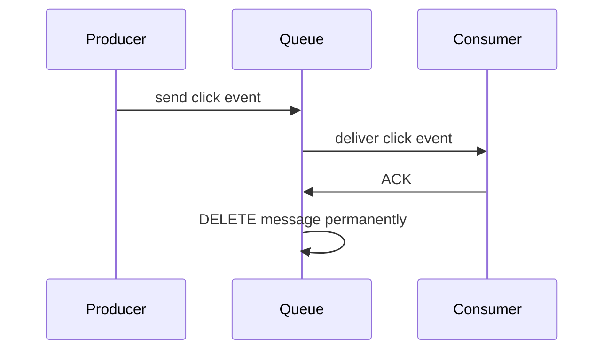
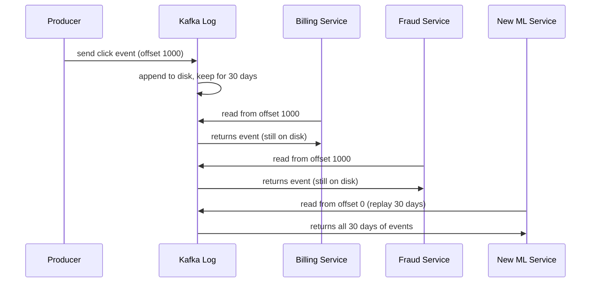

# Why Kafka Exists

> [!info] Kafka is not a traditional message queue. It is a persistent, append-only log that retains events for days or weeks, allows any number of consumers to read independently, and never deletes a message just because one consumer read it.

---

## The problem traditional queues can't solve

You're building Google's ad click pipeline. Every ad click needs to be processed by 4 systems:
- Billing — charge the advertiser per click
- Recommendations — feed the click into the ML engine
- Analytics — store for reporting
- Fraud Detection — check for click fraud

That's a pub/sub problem — one event, 4 subscribers. A traditional queue handles this fine at small scale.

Now add the real numbers: **Google processes 8.5 billion ad clicks per day — roughly 100,000 clicks per second.**

A traditional queue like RabbitMQ maxes out at ~50,000–100,000 messages/sec on good hardware. At 100,000 clicks/sec you're at the ceiling before even accounting for 4 consumers each needing to process every message.

Horizontal scaling helps — but it doesn't fix the fundamental problem.

---

## The delete-after-consumption problem

Traditional queues are delivery systems, not storage systems. Once a consumer reads a message and ACKs it, the message is deleted.



This works fine when you only care about processing events once. But what happens when you need to add a new consumer later?

**The replay problem:**

Tomorrow your team wants to add a 5th service — a new ML pipeline that needs the last 30 days of click history to train a model. With a traditional queue, those 30 days of events are gone. Every message was deleted the moment it was consumed. The new service can only start receiving events from today onwards.

30 days × 100,000 events/sec × 86,400 seconds = **259 billion events — all gone.**

---

## What Kafka does differently

Kafka never deletes messages after consumption. It stores every event as an entry in an **append-only log on disk**, and keeps it there for a configurable retention period — 7 days by default, 30 days, or forever if you want.



Every consumer reads from the log independently. Nothing gets deleted because one consumer read it. A new service added months later can replay the entire history from offset 0.

---

## The mental model shift

```
Traditional Queue          Kafka
─────────────────          ─────
Delivery system            Storage + delivery system
Delete after ACK           Retain for N days
Queue tracks delivery      Consumer tracks position
Can't replay               Full replay from any point
One consumer per message   Unlimited consumers, same data
```

> [!important] Kafka is fundamentally a **distributed commit log** — an ordered, immutable sequence of events stored on disk. Consumers don't consume and destroy. They read and remember where they are.

> [!tip] **Interview framing:** "I'd use Kafka here because I need multiple independent consumers reading the same event stream, I need replay capability for new services, and I need to handle sustained high throughput. A traditional queue would work for simple task distribution but can't handle the replay and retention requirements at this scale."
