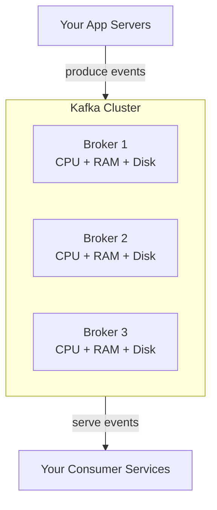

# Kafka Brokers

> [!info] A broker is a dedicated Kafka server — a machine whose entire job is to store partitions and serve reads and writes. You never run one broker in production. You run a cluster of brokers so the load and storage is distributed.

---

## What a broker is

A broker is just a machine running the Kafka process. It has its own CPU, RAM, and disk. It stores Kafka partitions on that disk and serves producer writes and consumer reads.



Brokers are completely separate from your application servers. Your app server handles user requests and business logic. The Kafka broker just stores and serves event logs. Think of it exactly like a DB server — dedicated infrastructure, separate from your app.

---

## Why a cluster of brokers

One broker has limits:
- One disk can only store so much data
- One machine can only handle so many writes per second
- One machine going down = entire Kafka down

A cluster solves all three:

```
Single broker:
→ 10TB disk limit
→ ~500MB/sec write limit
→ Single point of failure

3-broker cluster:
→ 30TB combined storage
→ ~1.5GB/sec combined write throughput
→ Can survive 1 broker failure
```

---

## HDD vs SSD for Kafka brokers

Kafka brokers can run on both, but the choice is driven by economics:

```
HDD (spinning disk):
→ Cheap — $20-30 per TB
→ Works perfectly for Kafka — sequential I/O only, no random seeks
→ Used by most large-scale Kafka deployments (LinkedIn, Uber)
→ Good for high retention (30 days of petabytes)

SSD:
→ Expensive — $200-300 per TB
→ Faster, lower latency
→ Better for latency-sensitive use cases
→ Overkill for most Kafka workloads
```

Because Kafka only ever does sequential I/O — appending to logs, reading forward — even cheap HDDs give excellent throughput. This is what makes Kafka economical at massive scale. You can store petabytes of event history on cheap spinning disks without sacrificing performance.

> [!tip] **Interview framing:** "Kafka brokers can run on HDDs because Kafka only does sequential I/O — no random seeks. At 30 days retention for 100,000 events/sec, you're looking at petabytes of storage. HDDs are 10x cheaper than SSDs and perform just as well for sequential workloads."
