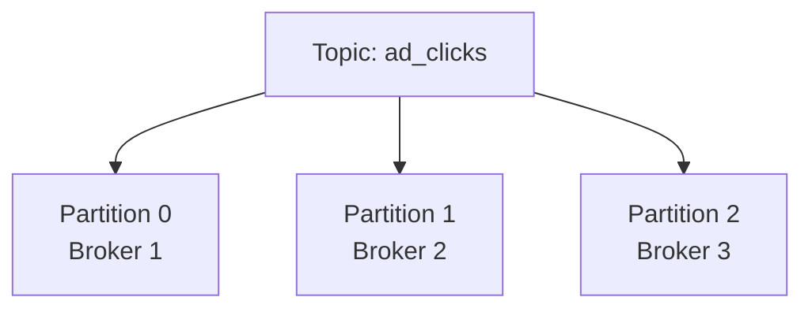
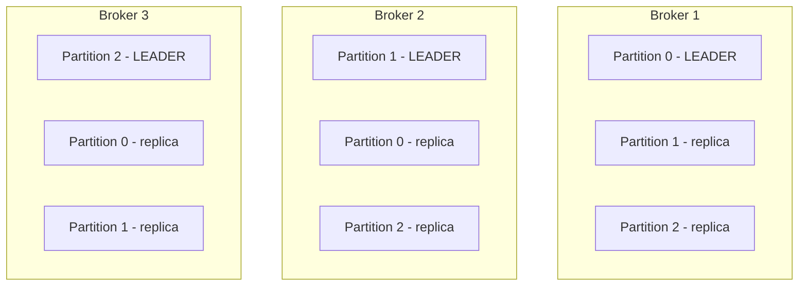

# Kafka Partitions

> [!info] A partition is Kafka's unit of sharding. One topic is split into multiple partitions, each living on a different broker. This distributes both storage and write load across the cluster. Messages within a partition are strictly ordered. Messages across partitions are not.

---

## The problem — one log can't scale

You have a topic `ad_clicks` receiving 100,000 events/sec. One broker storing this as a single log:
- Hits disk write limits
- Hits network limits
- One machine holds all 30 days of data — petabytes on one disk

The fix is the same as DB sharding — split the data across multiple machines.

---

## What a partition is

A partition is an independent, ordered log. One topic is split into N partitions, each stored on a different broker.



Each partition is its own append-only log with its own offsets starting from 0. Partition 0 has offsets 0, 1, 2... Partition 1 has its own offsets 0, 1, 2... independently.

```
Partition 0: [offset 0, offset 1, offset 2 ...]  → Broker 1
Partition 1: [offset 0, offset 1, offset 2 ...]  → Broker 2
Partition 2: [offset 0, offset 1, offset 2 ...]  → Broker 3
```

100,000 events/sec across 3 partitions = ~33,000 events/sec per broker. Both storage and write load are distributed.

---

## How producers decide which partition to write to

The producer uses a **partition key** — a field from the message that gets hashed to determine the partition.

```
click event: { advertiser_id: "nike", user_id: "abc", timestamp: ... }

hash("nike") % 3 = Partition 1  → all Nike clicks go to Partition 1
hash("adidas") % 3 = Partition 0 → all Adidas clicks go to Partition 0
hash("puma") % 3 = Partition 2  → all Puma clicks go to Partition 2
```

Same key always maps to the same partition. This gives you **ordering per key** — all Nike clicks are in Partition 1 in the exact order they arrived. No Nike click can overtake another Nike click.

If no key is specified, the producer round-robins across partitions — even distribution but no ordering guarantee.

---

## How partitions and replicas are distributed across brokers

Each broker doesn't just hold its own partitions — it also holds replicas of other partitions. Kafka spreads leaders and replicas intelligently so every broker shares the load.



Every broker is a leader for some partitions and a follower for others. This means:
- Write load is spread — no single broker handles all writes
- Storage is spread — each broker holds roughly 1/N of total data plus replicas
- Failure is tolerated — if Broker 1 dies, Broker 2 already has Partition 0's replica and gets promoted to leader

---

## Ordering guarantee — within partition only

Messages within a partition are strictly ordered. Messages across partitions are not.

```
Partition 0: Nike click 1 → Nike click 2 → Nike click 3  ← strict order guaranteed
Partition 1: Adidas click 1 → Adidas click 2             ← strict order guaranteed

But:
Nike click 2 vs Adidas click 1 — no ordering guarantee across partitions
```

This is why choosing the right partition key matters. If you need all events for a given entity in order — use that entity's ID as the partition key. All events for that entity land in the same partition, in order.

> [!important] Partition count is set at topic creation and is hard to change later. Too few partitions = bottleneck. Too many = overhead. A common starting point is partitions = number of consumers you plan to run, with room to grow.

> [!tip] **Interview framing:** "I'd partition the topic by advertiser_id. This ensures all clicks for a given advertiser land in the same partition in order — which is important for the billing service to count clicks correctly. It also distributes load evenly assuming advertisers have roughly similar click volumes."
