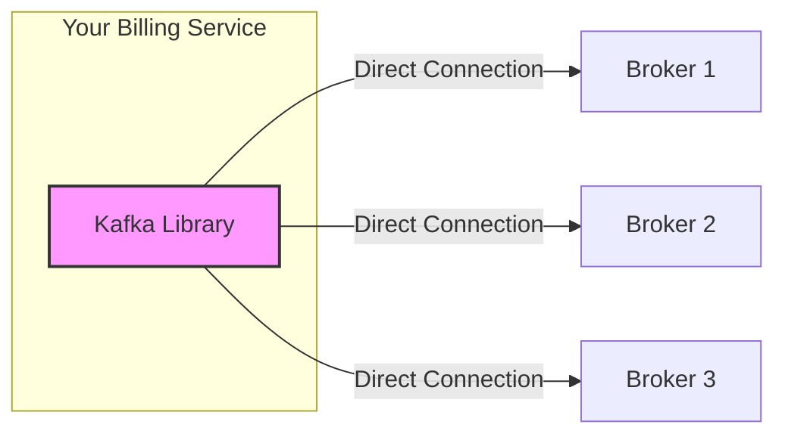

## What is a Topic?

In a massive system, you can't just throw all your data into one pile. You need categories.

- `Patient_Vitals` → heart rates, blood pressure
- `Lab_Results` → blood tests, imaging
- `ad_clicks` → billing events, user interaction

A **Topic** is the name of that category. It allows a developer to say "I only want to read `ad_clicks`" without having to sift through every other piece of data in the system.

---

## The "Middleman" Bottleneck (Why Kafka has no Load Balancer)

In most systems (like a Website or a SQL DB), you talk to a **Load Balancer (LB)**. The LB is a middleman that takes your request and hands it to a server.

At **Google scale** (100,000 events/sec), the middleman becomes the **bottleneck**.

**The Math of the Melt-Down:**
- 100,000 writes/sec + 400,000 reads/sec (for 4 different services)
- Total: 500,000 messages/sec
- If each message is 1KB, that's **~4 Gigabits/sec** of constant traffic.
- Once you add replication (copying data between brokers) and overhead, a single Load Balancer's network card will simply melt. It can't physically push that much data.

---

## The Solution: The "Smart Client" Model

Kafka eliminates the middleman. Instead of an LB, Kafka uses a **Metadata Map** and a **Smart Library** (SDK) that lives inside your own application code.

### How it works (The Direct-to-Broker Flow):

1. **Ask Once (Discovery):** When your service starts, the Kafka Library connects to *any* broker in the cluster and asks: "Where are the partitions for the `ad_clicks` topic?"
2. **The Map:** The broker sends back a map (Metadata):
   - Partition 0 is on **Broker 1**
   - Partition 1 is on **Broker 2**
   - Partition 2 is on **Broker 3**
3. **Go Direct:** Your code (via the library) now opens **3 direct connections** to those 3 brokers.

> [!important] By moving the "routing" logic into the client's code, Kafka offloads the heavy lifting from the servers to the clients. This is why Kafka can scale to millions of messages per second while other systems hit a "Middleman wall."

> [!tip] **Interview framing:** "Kafka doesn't use a Load Balancer because at high throughput, the LB becomes a network bottleneck. Instead, Kafka uses 'Smart Clients.' The client fetches metadata from the cluster to learn which broker is the leader for each partition and then communicates directly with those brokers."
