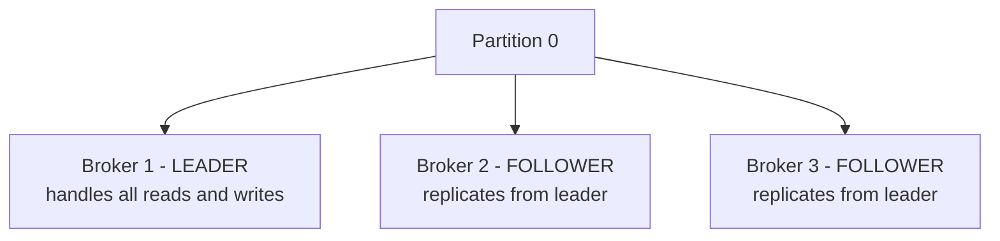
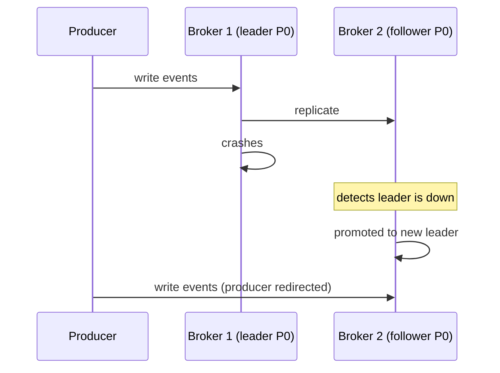

# Kafka Replication

> [!info] Every Kafka partition has one leader and N-1 followers. The leader handles all reads and writes. Followers just replicate. If the leader dies, a follower gets promoted. The producer's acks setting controls the durability vs latency trade-off.

---

## The problem

Broker 1 stores Partition 0. Broker 1's disk dies. Partition 0 is gone — all events on it are lost, and no consumer can read from it. That's a complete failure.

The fix is replication — copy every partition to multiple brokers.

---

## Leader and followers

Each partition has exactly one **leader** and zero or more **followers** (replicas).



**All producer writes go to the leader.** The leader appends the event to its log and then the followers pull the new data and replicate it.

**All consumer reads also go to the leader** by default. (Kafka 2.4+ allows consumers to read from the nearest replica for lower latency, but the leader is still the source of truth.)

Followers never serve reads or writes directly — they just stay in sync with the leader so they're ready to take over if the leader dies.

---

## What happens when the leader dies



Kafka's controller (a special broker that manages cluster metadata) detects the failure and promotes one of the in-sync followers to leader. Producers and consumers are redirected automatically. The cluster keeps serving without manual intervention.

---

## The acks setting — durability vs latency

The producer controls when it considers a write "done" via the `acks` setting.

**acks=0 — fire and forget**
```
Producer sends event → doesn't wait for anything → moves on immediately
→ Fastest possible — no waiting
→ If Broker 1 crashes before writing → event lost forever
→ Use for: metrics, logs where occasional loss is acceptable
```

**acks=1 — leader confirms**
```
Producer sends event
→ Broker 1 (leader) writes to its disk
→ Broker 1 ACKs producer ← done
→ Broker 2 and Broker 3 replicate in background

→ Fast — only one disk write in the critical path
→ Risk: if Broker 1 crashes AFTER ACKing but BEFORE Broker 2/3 replicate
  → event is lost — it was ACKed to producer but never replicated
→ Use for: moderate durability requirements, can tolerate very rare loss
```

**acks=all — all in-sync replicas confirm**
```
Producer sends event
→ Broker 1 (leader) writes to disk
→ Broker 2 and Broker 3 write to disk
→ All confirm back to Broker 1
→ Broker 1 ACKs producer ← done

→ Slowest — waits for multiple disk writes across network
→ Strongest guarantee — survives any single broker failure
→ Use for: financial data, billing, anything where loss is unacceptable
```

---

## Replication factor

The replication factor is how many total copies of a partition exist (leader + followers).

```
replication_factor = 1 → no replicas, broker failure = data loss
replication_factor = 2 → 1 leader + 1 follower, survives 1 failure
replication_factor = 3 → 1 leader + 2 followers, survives 2 failures
```

Standard production setting is **replication factor = 3**. You can survive 2 broker failures before losing data. Most systems only need to survive 1 failure at a time, so RF=3 gives a comfortable safety margin.

> [!important] Replication factor must be ≤ number of brokers. You can't have RF=3 with only 2 brokers — there aren't enough machines to place 3 copies on different machines.

> [!tip] **Interview framing:** "I'd set replication factor = 3 with acks=all for the billing and fraud topics — no data loss acceptable. For the analytics topic where approximate counts are fine, I'd use acks=1 for lower write latency. Same Kafka cluster, different durability settings per topic based on the data's criticality."
