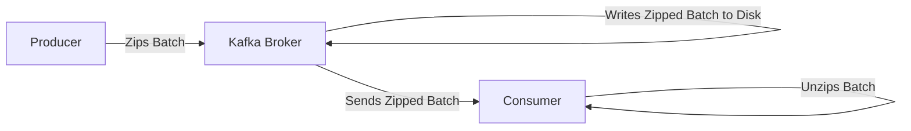

# Compression and Producer Efficiency

> [!info] Batching makes **Compression** much more effective. By zipping 100 messages at once instead of one at a time, Kafka can find patterns in the data and shrink it by up to 80%.

---

## Where does Compression happen?

This is a critical architectural choice in Kafka: **Compression happens on the Producer (your App server), not the Broker (Kafka).**

### Why this is a "Genius" move:
1. **The Broker is "Cold":** The Broker never has to unzip or re-zip the data. This keeps the Broker's CPU usage incredibly low.
2. **Reduced Network Cost:** We send much smaller "zipped boxes" over the wire from the Producer to the Broker, and from the Broker to the Consumer.
3. **Storage Savings:** Since the data is stored in its zipped state, we can fit 5x more data on the same hard drives (HDDs/SSDs).

---

## The "ZIP" Effect: Patterns in the Pile

If you compress a single 1-word text file, it doesn't shrink much. But if you compress a **Batch of 100 messages**, the "ZIP" algorithm finds common patterns:
- Same JSON keys: `"user_id":`, `"ad_id":`, `"timestamp":`
- Same data types: Many integers, many strings
- Redundant data: All 100 clicks might have the same `ad_id` or `advertiser_id`.

**The Payoff:**
By compressing the entire batch, we can shrink the total data size by **50% to 80%**. 

---

## Comparison: Compression Algorithms

- **Gzip:** High compression ratio, but uses more CPU.
- **Snappy (Google's):** Low CPU usage, very fast, decent compression. (Good for high throughput).
- **Zstd (Facebook's):** Excellent balance between speed and compression. (The modern gold standard).

> [!important] The "Zero-CPU" Broker: Because the Broker only moves zipped boxes from Producer RAM to Disk to Consumer RAM, it doesn't need a powerful CPU. This is how a single Kafka machine can move gigabytes of data per second without breaking a sweat.

> [!tip] **Interview framing:** "I'd enable compression (like Zstd or Snappy) on the producer. This offloads the CPU cost of compression to the producer and decompression to the consumer, allowing the Kafka broker to remain a 'dumb pipe' that just moves and stores bytes efficiently. It also significantly reduces network and storage costs."
