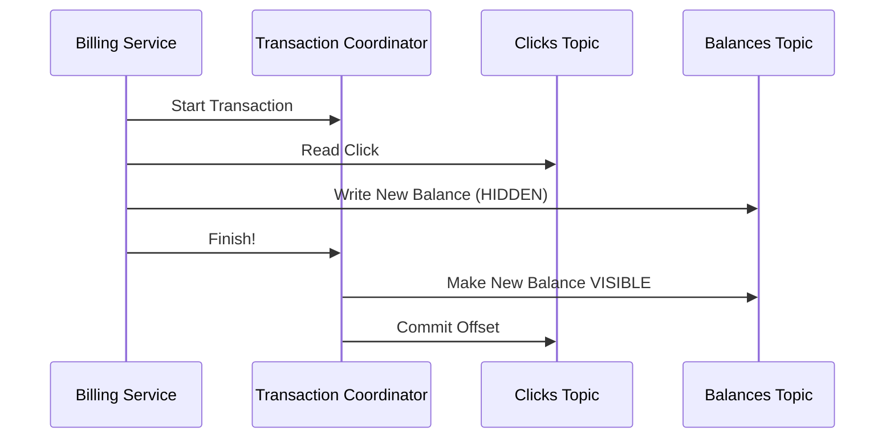

# Exactly-Once: Solving the "Double-Charging" Nightmare

> [!info] "Exactly-Once" is the Holy Grail of distributed systems. It guarantees that even if a server crashes, a message is processed **exactly once**. No data is lost, and nothing is duplicated. For a **Billing Service**, this is the difference between a happy user and a PR disaster.

---

## The Nightmare: At-Least-Once is not enough

Imagine your **Billing Service** pulls an ad-click from Kafka worth **$1.00**.

1.  **Read:** You read the click from Kafka.
2.  **Act:** You update the advertiser's balance: `$50 → $49`.
3.  **Crash:** Before you can tell Kafka "I'm done" (the Offset Commit), the power goes out.

**The Result:** When you restart, Kafka has no idea you already charged the user. It sends you the **same click again**. You charge them another $1.00. 

The advertiser now has **$48** instead of **$49**. If this happens to 100,000 clicks per second, you've just stolen millions of dollars.

---

## Step 1: The Idempotent Producer (The "Serial Number" fix)

First, we must stop the **Producer** (the app server) from sending duplicate clicks to Kafka in the first place.

Imagine the network is slow. The Producer sends a click, waits, gets no ACK, and sends it again. Without idempotence, Kafka would store the same click twice.

**The Kafka Solution:**
Kafka gives every Producer a **Producer ID (PID)** and every message a **Sequence Number** (1, 2, 3...). 

When the Producer retries:
1.  The Broker sees the message.
2.  It checks the PID and Sequence Number and says: **"Wait, I already have Message #1 from this Producer. I'm going to ignore this duplicate."**

> [!important] The Kafka log is now guaranteed to be "clean." No matter how many network glitches happen, the log only contains one copy of each click.

---

## Step 2: The Idempotent Consumer (The "Check the List" fix)

Now we must stop the **Consumer** (the Billing Service) from *acting* on the same message twice.

We make the database "smart." Instead of just subtracting money, we use a **Transaction** in our SQL Database:

1.  **Check:** *"Has Click #10,001 already been processed?"*
2.  **Action:** If "No," we:
    *   Deduct the $1.00.
    *   Add `10,001` to a `Processed_Clicks` table.
3.  **Commit:** We do both steps in **one single database handshake**.

**The Payoff:** If the service crashes and restarts, it reads Click #10,001 again, checks the list, sees it's already done, and **skips the charge**.

---

## Step 3: Kafka Transactions (The "All-or-Nothing" handshake)

If you're following the **No-DB (Kafka-only)** architecture, you use **Kafka Transactions**.

This is for "Hybrid" services that **Read** from one topic and **Write** to another. In one single transaction, the Billing Service can:
1.  **Produce** the new balance (`User_A: $49`) to the `Balances` topic.
2.  **Commit** the offset (`Offset 10,001`) to the `Clicks` topic.

**How it works:** Kafka keeps the new balance in a **"Hidden" state** on the disk. Only when the transaction is finished does the **Transaction Coordinator** flip a switch and make the balance visible to everyone else.

> [!important] This is the "Atomic" part of ACID. If the service crashes anywhere in the middle, **nothing happens**. The balance isn't updated, the offset isn't moved, and the user's money is safe.

---

## What it guarantees / What it doesn't guarantee

**What it guarantees:**
- **At-Least-Once:** No data will ever be lost.
- **No Duplicates:** Even if a message is redelivered, its effect will only happen once.

**What it doesn't guarantee:**
- **Pure Speed:** Exactly-once is slightly slower. It requires extra network trips and extra storage overhead for the "hidden" states.

> [!tip] **Interview framing:** "For the ad-click pipeline, I'd enable `enable.idempotence=true` on our producers. For the Billing Service, I'd implement the **Idempotent Consumer** pattern by using a SQL unique constraint on the `click_id`. This gives us the correctness of Exactly-Once without the high overhead of full Kafka Transactions."
