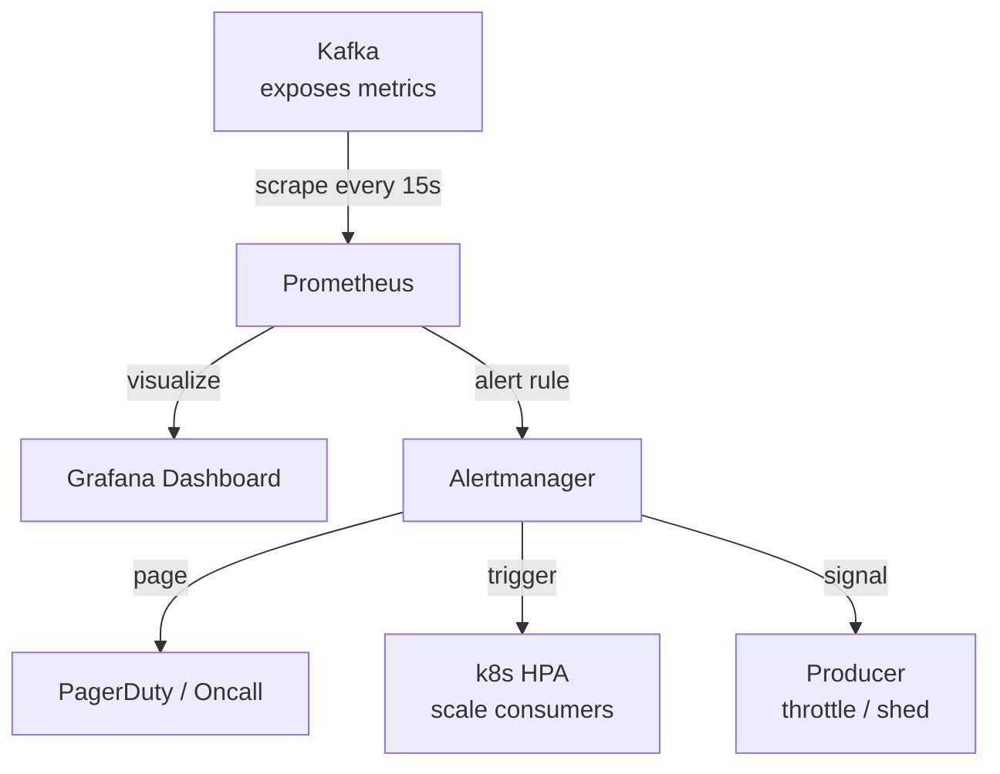
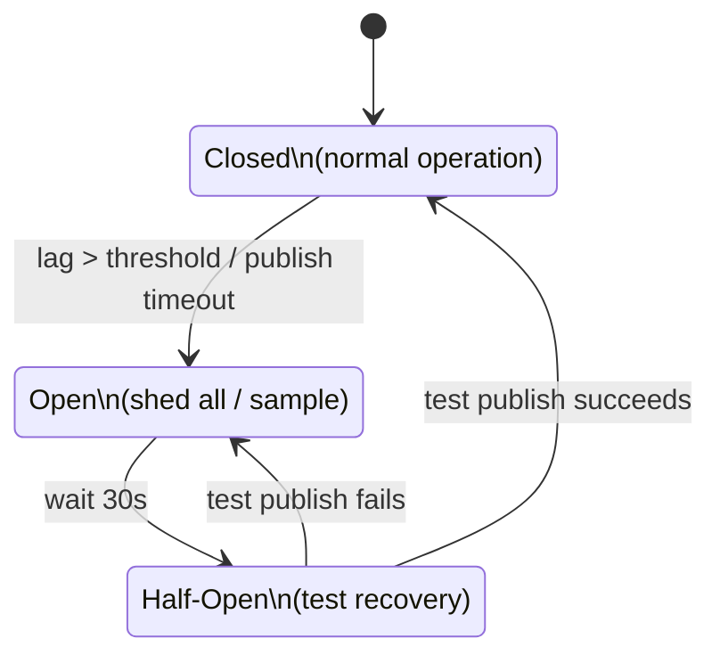

# Backpressure Signals

## The Problem

Kafka has no built-in mechanism to tell producers "slow down." Unlike SQS (which can block producers when queue is full), Kafka will happily accept messages until disk is full.

So you need an **external signaling system** to detect lag and push back on producers.

---

## The Stack: Prometheus + Grafana + Alertmanager



### Prometheus
- Scrapes Kafka consumer lag metrics every 15 seconds
- Stores time-series data
- Evaluates alert rules

### Grafana
- Visualizes lag over time per consumer group / partition
- Oncall dashboard to see lag trends at a glance

### Alertmanager
- Receives alerts from Prometheus
- Routes to PagerDuty, Slack, or triggers automated actions

---

## Alert Rule Example

```yaml
# Prometheus alert rule
- alert: KafkaConsumerLagHigh
  expr: kafka_consumer_group_lag{group="billing-service"} > 500000
  for: 30s
  labels:
    severity: warning
  annotations:
    summary: "Consumer lag too high, scaling up"
```

When this fires:
1. k8s HPA scales up consumer pods
2. If lag keeps growing → escalate to load shedding signal

---

## Signaling the Producer to Throttle

The producer needs to know lag is high. Two common patterns:

### Pattern 1: Feature Flag / Config Service
- Alertmanager flips a feature flag: `ad_click_sampling_rate = 0.2`
- Producer reads this flag and only sends 20% of clicks
- When lag drains, flag is reset to 1.0

### Pattern 2: Circuit Breaker
- Producer wraps Kafka publish in a circuit breaker
- Circuit breaker monitors error rates / timeouts
- If Kafka is backed up and publish starts timing out → circuit opens → producer sheds



### Pattern 3: Kafka Producer Config (built-in throttling)
Kafka brokers can throttle producers via quota config:
```
kafka-configs.sh --alter \
  --add-config 'producer_byte_rate=1048576' \  # 1MB/sec limit
  --entity-type clients \
  --entity-name ad-click-producer
```

This forces the producer to slow down at the broker level — no external signaling needed for rate limiting.

---

## End-to-End Backpressure Flow

```
1. Producer sends 100k clicks/sec
2. Consumer processes 80k/sec
3. Lag grows: 20k/sec accumulation
4. Prometheus detects lag > 500k after ~25 seconds
5. Alert fires → k8s HPA scales consumers from 4 → 8
6. Consumer now processes 160k/sec, lag drains
7. If spike is too large to scale away:
   → Feature flag flips sampling rate to 0.5
   → Producer sends 50k/sec
   → Consumer catches up
8. Lag returns to 0
9. Flag resets, consumers scale back down
```

---

## Key Insight

> Backpressure is not a Kafka feature — it's a system design pattern built around Kafka. You need the full stack: lag metrics, monitoring, alerting, auto-scaling, and producer-side throttling/shedding. None of it comes for free.
