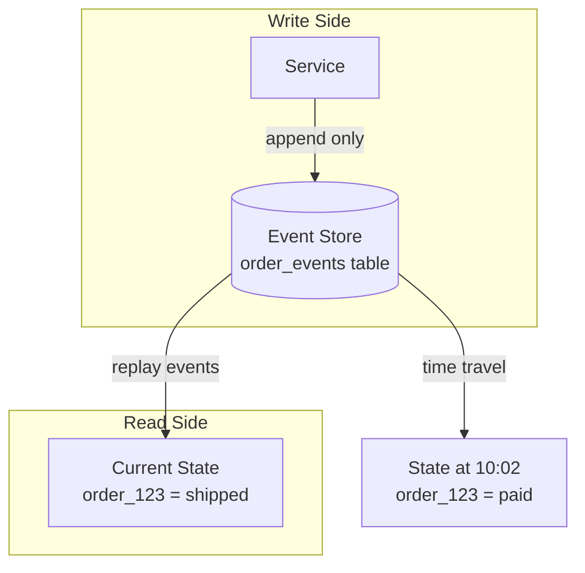
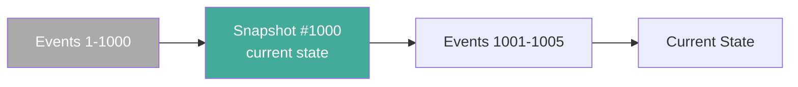

# Event Sourcing

## What is Event Sourcing?

Event Sourcing is a **design pattern** — a decision about how you store data.

Instead of storing the current state of an entity and updating it, you store every **event that happened** to it. Current state is derived by replaying those events.

---

## Normal Approach vs Event Sourcing

### Normal (mutable state)
```
orders table:
| order_id | status    | amount |
| 123      | shipped   | $49.99 |
```
Every status change = UPDATE the row. Previous states are gone forever.

### Event Sourcing (append-only events)
```
order_events table:
| order_id | event            | data                        | ts    |
| 123      | OrderCreated     | { user: u1, items: [...] }  | 10:00 |
| 123      | PaymentInitiated | { amount: $49.99 }          | 10:01 |
| 123      | PaymentConfirmed | { txn_id: txn_456 }         | 10:02 |
| 123      | OrderShipped     | { tracking: UPS123 }        | 10:05 |
| 123      | OrderDelivered   | {}                          | 10:30 |
```
Only INSERTs, never UPDATEs. Events are **immutable**.

Current state of order_123 = replay all 5 events in order.

---

## Why Event Sourcing?

### Problems with mutable state
- **No audit trail** — you can't answer "when did payment happen?" or "did a bug skip a state?"
- **No history** — impossible to reconstruct past states for debugging or compliance
- **Race conditions** — two services updating the same row simultaneously

### What Event Sourcing gives you
- **Full audit trail** — every transition recorded with timestamp and context
- **Time travel** — reconstruct state at any point in time by replaying up to that timestamp
- **Bug detection** — illegal transitions (created → delivered, skipping paid) are visible
- **Event replay** — rebuild derived data, fix bugs by replaying with corrected logic

---

## Diagram



---

## The Replay Performance Problem

If order_123 has 10,000 events, replaying all 10,000 every time you need current state is slow.

### Solution: Snapshots

Periodically compute and save a snapshot of current state:

```
Snapshot at event #1000:
{ order_id: 123, status: shipped, address: ..., items: [...] }

Events #1001 → #1005:
[ DeliveryAttempted, DeliveryFailed, Redelivered... ]
```

To get current state:
1. Load latest snapshot
2. Replay only events **after** the snapshot

Instead of replaying 1005 events → replay 5.



**Snapshot frequency**: typically every N events (e.g., every 100 or 1000), or on a time schedule.

---

## The Complex Query Problem

Event sourcing solves writes well. But complex read queries are painful:

> "Show all orders in payment_pending for users in California, sorted by amount"

You'd have to replay events for every order across millions of rows — completely impractical.

**Solution**: Maintain a separate read-optimized table that listens to events and keeps current state pre-computed. This is **CQRS** (covered next).

---

## When to Use Event Sourcing

**Good fit:**
- Financial systems (payments, banking) — audit trail is mandatory
- Order management — need full history of state transitions
- Collaborative tools (Google Docs) — every edit is an event
- Any domain where "how did we get here?" matters

**Bad fit:**
- Simple CRUD with no history requirements
- High-frequency updates where replay cost is prohibitive without careful snapshotting
- Teams unfamiliar with the pattern (high operational complexity)

---

## Key Insight

> Event Sourcing trades write simplicity (just append) for read complexity (must replay or maintain projections). The audit trail and time-travel capabilities are the payoff. Use it when history is a first-class requirement, not just a nice-to-have.
