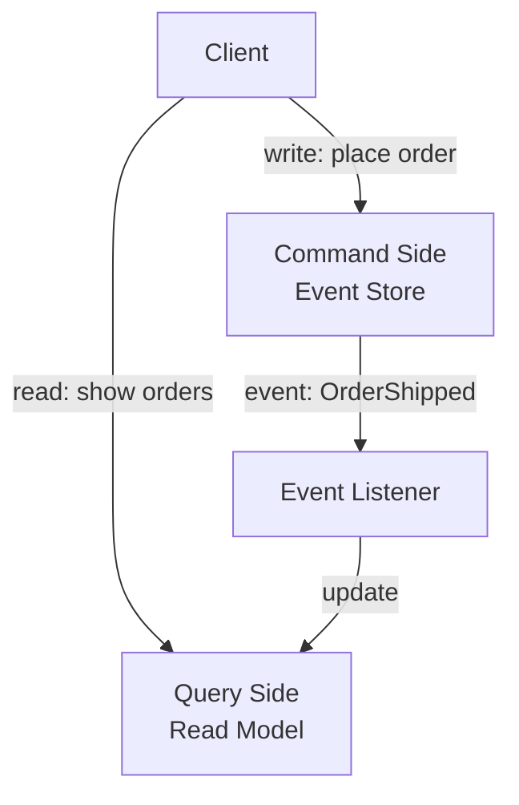

# CQRS Basics

## What is CQRS?

CQRS stands for **Command Query Responsibility Segregation**.

It is a design pattern that separates the **write side** (commands) from the **read side** (queries) of your system. They use different models, different tables, and often different databases.

---

## The Problem it Solves

In a normal system, the same table handles both writes and reads:

```
orders table:
| order_id | status    | amount | user_id |
| 123      | shipped   | $49.99 | u1      |
```

This works fine for simple queries. But complex read queries become painful:

> "Show all orders in payment_pending for users in California, sorted by amount"

In an event-sourced system, this is even worse — there's no `status` column at all, only raw events. You'd have to replay every order's events to answer this query.

**CQRS fixes this by maintaining a separate read-optimized model.**

---

## Command Side vs Query Side

### Command Side (Write)
- Handles state changes
- Appends events to the event store
- Optimized for correctness and consistency
- Does NOT serve read queries

### Query Side (Read)
- Handles all read queries
- Maintains pre-computed read models (projections)
- Optimized for query performance
- Does NOT handle writes



---

## Why Separate Them?

### Different optimization needs
- Write side needs ACID guarantees, event ordering, consistency
- Read side needs fast queries, indexes, denormalized data

### Different scaling needs
- Reads are typically 10-100x more frequent than writes
- You can scale read replicas independently without touching write side

### Different storage needs
- Write side: append-only event store (PostgreSQL, EventStoreDB)
- Read side: whatever fits the query pattern
  - PostgreSQL for relational queries
  - Elasticsearch for full-text search
  - Redis for fast key lookups
  - Cassandra for time-series reads

---

## Simple Example

```
Write side (event store):
| order_id | event            | ts    |
| 123      | OrderCreated     | 10:00 |
| 123      | PaymentConfirmed | 10:02 |
| 123      | OrderShipped     | 10:05 |

Read side (read model):
| order_id | current_status | amount | user_state  |
| 123      | shipped        | $49.99 | California  |
```

Query side is always pre-computed and ready. No replay needed.

---

## Key Insight

> CQRS is not about event sourcing specifically — you can use CQRS without event sourcing. But they pair naturally: event sourcing handles writes as immutable events, CQRS handles reads via projections built from those events.
