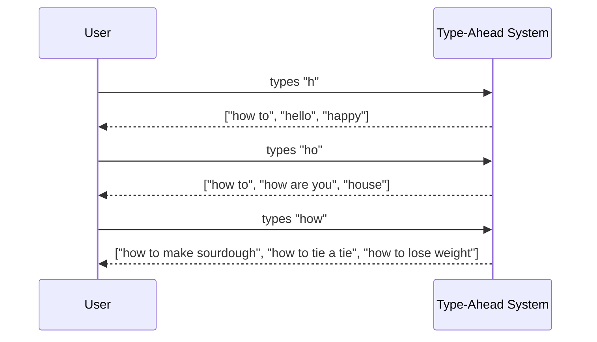

# Type-Ahead System — Introduction

## What Are We Building?

A **type-ahead system** (also called autocomplete or autosuggest) shows you a list of suggestions as you type — updating in real time with every keystroke.

You use it dozens of times a day without thinking about it:

- Type `"how to"` in Google → instantly see `"how to make sourdough"`, `"how to tie a tie"`
- Type `"shir"` on Amazon → instantly see `"shirt"`, `"shorts"`, `"shoes"`
- Type a friend's name in WhatsApp → their full name appears before you finish



Every character typed is a new request. Suggestions get more specific as the prefix gets longer.

---

## Why Is This Hard to Build?

On the surface it sounds simple — just search a list for words starting with what the user typed. The challenge is doing that **at Google scale**:

| Challenge | Why it's hard |
|---|---|
| **Speed** | Must respond in < 100ms — user is actively waiting, finger on keyboard |
| **Scale** | Google processes ~8.5 billion searches per day. Type-ahead fires on every keystroke — that's many times more requests than actual searches |
| **Relevance** | Don't just return any matching word — return the most *popular* ones first |
| **Freshness** | Trending topics ("earthquake 2026") must appear in suggestions within minutes, not days |

---

## The Core Idea — Prefix Matching

The fundamental operation is: **given a prefix, find the most popular completions.**

```
Prefix: "appl"

All words starting with "appl":
  "apple"          → searched 10 million times
  "apple store"    → searched 8 million times
  "application"    → searched 6 million times
  "apply for job"  → searched 2 million times
  "appliance"      → searched 500k times

Return top 5 by popularity ✅
```

This is not a simple string search. At billions of queries, scanning every word for every keystroke would be impossibly slow. The entire design challenge is building a data structure and infrastructure that makes this lookup **instantaneous at massive scale**.

---

## Where This Fits in a Google Interview

Type-ahead is a favourite Google interview question because it tests several things simultaneously:

- **Data structures** — what structure lets you look up by prefix instantly? (Trie)
- **Scale reasoning** — how do you handle billions of queries per day?
- **Caching** — most prefixes are queried repeatedly, so caching is critical
- **Freshness vs speed trade-off** — keeping suggestions up to date conflicts with caching them
- **Read-heavy system design** — this is almost entirely reads, which changes the architecture

---

## Files in This Case Study

```
03-Type-Ahead-System/
├── 00-Introduction.md              ← you are here
├── 02-Functional-Requirements.md
├── 03-Api-Specs.md
├── 04-Non-Functional-Requirements.md
├── 05-Estimations.md
├── 06-Tries.md
├── 07-Redis.md
└── 08-Architecture.md
```
