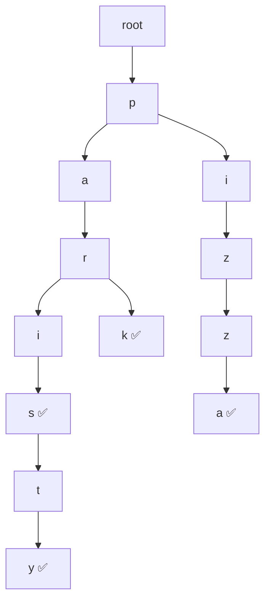
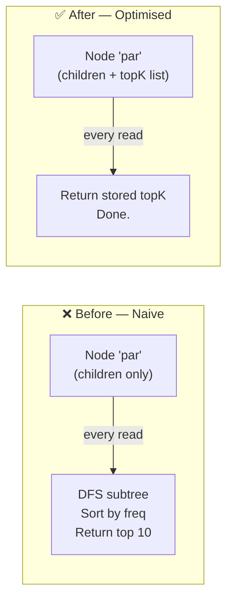
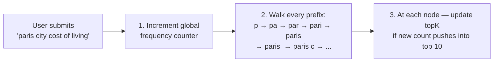
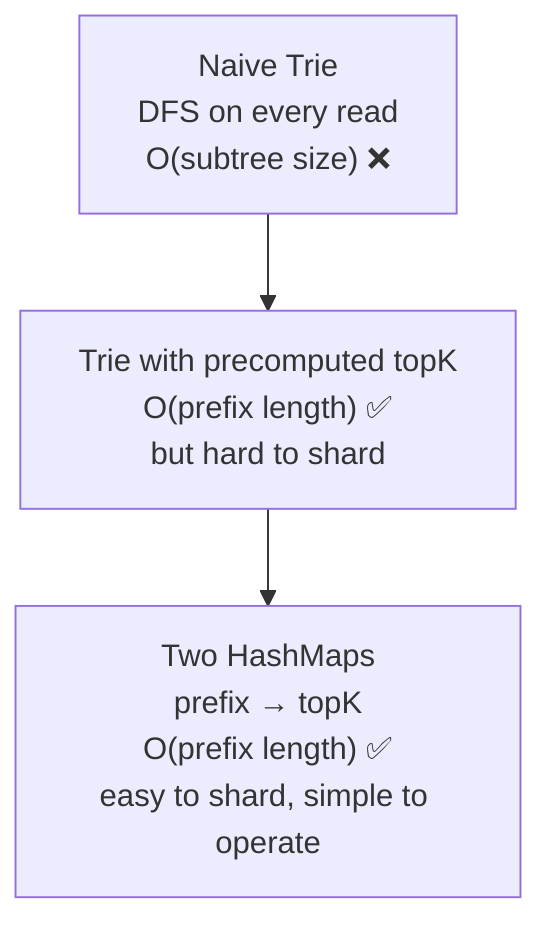

## What Is a Trie?

A ==Trie== (pronounced "try") is a tree where **each node is one character**. You spell out a word by following a path from root to leaf.



> [!example] Prefix lookup in action
> To find all words starting with `"par"`:
> traverse `p → a → r` then collect **everything** in the subtree below that node.
>
> **Time complexity:** `O(length of prefix)` to reach the node — independent of how many total words are stored.

---

## Why a Trie Looks Perfect for Autocomplete

```
User types "par"
  → traverse p → a → r          (3 steps, always)
  → collect subtree
  → return suggestions
```

- Reaches the right node in `O(prefix length)` — fast regardless of dataset size
- Structure naturally mirrors how typing works character by character
- Adding new words doesn't slow down existing lookups

So the instinct is: ==*"put all queries in a Trie"*== — correct direction, but the naive execution has three serious problems.

---

## Problem 1 — We Don't Want All Results

> [!bug] Trie returns everything. We need only top 10.

A Trie under prefix `"p"` contains **millions** of words. Autocomplete needs only the **top 10 by popularity**.

```
Prefix "p" matches:
  paris, pizza, python, php, paris travel, paris weather ...
  + millions more

We need only:
  1. paris     (searched 50M times)  ← show
  2. pizza     (searched 40M times)  ← show
  3. python    (searched 30M times)  ← show
  ...
  ❌ parenchyma (searched 200 times)  ← don't show
```

A basic Trie gives you everything. You need a ranked subset. These are different problems.

---

## Problem 2 — Tries Can't Live in a Database

Tries are pointer-heavy tree structures. Every node points to its children.

| Storage | Reality |
|---|---|
| **MySQL / Postgres** | Row-oriented — tree traversal needs recursive CTEs, catastrophically slow |
| **DynamoDB / Cassandra** | Key-value / wide-column — no concept of pointer traversal |
| **RAM** | ✅ Pointers = memory addresses — traversal is nanoseconds |

> [!warning] A Trie must live in memory
> You cannot query a Trie efficiently from any disk-based database. In-memory is the only option.

---

## Problem 3 — Sharding a Trie Is Painful

At 1M QPS and 30GB of data, one machine isn't enough. But splitting a Trie across machines is awkward:

| Strategy | Problem |
|---|---|
| Split by first letter (a–m / n–z) | `"p"` and `"s"` handle most English traffic → extreme hotspot on one machine |
| Split by prefix ranges | Complex routing logic, hard to rebalance when traffic shifts |
| Full replication | Works but 30GB × N replicas gets expensive fast |

> [!danger] No clean sharding strategy exists for a Trie
> This is the operational nightmare that makes Tries painful at Google scale.

---

## The Naive In-Memory Approach — And Why It Collapses

Put the Trie in RAM. Store frequency at each leaf. On every request:

```
1. Traverse to prefix node     O(prefix length)
2. DFS entire subtree          O(subtree size)  ← 💀 the killer
3. Collect all matching words
4. Sort by frequency
5. Return top 10
```

> [!danger] For the prefix `"p"` at 1M QPS
> ```
> Subtree size = millions of words
> DFS cost     = O(millions) per request
> At 1M QPS   → millions × millions ops/sec → instant collapse ❌
> ```

Steps 2–4 happen on ==every single request==, even though the top 10 for `"par"` barely changes from one second to the next.

---

## The Key Insight — Precompute Top K at Every Node

> [!success] The breakthrough
> **Top 10 suggestions for a prefix don't change on every request.**
> They only change when new searches come in and popularity shifts.
> So why recompute them on every read?

**Fix: store the top K results directly at each prefix node.**



New request flow:
```
1. Traverse to prefix node    O(prefix length)
2. Return stored topK list    O(1)
✅ Done.
```

Response time = ==`O(prefix length)`== — nothing extra. No DFS. No sorting.

---

## The Trade-off: Space for Time

Storing top K at every node means the same query appears in multiple nodes:

```
"paris" stored in top K of:
  node "p"     → ["paris", "pizza", ...]
  node "pa"    → ["paris", "party", ...]
  node "par"   → ["paris", "park",  ...]
  node "pari"  → ["paris", ...]
  node "paris" → ["paris weather", ...]
```

> [!info] Is this worth it?
> "paris" gets stored 5 times — but we calculated total storage at ~30GB, which fits in RAM.
> The read performance gain (no DFS at 1M QPS) is absolutely worth the extra memory.
> This is a classic ==space-time trade-off== — buy speed with memory.

---

## How Top K Gets Updated When New Searches Come In

When a user submits `"paris city cost of living"`:



This is called ==incremental propagation== — the update ripples from the full query up to all its prefixes.

### Write Cost Per Submission

```
1 query submission   → updates ~10 prefix nodes
1B searches/day      × 10 updates = 10B prefix writes/day

10,000,000,000 ÷ 86,400 = ~115,000 ≈ 100,000 write QPS
```

> [!warning] 100k write QPS is the bottleneck
> If every search submission directly updates the in-memory Trie, it becomes a write hotspot at this scale.
> The fix — covered in [[07 Redis]] — is **not** to write directly on every submission. Instead: batch updates, write periodically. The Trie becomes an eventually-consistent read cache.

---

## The Better Approach — Two HashMaps Instead of a Trie

> [!tip] You don't actually need the tree structure
> The Trie's job was just to group words by prefix. A flat HashMap does the same thing — simpler, easier to shard, easier to persist.

### HashMap 1 — Prefix → Top K Results

```
"p"     →  ["paris", "pizza", "python", ...]
"pa"    →  ["paris", "party", "park", ...]
"par"   →  ["paris", "party", "park"]
"pari"  →  ["paris", "paris travel"]
"paris" →  ["paris weather", "paris hotels", "paris city guide"]
```

### HashMap 2 — Query → Frequency

```
"paris"                      →  50,000,000
"pizza near me"              →  40,000,000
"paris city cost of living"  →  12,045
```

### Why HashMaps Win in Production

| | Trie | Two HashMaps |
|---|---|---|
| **Lookup time** | `O(prefix length)` | `O(prefix length)` — identical |
| **Sharding** | ❌ Painful — tree structure fights partitioning | ✅ Easy — hash the prefix key |
| **Persistence** | ❌ Complex — must serialise pointer graph | ✅ Simple — snapshot flat map to disk |
| **Rebuild after crash** | ❌ Rebuild entire tree | ✅ Reload flat files |
| **Code complexity** | ❌ High | ✅ Low |

> [!success] Production reality
> Google, Redis-backed autocomplete, and most large-scale systems use this **flattened prefix → topK map** approach — not a live Trie traversed on every request.

---

## Evolution Summary



> [!abstract] Key takeaways
> - Precompute top K at each prefix node — never recompute on a read request
> - Space-time trade-off: ~30GB storage buys instant reads at 1M QPS
> - Two HashMaps > Trie in production — same speed, far simpler to operate
> - 100k write QPS bottleneck → solved by batching updates (next file)
