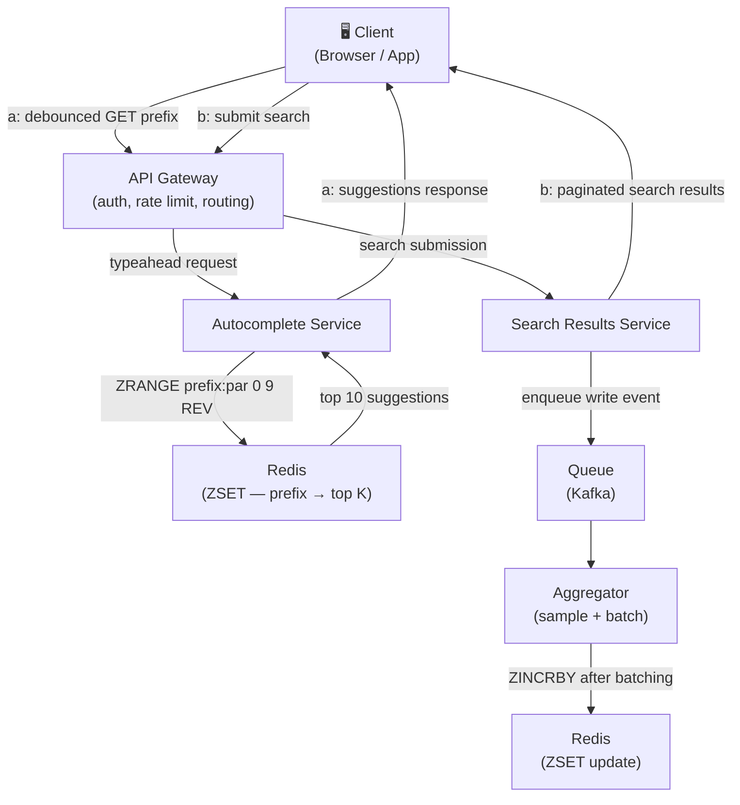
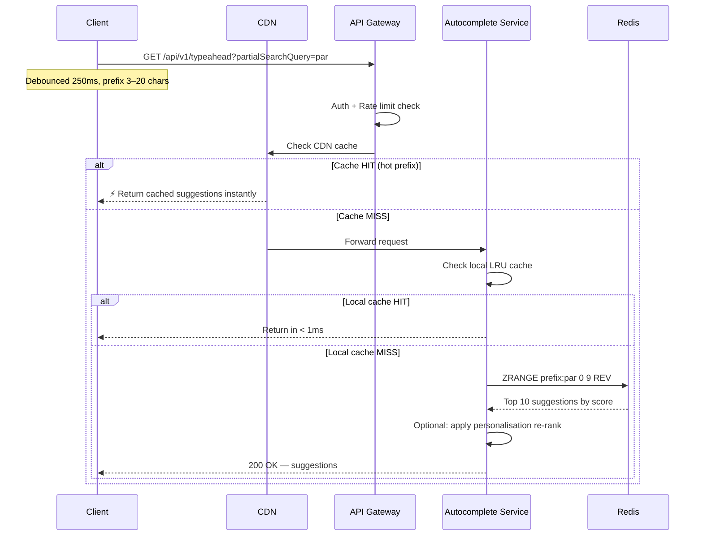
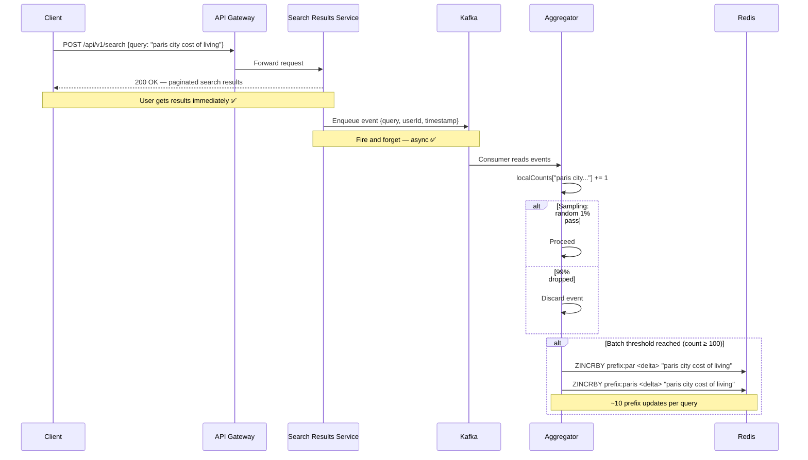
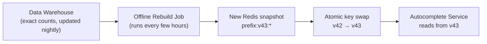
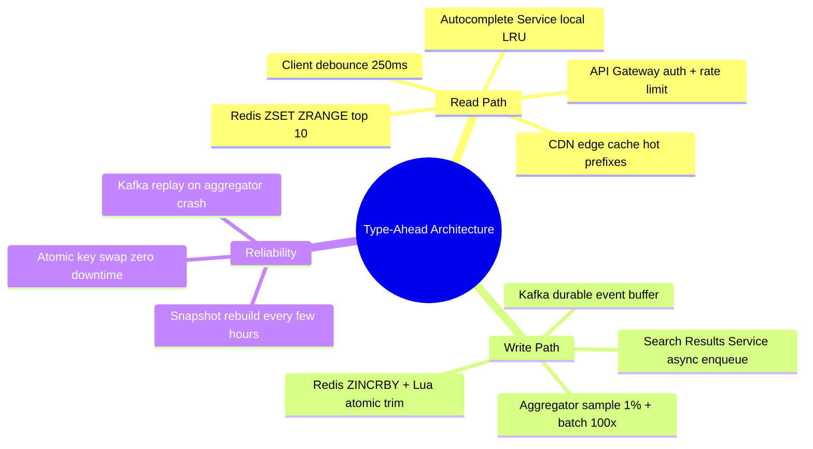

# Type-Ahead System — Architecture

> [!abstract] This file brings everything together.
> Two separate flows — read and write — designed independently because they have opposite characteristics.
> Everything in this file follows directly from the decisions made in [[06 Tries]] and [[07 Redis]].

---

## The Full Picture

![[Architecture.png]]



> [!info] Two completely separate paths
> - **Path A (TypeAhead)** — read path, latency critical, served from Redis in < 1ms
> - **Path B (Search Submit)** — write path, async, goes through a queue before touching Redis

---

## Path A — TypeAhead (Read Path)

> [!question] Goal
> Return top 10 suggestions for a prefix in **< 50ms P99** at up to **1M QPS**.

### Step-by-Step Flow



### Each Component Explained

**API Gateway**
- Authenticates the request token
- Applies rate limiting — per-IP and per-user (token bucket algorithm)
- Rejects requests if the system is overloaded (circuit breaker)
- Routes to the Autocomplete Service

**CDN (Edge Cache)**
Hot prefixes like `"par"`, `"the"`, `"how"` are queried millions of times per second. Caching them at the CDN edge means those requests never reach the origin servers at all.

```
Cache key: typeahead:v{version}:{region}:{prefix}

Example:   typeahead:v42:us-east:par
```

> [!tip] CDN cache hit rate for type-ahead is very high
> The same popular prefixes get queried constantly. A well-tuned CDN absorbs 80–90% of read traffic before it hits your infrastructure.

**Autocomplete Service**
- Checks its own **local LRU cache** first (in-process memory, microsecond lookup)
- On miss, queries Redis
- Optionally applies a lightweight personalisation re-rank on top of the Redis results (no extra Redis calls)

**Redis**
```redis
ZRANGE prefix:par 0 9 REV WITHSCORES
```
Returns top 10 members of the sorted set ordered by score (frequency) in descending order. Executes in `O(log N + 10)` — under 1ms.

### Latency Budget

```
CDN cache hit:           ~5ms    (network to nearest edge node)
Local service cache hit: ~1ms    (in-process memory)
Redis read (same region):~1ms
Network + processing:    ~5–15ms
─────────────────────────────────
P50 target:              ~10ms ✅
P99 target:              ~50ms ✅
```

---

## Path B — Search Submit (Write Path)

> [!question] Goal
> Record every completed search to update popularity rankings — **without blocking the read path or overwhelming Redis.**

### Step-by-Step Flow



### Each Component Explained

**Search Results Service**
- Returns paginated search results to the user synchronously — this is the user-facing response
- ==Immediately after responding==, enqueues a write event to Kafka
- The user never waits for the ranking update — they already have their results

**Kafka (Queue)**
- Durably stores every search event
- Acts as a buffer between the high-volume write path and Redis
- Partition key = query hash, so related prefix updates land in the same partition

> [!info] Why Kafka and not direct writes?
> Without Kafka, every search submission would directly hit Redis. At 1M QPS that's instant overload.
> Kafka absorbs the burst, lets the aggregator consume at a controlled pace, and provides durability — if the aggregator crashes, events aren't lost.

**Aggregator**
Applies the two write reduction strategies from [[07 Redis]]:

```
Raw events:             100,000/sec
After 1% sampling:        1,000/sec
After 100x batching:         10/sec  ← actual Redis writes
```

When flushing, it uses a **Lua script** to make the update atomic:

```lua
-- Atomic: increment score + trim to top 500
local key    = KEYS[1]   -- e.g. "prefix:par"
local member = ARGV[1]   -- e.g. "paris city cost of living"
local delta  = ARGV[2]   -- e.g. 100 (batched increment)

redis.call('ZINCRBY', key, delta, member)
redis.call('ZREMRANGEBYRANK', key, 0, -501)  -- keep only top 500
```

> [!info] Why Lua? Why atomic?
> Without atomicity, two aggregators could ZINCRBY the same prefix simultaneously and then both try to trim — one trim might delete entries the other just added. The Lua script runs as a single unit on Redis, so this race condition can't happen.

---

## Snapshot Rebuild — The Safety Net

> [!warning] Approximation accumulates errors over time
> Sampling and batching introduce drift. Over days/weeks, Redis counts diverge from reality — a query that stopped trending might still rank high from old accumulated score.

The fix: **periodic full rebuild from offline analytics.**



```
New snapshot built at:  typeahead:v43:prefix:*
Old snapshot was:       typeahead:v42:prefix:*

Atomic swap: update config pointer from v42 → v43
Autocomplete Service picks up v43 on next request
Old keys expire after TTL
```

> [!success] This gives the best of both worlds
> - Incremental updates keep rankings fresh in near-real-time
> - Periodic full rebuild corrects accumulated approximation errors
> - Atomic swap means zero downtime during rebuild

---

## Redis Key Design

| Key pattern | Type | Purpose |
|---|---|---|
| `typeahead:v{n}:prefix:{prefix}` | ZSET | Top K suggestions for a prefix, scored by frequency |
| `typeahead:counts` | HASH | Global query → exact count (for analytics) |

```
Read:   ZRANGE typeahead:v42:prefix:par 0 9 REV WITHSCORES
Write:  ZINCRBY typeahead:v42:prefix:par 100 "paris city cost of living"
Trim:   ZREMRANGEBYRANK typeahead:v42:prefix:par 0 -501
Count:  HINCRBY typeahead:counts "paris city cost of living" 100
```

> [!tip] Why versioned keys?
> When a new snapshot is built, it writes to `v43:*` keys while `v42:*` still serves live traffic. Once `v43` is fully built and verified, we atomically swap the pointer. Zero downtime. Zero stale reads during rebuild.

---

## Complete Component Summary



---

## NFR Verification

| NFR | Target | How achieved |
|---|---|---|
| Read latency P99 | < 50ms | CDN → local cache → Redis, all sub-millisecond |
| Availability | 99.99% | CDN + multiple AC replicas + Redis cluster |
| Write throughput | 100k raw events/sec | Kafka buffers, aggregator reduces to ~10 Redis writes/sec |
| Consistency | Eventual | Acceptable — rankings update in near-real-time, full rebuild corrects drift |
| Storage | ~30GB | Fits in Redis cluster RAM |
