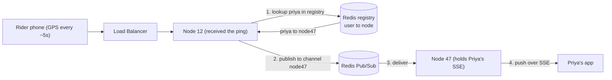
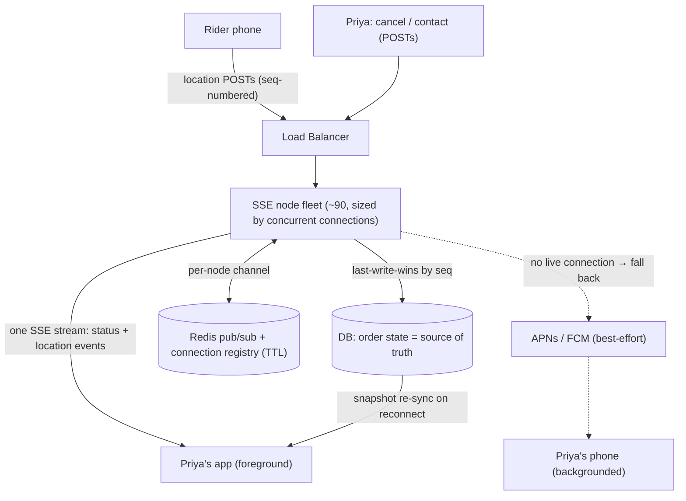

# Real-Time Updates — Mock Interview: Live Order Tracking

This is a **mock interview transcript** on the *real-time updates* pattern, run as a Google L4 design grill. The scenario is the **live order-tracking screen of a food-delivery app** (Zomato / DoorDash style): after an order is placed, the customer watches `accepted → preparing → picked up → en route → arriving → delivered`, and the rider's location dot moves on a map as they approach.

It's written as **Interviewer question → Candidate answer → Verdict/correction → next question**, so the *reasoning trajectory* — including the wrong turns and how they were caught — is preserved. The mistakes are the point; they're where the learning lives.

> [!info] The single thread running through this whole interview
> **Real-time transports are sized by *concurrent open connections*, not by *request rate*.** Almost every mistake below is a variation of forgetting that one sentence.

---

## Q1 — Pick the transport, and say what you'd clarify first

> [!question] Interviewer
> Design the backend for the live order-tracking screen. Status steps update a handful of times per order; the rider's dot should refresh roughly every 5 seconds while en route. Pick your transport — but first, decide what you need to know before you can make that call.

**Candidate — clarifying question:** what does "a handful of times per order" actually mean?

> [!note] Interviewer's clarification
> - **Order status**: ~5–6 discrete transitions over the whole ~35-minute order lifetime. A few events, unpredictable timing, spread over half an hour.
> - **Rider location**: a fresh coordinate ~every 5 seconds, but only during the ~10-minute "en route" window.
>
> So there are **two very different update streams on the same screen** — one rare and bursty, one frequent and steady.

**Candidate's answer:** Use **short/long polling** for the order-status stream (poll every ~5 min), and **SSE** for the rider location, since it's one-way server→client — the client doesn't need to send anything.

> [!success]- Verdict: ✅ rider call right (for a slightly-off reason), ⚠️ two problems flagged
> **✅ SSE for rider location is correct — because the flow is one-way, server → client.** The rider's coordinates originate on the *rider's* device, hit the server, and get pushed down to the *customer*, who never sends anything upstream. No need for WebSocket's second direction. That directionality is the correct discriminator.
> *(The candidate's stated reason — "the client's location is static / it's a home" — was muddled; the thing being streamed is the **rider's** location, not the customer's. But the conclusion "one-way ⟹ SSE, not WebSocket" holds.)*
>
> **⚠️ Flag parked:** a 5-minute poll means order status can be up to 5 minutes stale — "your food is at the door" while the app still says *preparing*. Revisit.
>
> **⚠️ The real smell (next question):** this design opens **two separate channels from one screen** — a polling loop *and* an SSE stream, to the same backend, at the same time.

---

## Q2 — Justify two channels, or collapse them

> [!question] Interviewer
> Your screen now holds a polling loop for status **and** a separate SSE connection for location — two independent channels to the same backend. Defend that, or collapse it. And do the connection math: at 100k people tracking at dinner rush, is the second channel earning its keep?

**Candidate's answer:** Since we need SSE for the rider anyway, **use that same stream to carry the status events too**. The backend decides when to emit each event based on what's happening behind the scenes (distance left, status change, etc.).

> [!success]- Verdict: ✅ the senior move
> **One SSE stream per tracking screen, carrying named event types:**
> - `event: status` → the lifecycle steps
> - `event: location` → the moving dot
>
> The backend emits `status` on a real transition and `location` on a timer/distance-delta; the client routes by event type. **One connection, not two.** SSE explicitly supports named event types precisely so a single stream can multiplex different kinds of update. Collapsing the two channels halves the connection count and removes the redundant polling loop.

---

## Q3 — Size the SSE tier

> [!question] Interviewer
> Numbers to work with: ~20M orders/day; heavily concentrated at lunch & dinner peaks; each tracking screen (and its SSE connection) stays open for the ~30-minute active life of the order. I gave you a **per-day** number on purpose — is orders/day the number that sizes your SSE tier? If not, derive the right one and tell me how many nodes you need.

**Candidate's answer:** 20M / 86,400 ≈ **~200 orders/sec** average; worst-case peak factor ~2.5× → **~500 orders/sec**. "That's a cakewalk for SSE — one server handles 10k connections easily."

> [!danger]- Verdict: ❌ walked straight into the rate-vs-concurrency trap
> Listen to the two claims back to back: **"500 orders/*sec*"** and **"one server, 10k *connections*."** That compares a **rate** (orders per second) against a **standing count** (concurrent open connections) as if they were the same number. **They are not.** This is the entire *"size by connection count, not request rate"* lesson — and the candidate sized by rate.
>
> The fix uses the duration the candidate *already stated* and then dropped:
> ```
> concurrent open connections = arrival rate × how long each connection stays open
>                             = 500 /sec  ×  1,800 sec (30 min)
>                             = 900,000 concurrent open SSE connections at peak
> ```
> Every order that starts opens a connection that **doesn't close for 1,800 seconds**. The "500" and the "900k" differ by **180×** — the difference between provisioning 1 box and 90.

**Candidate's corrected answer:** So ~**900k concurrent connections** at peak; at 10k/node → **90 nodes**.

> [!success]- Verdict: ✅ correct shape
> 900k concurrent ÷ 10k per node = **90 nodes**. Correct — and note it's 180× the "cakewalk" answer.
>
> **Aside (given for free):** 10k/node is *conservative* for SSE. SSE connections are **idle and one-way** — no chatty receive buffers churning, just a tiny payload every few seconds — so the file-descriptor + memory ceiling lets a tuned event-driven node hold **low hundreds of thousands**, approaching **~1M**. Same ceiling mechanism as WebSockets; SSE just gets more out of it because the connections are mostly idle. So 90 is a safe *upper* bound.

---

## Q4 — The fan-out problem: routing across the fleet

> [!question] Interviewer
> You now have 90 nodes. Customer **Priya**'s SSE connection is pinned to **Node 47** for the whole 30 minutes. But her **rider's phone** pushes GPS every few seconds, and those requests hit the load balancer fresh each time — landing on **any** node, say **Node 12**. How does a location update that arrives at Node 12 reach the one node (Node 47) holding Priya's stream? What state do you need?

**Candidate's answer:** Store a **`user → server` mapping in Redis**. Look up which server holds Priya, send the location to that server, and that server pushes it down her SSE stream.

> [!success]- Verdict: ✅ right direction (connection registry + targeted routing), but the *delivery step* was hand-waved
> A **connection registry in Redis** (`user → node`) plus **targeted routing** is the standard answer. But "and then we send it to that server" skips the actual mechanism: Node 12 and Node 47 are **separate machines**. Knowing the name "Node 47" doesn't move a byte. → *How* does Node 12 deliver to Node 47?

---

## Q5 — How does one node actually reach another?

> [!question] Interviewer
> Redis says `priya → node47`. Concretely, what is the *wire* between Node 12 and Node 47? And what must Node 47 have done ahead of time for the delivery to reach it?

**Candidate's answer (first attempt):** Use a **webhook** — Node 12 makes an HTTP call, putting the target in the URL path, and the API Gateway routes it to the right server.

> [!danger]- Verdict: ⚠️ right instinct, wrong mechanism — direct addressing fights the infra
> Two problems:
> 1. **The load balancer's job is the opposite.** An LB exists to *spread* traffic so no client cares which node it hits. Asking it to pin-route to *one specific named instance* (Node 47 only) is not what LBs do.
> 2. **Node churn destroys direct addressing.** The 90 nodes are **ephemeral** — they autoscale, crash, redeploy with new IPs. For point-to-point HTTP, every node must continuously track every other node's live address: an **N×N discovery mesh** that breaks on every fleet change.
>
> What you want: a way for Node 12 to say *"deliver this to whoever owns Priya"* **without knowing which physical box that is**, and letting nodes come and go freely. *(Nudge: Redis already offers this primitive.)*

**Candidate's answer (second attempt):** Put the rider's location into a **message queue**; whoever is subscribed for Priya consumes it.

> [!danger]- Verdict: ⚠️ "queue" is the wrong word, and the distinction is load-bearing
> - **Message queue** = *competing consumers*. One message → exactly **one** consumer pulls it. That's for distributing *work* where you don't care who does it.
> - **Pub/Sub** = one publisher → **every subscriber of that channel** gets a copy.
>
> With a real **queue** across 90 nodes, the location message gets grabbed by **one arbitrary node** — probably *not* Node 47. That node finds no Priya connected, and **drops it on the floor**. Her dot never moves. A queue's whole point ("any one worker takes it") is exactly wrong when the message must reach *one specific* holder.
>
> ✅ So it's **pub/sub**, not a queue. Fix the term — it changes the semantics.

---

## Q6 — What is the pub/sub channel keyed on?

> [!question] Interviewer
> You've said pub/sub. What is the channel keyed on? And for the option you pick — do you still need the separate Redis registry, or did the subscription just replace it?

**Candidate's answer:** Two options:
1. **Per-node channel** (`node47`): the node subscribes to its own id; on publish you do a Redis lookup (`priya → node47`) then publish to `node47`.
2. **Per-user channel** (`user:priya`): the node holding Priya subscribes to *her* id when she connects. On publish, the GPS producer knows the order → customer, so it publishes to `user:priya` directly. **You don't need the Redis registry at all** — only one node can hold Priya, so only that node subscribes, and *being subscribed is being registered*.

> [!success]- Verdict: ✅ genuinely good insight
> Correct: with **per-user channels, the subscription itself becomes the routing table.** No separate lookup — Redis pub/sub delivers to whichever node is listening on `user:priya`, and nobody ever asked "which node?" The registry evaporates because *being subscribed IS being registered*.

---

## Q7 — Price the elegant choice

> [!question] Interviewer
> You found the elegant option and declared "solved" without pricing it. Per-node creates how many total subscriptions across the fleet? Per-user creates how many? Use the 900k figure. Is "we don't need the registry" a free win?

**Candidate's answer:** Number of users ≫ number of nodes. But we'd store 900k users in Redis *anyway* (as the registry), so it's fine to instead "store" them as pub/sub subscriptions — same 900k either way.

> [!success]- Verdict: ✅ fair hit on cardinality, ❌ but "equal to store" ≠ "equal to operate"
> **Cardinality is 900k either way** — per-node = 900k `user→node` entries; per-user = 900k subscriptions. So the storage-count argument lands. **But they're two different kinds of object, and they diverge hard once you outgrow a single Redis box:**
>
> | | Per-node registry | Per-user channels |
> |---|---|---|
> | Total subscriptions | **90** (each node → its own channel) | **900,000** (one per user) |
> | Object type | passive KV data | live routing state |
> | Sharding across a Redis cluster | trivial — key hashes to a shard | **classic Redis pub/sub does NOT shard** — a publish propagates to *every* cluster node regardless of subscribers |
> | Per-publish cost | 1 cheap GET + publish to a **1-subscriber** channel; Redis matches against **90** channels | publish must fan-out-match against up to **900k** channels; riders publishing every 5s can flood the whole cluster |
>
> *(Redis 7 added **sharded pub/sub** specifically to fix the cluster-broadcast problem — the fact they had to add it tells you the naive version bites at scale.)*
>
> **Both patterns ship in the real world.** The senior signal is saying the trade-off sentence out loud: *"per-user channels remove the registry but cost 900k live subscriptions and don't shard cleanly; per-node keeps a cheap shardable registry at the cost of one extra lookup per publish."*

> [!important] Decision for this design
> **Go with the per-node registry + Redis lookup.** Reasons: only **90 subscriptions**, the registry is passive KV that **shards trivially** across a cluster, and each publish is a cheap point lookup + a publish to a single-subscriber channel. It scales past one Redis box cleanly, which per-user channels do not (without sharded pub/sub).

---

## Routing architecture (chosen design)



---

## Q8 — The tunnel: what survives a disconnect?

> [!question] Interviewer
> Priya tracks her order in a cab and goes through a **tunnel — her SSE connection drops for 40 seconds**. During those 40 seconds the rider **arrives** and then the order is marked **delivered**; both events publish to `user:priya`. She reconnects on the far side. **What does she see, and what did she miss?** And whose job is it to fix that — the transport's, or something else's?

**Candidate's answer:** The `arrived` event gets *overridden*, so she sees only the last status `delivered`; the location events get overridden too — or maybe she receives the flood of all events, depending on the implementation.

> [!danger]- Verdict: ❌ "overridden" is the wrong mental model — nothing overrides, because nothing is stored
> While Priya is in the tunnel her SSE connection is **dead**, so — per the routing design — **no node holds it, and nothing is subscribed to `user:priya`.** When the publisher fires `arrived` and `delivered` onto the bus, **pub/sub has no subscriber to hand them to and no memory to keep them.** They aren't overridden, queued, or waiting to be replaced — they are **delivered to zero listeners and instantly gone.**
>
> **Pub/Sub is fire-and-forget.** Publish into an empty room and the sound just vanishes. There is no buffer for a later event to "override." The candidate's first framing (events sitting somewhere, newer replacing older) describes a *queue with retained state* — which pub/sub is not.

**Candidate's pushback:** But they can't just *vanish* — there should be a limit, a timeout, or they should be kept until a consumer reads them. And on reconnect the client should send back the **last event ID** it received, so the backend can decide whether to send all missed events or just the latest.

> [!danger]- Verdict: ❌ the "retention" intuition describes a different tool; ✅ the Last-Event-ID reflex is right but has a hidden dependency
> **"Retained until a timeout or until a consumer reads them" is a message queue or a log — NOT pub/sub.** The candidate mentally swapped the tool.
>
> | | **Pub/Sub** (Redis PUBLISH — what was chosen) | **Queue / Log** (SQS, RabbitMQ, Kafka, Redis Streams) |
> |---|---|---|
> | Retention | **None. Zero.** | Retained until consumed/acked (queue) or for a window (log) |
> | No subscriber at publish time | Message **dropped instantly** | Message **kept**, waits for a consumer |
> | Mental model | **Live radio broadcast** — radio off = missed, not recorded | **Voicemail / recorded tape** — plays back later |
>
> Redis `PUBLISH` to a channel with no subscribers returns *"delivered to 0 clients"* and that's the end of it — no timeout, no waiting, by design. So the events **genuinely vanish.** The feeling that "there should be retention" is the brain correctly saying *"then pub/sub is the wrong tool for anything that must survive a disconnect."* **If events must survive, you reach for a durable log, not pub/sub.**
>
> **On `Last-Event-ID` (✅ right reflex, sharpen it):** it is **only a bookmark**. It's useless unless there's a **book** to page back through. When the client reconnects with `Last-Event-ID: 102`, the server can only reply "here's 103, 104…" *if the server stored those events.* **SSE gives the mechanism (the browser auto-sends the header) but stores nothing** — the replayable log is **yours to build.** Two distinct layers:
> - **Transport** (SSE + `Last-Event-ID`) = auto-reconnect + the bookmark. *Free.*
> - **Durability** (a stored event log the bookmark reads from) = **you build it.** *Not the transport's job.*
> - **Pub/Sub** = neither — just live fan-out, no memory.

**Candidate's answer (converging):** For events with no subscriber, store the state in the DB. If she missed the rider location, send back the **latest** driver location; if the rider already arrived/delivered, that's just the **latest** status event.

> [!success]- Verdict: ✅ landed the senior answer — both event types collapse to "current truth," not "history"
> Both streams **coalesce** on reconnect:
> - **Location** → don't replay the missed dots (worthless the instant a newer one exists); push the **latest** position.
> - **Status** → `delivered` already **subsumes** `arrived`; the latest state is the whole truth.
>
> So this screen needs **no `Last-Event-ID` replay and no special event log.** The **order state is already in the DB as the source of truth** (the lifecycle is business data, persisted regardless of streaming). Recovery is simply:
> ```
> reconnect → GET current order state from DB (snapshot) → resume SSE for future updates
> ```
> The DB was always the truth; the SSE stream is a live **accelerator** on top of it. Lose the stream → fall back to the truth. *(Nice touch from the candidate: send location only `iff` status is not already completed — once delivered, the en-route phase is over, so there's no live location to send.)*

> [!important] Reusable principle — state-based vs event-based streams
> A **state-based** screen recovers with a **snapshot re-sync** (cheap, no event log). You only need the heavy machinery — **durable event log + `Last-Event-ID` replay + dedup** — when the stream is **event-based**, where every event carries irreplaceable meaning and newer ones do **not** subsume older ones.
>
> **The one discriminator question:** *Does a newer event make the older one irrelevant?*
> ```
> YES — newer subsumes older (coalescible / last-write-wins)
>    → location dot, presence, price ticker, order status, typing indicator
>    → snapshot re-sync on reconnect. NO replay, NO Last-Event-ID. Drop the stale ones.
>
> NO — every event is independent and must be seen, in order
>    → chat messages, notifications, audit feeds, bank transactions, collab-edit ops
>    → durable log + Last-Event-ID replay + dedup. You cannot skip any.
> ```

> [!question] Interviewer (the boundary check)
> Name a screen where the "just re-sync current state" trick **collapses**, forcing a durable event log + replay.

**Candidate:** *(stuck)* — "I don't know; our order-tracking design is fine."

> [!success]- Debrief: the counter-example is a chat screen (a *contrast*, not a new design)
> **A chat / messaging screen breaks the snapshot trick.** In the tunnel, messages `M5, M6, M7` arrive. Try "show current state" — what *is* the current state of a chat? It's **not** `M7`; `M7` does **not** subsume `M5` and `M6`. They're three irreplaceable pieces of content she must see, **in order**. A chat's "state" *is the entire ordered history of every message* — so recovering just the gap requires **durable log + `Last-Event-ID` ("I have up to M4, send from M5") + dedup.** The exact machinery order-tracking didn't need is *mandatory* here.
>
> ```
> Food-delivery order status  → newer subsumes older → snapshot re-sync      ← this design, correct
> Chat (WhatsApp)             → every message matters → durable log + replay  ← the contrast
> ```
> **Why the interviewer asks this:** getting the right design isn't enough — you must be able to state *when it would fail*. "It works here because status is coalescible; it'd break for chat, where I'd need a durable log + replay" proves you understand the **boundary** of your own decision. That sentence is the senior signal. *(Chat is never designed here — it's only held up as the opposite case so the line is sharp.)*

---

## Q9 — Auth on a long-lived connection (token expires mid-stream)

> [!question] Interviewer
> Priya's SSE stream authenticates at connect time — a **JWT in a cookie** validated before the stream is accepted. But your JWTs expire after **15 minutes** and her order takes **35**. At minute 15 her token expires *while the stream is still open and pushing*. **What happens at minute 15?** And if it's a problem, how do you keep her authorized for the full 35 minutes without a re-login?

**Candidate's answer:** For every request — even on the same connection — there's an auth check, so it'll see the token expired.

> [!danger]- Verdict: ❌ the whole trap — there are no further requests on a persistent connection
> On a persistent connection there is **exactly one auth check, at the handshake.** After that, the events are **not requests** — they're bytes flowing down an already-authorized pipe. No event carries a token; no event triggers validation. So at minute 15, **nothing happens.** The stream doesn't break; nobody notices. *You cannot re-check a header that is never sent again.*
>
> **Flip the danger:** the problem isn't that the stream breaks — it's that it **doesn't.** The connection **outlives its own authorization** and keeps streaming on a dead token. Worse: if Priya were de-authorized mid-order (suspended, logged out, session revoked), the stream would keep pushing data anyway, because it never looks again. *That's* the real hole.

**Candidate:** Then re-authorize by reconnecting — issue a new token and send it with the next event.

> [!success]- Verdict: ✅ reconnect is right for SSE; ❌ "send with next event" is the wrong direction
> **Reconnect is correct for SSE:** the stream is one-way (server→client), so you can't send a token *up* it — you tear it down and reopen carrying the new token. But "attach the token to the next event" pushes it the **wrong way** down a one-way pipe. And the new token must **not** come from a re-login (that's the bad UX you're avoiding).

**Candidate's scheme:** On reconnect, present the old (expired) JWT; the server checks a DB counter of how many times it's been refreshed (cap 5); if under cap, mint a new JWT and increment.

> [!danger]- Verdict: ❌ security hole + a confused mechanism
> **Hole:** using the *expired access token* to mint a new one **defeats the entire point of expiry.** A thief with the leaked token walks to the refresh endpoint and gets a fresh valid one → the leak becomes *permanent* access. **An expired credential must be dead** — it can't be the key that resurrects itself.
> **Confused mechanism:** there's no standard "refresh 5 times" cap. That's a garbled memory of **refresh-token rotation** (each refresh issues a new refresh token and kills the old; a replayed old one signals theft → revoke the family). The natural "must log in again" boundary is the **refresh token's own expiry** (= session length), a *time* limit, not a *count*.

> [!important] The two-token model
> | | **Access token (JWT)** | **Refresh token** |
> |---|---|---|
> | Job | proves *"who I am right now"*; checked at the SSE handshake | proves *"I may get new access tokens"*; used only at `/auth/refresh` |
> | Validated by | **signature check — no DB**, fast | **DB lookup** — slower, but rare |
> | Revocable? | **No** (stateless) | **Yes** (delete the row) |
> | Lifetime | short (15 min) → limits leak damage | long (7 days) → session length |
> | Exposure | sent on *every* request → higher leak risk | sent *rarely*, `Path`-scoped, `HttpOnly` → low risk |
>
> **Flow:** at refresh time the app makes a **separate** `POST /auth/refresh` (out-of-band, *not* on the SSE stream) carrying the refresh token → server returns a fresh access token → app reconnects the stream with it. The expired access token plays **no part**.

### Why not just make the JWT last 7 days?

> [!danger]- Verdict: because JWTs can't be revoked
> A JWT is validated **statelessly** — signature + `exp`, **no DB lookup.** That's its speed superpower *and* its curse: the server keeps no record of it, so it **cannot un-issue it.** A 7-day JWT that leaks = **7 days of un-killable access** — password change, account suspension, logout all do nothing, because nothing checks a revocation list. So you keep the access token **short** (self-heals fast on leak) and put revocation on the **refresh token**, which *is* DB-backed: to kill a session, delete its row → the next refresh returns 401. *("Why not check the JWT against a DB every request?" → then you've thrown away statelessness and might as well use plain server sessions.)*

### Cookie mechanics — how it's stored and sent

> [!info] Two named cookie slots; refresh overwrites, never accumulates
> Cookies are **name → value** slots the browser auto-attaches to matching requests. Two exist, permanently:
> ```
> access_token  = <JWT>          Set-Cookie: access_token=<JWT>;  HttpOnly; Secure; SameSite=Strict; Path=/
> refresh_token = <RT>           Set-Cookie: refresh_token=<RT>;  HttpOnly; Secure; SameSite=Strict; Path=/auth/refresh
> ```
> On refresh, `Set-Cookie: access_token=<NEW>` **overwrites the same slot** — the old JWT is replaced, *not* piled up. Still two cookies total. `Set-Cookie` is silent browser plumbing; nothing is shown on screen.
>
> **`Path`** = which URLs the browser attaches the cookie to. `access_token` (`Path=/`) rides every request; `refresh_token` (`Path=/auth/refresh`) is **physically absent** from `/profile`, `/orders`, the SSE stream — it appears only on the one endpoint that consumes it → tiny leak surface.
>
> **`HttpOnly`** = JavaScript **cannot read** the cookie (`document.cookie` won't show it), but the browser still sends it automatically. This blocks the #1 theft vector — **XSS reading storage** — while auth keeps working.

**The three-phase lifecycle (any normal request, e.g. clicking Profile):**
```
PHASE 1  JWT valid    → GET /profile (access_token) → server checks exp (future) ✅ → 200 OK   (refresh token idle)
PHASE 2  JWT expired  → GET /profile (access_token) → server checks exp (past)   ❌ → 401
PHASE 3  renew        → app catches 401 → POST /auth/refresh (refresh_token) → server DB-checks it ✅
                        → Set-Cookie: access_token=<NEW> (overwrites slot)
                        → app RETRIES GET /profile (new token) → 200 OK
... every 15 min: expire → 401 → refresh → retry, invisibly, for 7 days
... at 7 days: refresh token itself expires → /auth/refresh returns 401 → redirect to LOGIN (only real re-login)
```
So the refresh token's whole job is that silent **401 → refresh → retry** dance that keeps her logged in until *it* dies.

### Can the refresh token be stolen too?

**Candidate:** Just like the JWT, can't the attacker steal the refresh token?

> [!success]- Verdict: ✅ yes — nothing is un-stealable; the win is "much harder + contained + revocable"
> The model was never "un-stealable." The refresh token is deliberately **harder to steal** (`HttpOnly` blocks XSS reads; `Path`-scoped + `SameSite` shrink exposure; sent rarely) **and revocable** (DB row — delete it) **with theft detection** (rotation catches a replayed old token). Compare:
> ```
> One 7-day JWT:  every request (high exposure) + un-revocable + 7-day damage  ← worst case
> Access+refresh: stealable access = ~15-min useless-ish;  refresh = hard-to-steal + killable  ← contained
> ```
> The point isn't perfection — it's **concentrating power into one minimally-exposed, revocable credential** instead of a large, permanent, un-killable one.

> [!warning] Correction the candidate caught: don't over-claim the XSS asymmetry
> If the access token is **also** `HttpOnly` (as in cookie-based sessions), then **XSS can read *neither* token** — so "XSS steals the JWT but not the refresh token" is **false** in that design. There are two architectures:
> - **Design A — both tokens in `HttpOnly` cookies** (cookie-based sessions): XSS reads neither. The two-token split is justified by **revocability** (refresh) + **smaller `Path` exposure** (refresh), *not* XSS-readability.
> - **Design B — access token in JS memory (`Authorization: Bearer`), refresh in `HttpOnly` cookie**: XSS *can* steal the access token (15-min damage), not the refresh token. This is the world where the "steal the JWT" line is true — and where the client can read the JWT's `exp` to refresh proactively.
>
> **Résumé note:** "cookie-based sessions (JWT validation)" = **Design A** → defend on *revocability + exposure*, not XSS-readability (both are `HttpOnly`). In Design A the client can't read `exp` (it's `HttpOnly`), so proactive exp-timers rely on a readable hint or known TTL — see below for why you likely don't need them at all.

### Do we even need proactive (early) refresh for the stream?

**Candidate's insight:** The SSE stream won't terminate when the token expires, and after it ends — or whenever Priya clicks anything — that request 401s and triggers the refresh. So we don't need a client-side JWT-reading timer to refresh early.

> [!success]- Verdict: ✅ correct — this *refines* the earlier claim that streams "need" eager refresh
> For **keeping the user authenticated**, the reactive `401 → refresh` flow catches every path that matters — normal clicks *and* **reconnection** (a reconnect is itself a fresh request that 401s and refreshes). So the client exp-timer is **unnecessary** here.
>
> The *only* thing proactive/mid-stream re-validation buys is a **security checkpoint** — cutting a live stream when the user is de-authorized mid-flight. For **low-sensitivity data (her own order) on a stream that self-terminates in ~35 min**, that exposure ("a revoked user sees her own rider's dot a few more minutes") is negligible → **skip it.**
> ```
> Skip mid-stream re-validation   → low-sensitivity + naturally short stream   (order tracking ✅)
> Require mid-stream re-validation → sensitive data (financial/admin/other-user) OR very long-lived streams
> ```
> When you *do* need it, the cleaner mechanism is **server-driven**: the server **closes the stream at token `exp`**, forcing a reconnect that re-authenticates — no client-side exp-reading required.

> [!tip] Interview framing for Q9
> *"On a persistent connection auth is checked once, at the handshake — the stream then outlives its token, which is a security concern, not a functional break. I use a short access token (stateless, so a leak self-heals in 15 min) plus a separate `HttpOnly`, `Path`-scoped, DB-backed refresh token as my revocation lever. Refreshing is reactive: any request or a reconnect throws a 401, the client silently hits `/auth/refresh` and retries. I don't proactively refresh the stream — for low-sensitivity order data on a 35-minute connection it's not worth it; if it were a financial or admin stream I'd have the server close the connection at token expiry to force a re-authenticated reconnect."*

---

## Q10 — The locked screen (push notifications)

> [!question] Interviewer
> Priya locks her phone and pockets it. The OS suspends the app and tears down her SSE connection. Ten minutes later the rider **arrives** and your backend fires the `arrived` event. (1) With the SSE + pub/sub design, what happens to that event — does her phone buzz? (2) Why can't you fix this by making the app reconnect or "hold the connection harder"? What stops *all four* transports?

**Candidate's clarify:** Is the app cleared from RAM, or still running in the background?

> [!note]- Interviewer's clarification: "in RAM vs cleared" is a red herring — the app is *suspended*
> When the phone locks, within seconds the OS **suspends** the app: **its code is not executing** (no threads run) and **the OS tears down its network connections.** Whether its memory pages are still resident doesn't matter:
> ```
> Suspended app:  no code executing → can't run reconnect logic
>                 no live socket    → OS already killed the SSE connection
> ```
> A phone can't keep thousands of suspended apps' sockets alive on battery, so it deliberately kills them. Even the most generous case (fully in RAM, just frozen) already has no running thread and no open connection.

**Candidate's answer:** The connection is gone, and the server can't recreate it because SSE is **client-initiated** — so to reach her you need a push service like **FCM/APNs**. Their delivery isn't consistent (may arrive late or be dropped); I know the *functionality* but not the internals.

> [!success]- Verdict: ✅ core reasoning correct — only a platform push service can reach a frozen app
> Right conclusion: SSE is client-initiated, the app is frozen (can't reconnect), so **none of the four transports can wake it** — only the OS can, via **APNs** (Apple Push Notification service, iOS) / **FCM** (Firebase Cloud Messaging, Android). And the "not consistent" instinct is correct — push is best-effort. Here's the mechanism you were missing:

> [!info] The one trick: ONE OS-owned connection for the whole phone
> SSE failed because *each app* would need its own always-on socket, which the OS won't allow on battery. Push flips it: **the operating system itself** (not your app) keeps **a single persistent connection** to APNs/FCM, **shared by every app on the device.** One channel for the whole phone is battery-affordable; thousands of per-app channels are not. That OS-level connection stays alive even when every app is suspended — that's the whole magic.

**Flow, end to end:**
```
REGISTER (once, first run):
   app asks OS for push permission → OS registers with APNs/FCM
   → push service returns a DEVICE TOKEN ("this app, on this exact phone")
   → app sends the token to YOUR backend → you store it:  priya → device_token_xyz

SEND (rider arrives, app suspended):
   backend does NOT touch the dead SSE stream.
   → HTTPS request to APNs/FCM: "deliver this payload to device_token_xyz"
   → APNs/FCM pushes it down the OS-level connection to Priya's phone
   → OS shows it on the lock screen (can briefly wake the app to handle it)
   → phone buzzes: "Your rider has arrived 🛵"
```
The backend reaches her **with no connection to her app at all** — it hands the message to Apple/Google, who already hold a live pipe to her phone.

> [!important] Push is a "tap on the shoulder," not a data channel
> APNs/FCM are **best-effort**: they delay, batch, coalesce, or drop notifications to save battery (there are **priority levels** — a time-sensitive "rider arrived" goes high-priority, but even that isn't a *guarantee*). So never treat push as reliable delivery of critical data. The **truth still lives in your DB** — when Priya taps the notification and the app reopens, it re-syncs current state (the Q8 snapshot) and reconnects the SSE stream.

**The real architecture is both, side by side:**
```
App FOREGROUND  → live SSE stream → rich real-time updates (moving dot, every status)
App SUSPENDED   → SSE dead → backend sends via APNs/FCM → OS wakes phone → notification
```
Backend picks the channel by the connection registry: **connection alive → push over SSE; connection gone → fall back to APNs/FCM** via the stored device token. *(How the backend knows the connection is gone = **Q11, zombie connections**.)*

### Transactional vs promotional (candidate's observation)

**Candidate:** I get "order this!" pushes when I haven't ordered anything — are they misusing the feature? Shouldn't it be for the right use case only?

> [!success]- Verdict: ✅ right instinct — not tech misuse, but a trust/design problem, and it's self-defeating
> Two categories ride the same channel:
> ```
> TRANSACTIONAL → tied to a user action/expectation: "rider arrived", "OTP", "payment received"
>                 → high value, user-expected, high-priority
> PROMOTIONAL   → not tied to any action: "order now 40% off", "we miss you" ← the spam
> ```
> Not a *tech* misuse (the channel carries both), but **blasting promos is self-defeating**: over-notify → the user mutes or uninstalls → you lose the channel for the alerts that *matter* (rider arrived, OTP). You spent your transactional trust on marketing and got it revoked.
>
> The platforms encode the pushback: **permission is required and revocable**; **notification channels/categories** (Android 8+ forces categorization; iOS has categories) let users mute "Promotions" while keeping "Order Updates"; and over-sending low-priority pushes gets them **throttled/coalesced**, degrading your own deliverability.
>
> **Design takeaway (a Notification-System interview point):** *separate transactional from promotional into distinct channels with independent user preferences and rate limits — transactional is always-on/high-priority (a service), promotional needs its own consent, is low-priority and rate-limited — because burning notification trust on marketing kills your ability to deliver what matters.* Our `rider arrived` is firmly transactional → clean use of the channel.

> [!tip] Interview framing for Q10
> *"When the app is backgrounded the OS suspends it and kills its socket, so none of the four transports can reach it — the server can't even initiate SSE. The only thing with a live connection to a frozen phone is the OS itself, via one shared APNs/FCM channel, so I register a device token per user and, when there's no live SSE connection, push through APNs/FCM instead. But push is best-effort — a 'tap on the shoulder' — so the DB stays the source of truth and the app re-syncs on open. Real design: live stream in the foreground, push when backgrounded, and keep transactional notifications on a separate high-trust channel from marketing."*

---

## Q11 — The zombie connection (detecting dead clients)

> [!question] Interviewer
> The SSE-vs-push decision from Q10 rests on the connection registry being *truthful*. Priya's phone hits a **dead zone** and dies **silently** — no clean TCP `FIN` reaches the server. Node 47 still thinks her connection is alive and keeps `priya → node47` in the registry. `arrived` gets routed to a **ghost**. (1) What happens to the event? (2) Why didn't Node 47 just *know* the connection died — what's different about *this* death vs a clean app-exit?

**Candidate's clarify:** How is a silent death (dead zone / battery) different from manually exiting the app or turning off the internet?

> [!info]- A TCP connection is *state*, not a wire — the difference is whether a "goodbye" packet reaches the server
> A connection isn't a physical circuit; it's a **table entry in memory on each machine**, both *believing* they're connected. They only learn about a change if a **packet tells them**.
> - **Graceful close (exit app):** software runs `close()` → phone sends a TCP **`FIN`** ("I'm done") → it *reaches* the server → server updates its table → cleans up. **The server was told.** ✅
> - **Silent death (tunnel / battery):** the failure is physical/sudden → no software step runs, or the `FIN` can't be transmitted (no radio) → **no goodbye packet ever reaches the server** → its table still says `ESTABLISHED`. ❌
>
> **The killer:** to the server, an **idle** connection and a **dead** one look *identical* — both are just "no packets arriving." TCP has no built-in "are you there?" pulse, and an **SSE stream is silent from the client by nature** (server pushes down; client sends nothing up). So Node 47 cannot tell *"Priya's fine, just quiet"* from *"Priya's phone is dead."* Result: a **zombie (half-open) connection** — alive on the server, dead on the client. The registry keeps the stale entry, `arrived` is written into a socket whose other end is gone, the backend *thinks* it delivered, and never falls back to push. *(Rule: **did a goodbye packet reach the server?** App-exit → yes. Sudden signal/power loss → no.)*

**Candidate's answer:** We need some confirmation from the client that it's still there — I'm guessing.

> [!success]- Verdict: ✅ right principle (make the connection prove it's alive) → the tool is a heartbeat
> Correct soul: you can't trust silence, so you make the connection **periodically prove it's alive.** "Confirm what she received" is a heavy version (per-message ACK); the standard lightweight tool is a **heartbeat (ping/pong):**
> ```
> Every ~30s, send a tiny ping. Expect it to be answered/carried.
> N pings unanswered within a timeout → declare DEAD → tear down + clean the registry.
> ```
> This **converts ambiguous silence into a definite signal**: before, "no packets" meant *idle OR dead*; now "no response to my ping in 90s" means **dead**. You manufacture traffic so its *absence* becomes meaningful.

### How does the server detect death with no PONG? (SSE is one-way!)

> [!important] "One-way" is only the *application* layer — the transport (TCP) is *always* two-way
> The events go one way (server→client). But **every byte the server sends, the client's phone auto-acknowledges** with a tiny receipt (a TCP **ACK**) — handled by the phone's system software, *not* the app. The server detects death from **its own sends failing**, not from an app-level PONG.
>
> **Registered-post analogy** (the one that makes it click): sending over TCP is like **registered mail** — every package you send comes back with a **signed receipt**. Send a package and *no receipt returns*? The courier retries, then reports **"address not responding — delivery failed."** You learned the recipient is gone **purely by sending**, from the *missing receipts to your own deliveries.*
> ```
> Server sends keep-alive ": ping\n\n"
>   Priya ALIVE → her phone's TCP auto-returns a receipt (ACK) → server sees it → healthy
>   Priya DEAD  → no receipt → TCP retransmits → gives up → the WRITE fails with an error
>                 (broken pipe / connection reset) → server learns she's dead
> ```
> A dead phone **can't fake ACKs**, so the server reads the *silence of receipts on its own sends*. This is *why* you send periodic keep-alives — to **force writes** so a dead socket surfaces its error (and keep proxies from killing an "idle" connection). The **client half** — client sees silence for X s → **reconnects** — is the complementary, often-faster detector. *(WebSocket is cleaner: real app-level ping/pong frames, because it's two-way.)*

> [!warning] Why not rely on TCP's own keepalive?
> TCP has an OS-level keepalive, but default timers are huge (Linux waits **~2 hours** before the first probe), it's config-dependent, and it only catches a fully-dead TCP peer — it misses an app that's frozen but whose stack still ACKs. Use **application-level heartbeats** for timely, reliable detection.

> [!important] Three distinct mechanisms — don't conflate them
> These sound alike but are different things; the app-level heartbeat **rides on** TCP ACKs and does **not** need TCP keepalive:
> | | What it is | When it fires | Do we rely on it? |
> |---|---|---|---|
> | **TCP ACK** | automatic receipt for **data that was sent** | on **every** send (e.g. our keepalive write) | **Yes** — missing ACKs make our *write* fail → death detected |
> | **TCP keepalive** | OS idle-probe feature, protocol-agnostic | only on an **idle** connection, on the OS's timer | **No** — ~2 h default, too slow/weak |
> | **App-level heartbeat** | *our* `: ping\n\n` every ~30s + client reconnect-on-silence | our schedule, in our control | **Yes — this is the solution** |
>
> **Common trap:** "SSE is one-way, so I can't do an app-level heartbeat, so I must use TCP keepalive." **False.** The SSE heartbeat doesn't need an upstream app-pong — it's two one-way mechanisms: (A) server *writes* keepalives, detecting death via the failed write (transport ACKs), and (B) client sees silence and *reconnects*. Neither needs the client to send an app-level message.
>
> **The subtle sting (which layer ACKs the heartbeat?):** when the server sends `: ping\n\n`, the client's **TCP stack ACKs it at the transport layer, automatically — the app is not involved.** So the server-side SSE heartbeat really only confirms *"the client's TCP stack is reachable,"* **not** *"the client app is healthy"* — which is essentially what TCP keepalive detects too. Its real wins over TCP keepalive are **(1)** we control the interval (30s not 2h), **(2)** the writes double as anti-idle-timeout so proxies don't kill the stream, **(3)** fast, predictable detection. The part that confirms the *app itself* is alive is the **client-side reconnect (B)** — genuinely app-level. *(WebSocket's ping/pong is the clean fully-app-level, bidirectional version — a point for Q14.)*
> ```
> Server→client (SSE):  server writes ping → detected via TRANSPORT ACK (auto, app uninvolved) ≈ fast controllable keepalive
> Client→server (SSE):  client sees silence → RECONNECTS → the genuinely app-level half
> WebSocket ping/pong:  app-level + bidirectional → confirms the app itself responds
> ```

> [!important] Registry cleanup — two layers
> 1. **On detected death** (failed write, or clean `FIN`): remove `priya → node47` and drop the pub/sub subscription. Immediate.
> 2. **TTL backstop:** give each registry entry a short TTL that the **heartbeat refreshes**. If Node 47 itself **crashes** and never runs cleanup, its entries **self-expire** because nobody's left to refresh them. Covers *server* death, not just client death.
>
> **Full circle to Q10:** once the registry is truthful, the *"is Priya connected?"* check returns the truth → the backend correctly falls back to **APNs/FCM** instead of routing into a ghost. The heartbeat is what makes the SSE-vs-push decision trustworthy.

### The detection window (candidate's question)

**Candidate:** After a good heartbeat at t=0, if the client dies at t=1s, the server thinks she's alive for ~29 more seconds and sends events into the void — but is that harmless because the reconnect gives her the snapshot anyway?

> [!success]- Verdict: ✅ correct, and here's exactly why (and when it wouldn't be)
> ```
> t=0s    keep-alive → receipt → "alive"
> t=1s    phone dies in a tunnel (server doesn't know yet)
> t=1–30s server keeps sending events; each gets no receipt, but the network is still RETRYING
>         (hasn't "given up" yet) → no failure surfaced → server still thinks she's alive
> t=30s   next keep-alive fails conclusively → declared dead → cleanup → switch to push
> ```
> That t=1→~30s gap is the **detection window** — it exists because the network takes time to *give up and report failure*.
> **Harmless for order tracking because:** (1) in a tunnel she's unreachable by **any** channel anyway (no SSE, no push — no signal), so the "wasted" events cost nothing; (2) on reconnect the **snapshot re-sync** (Q8) heals her screen regardless — the lost coalescible events are subsumed by current state.
> **When it *would* cost:** event-based streams (chat) — lost events aren't recoverable by snapshot → need replay; or when **fast push-fallback is critical** → shorten the heartbeat interval (faster detection, more overhead).

> [!tip] Interview framing for Q11
> *"A dead connection and a healthy-idle one look identical — no packets either way — so I add application-level heartbeats. SSE is one-way at the app layer, but TCP underneath still ACKs every send, so the server detects a dead client when its keep-alive write fails (no ACKs → broken pipe), and the client self-detects silence and reconnects. On detection I remove the registry entry and unsubscribe, with a heartbeat-refreshed TTL so a crashed node's entries self-expire. There's a detection window where I send into a dead socket, but it's harmless here — she's unreachable anyway and the reconnect snapshot heals the screen. Once the registry is truthful, the connection-alive check correctly falls back to push."*

---

## Q12 — The deploy (load balancing & zero-downtime)

> [!question] Interviewer
> You ship a new build. Deploys replace nodes, so **Node 47 is torn down** and its **~10,000 SSE connections drop at once** — and every client reconnects. Then a rolling deploy marches through all 90 nodes. (1) What load hits the backend, and how big? (2) What's the failure mode across the full deploy? (3) How do you make a deploy *not* do this?

**Candidate's answer:** The 10k reconnect and the LB routes them to node-48; even with jitter node-48 can be overwhelmed and cascade the whole system down. Fix: bring the *new* node up before taking the old one down, so reconnects have somewhere to land.

> [!warning]- Verdict: ⚠️ good instincts (cascade, jitter, surge) but the load model is off
> **Correction: clients reconnect to the *load balancer*, not to "node-47."** The client only knows the service's stable address, so the 10k reconnects hit the **LB**, which **spreads them across all ~89 healthy nodes** (~112 each — trivial for connection *count*). They don't pile onto one node. So where's the real pain?
> 1. **Simultaneity** — all 10k reconnect in the *same second* = a **10,000/sec spike of new connections**, and each reconnect = **TLS handshake + auth + a snapshot DB read** (Q8). The spike lands on the **DB/auth tier**, not the socket count.
> 2. **Rolling cascade** (the candidate's instinct, correct) — drain 47 → its 10k spread onto the rest → drain 48, now holding its own 10k *plus* a share → each step sheds more → the storm **compounds** toward the end.
>
> "Bring new up before old down" = **surge capacity** (never let total capacity dip) — keep it, but it doesn't stop node-47's 10k from dropping *simultaneously*; it only gives them somewhere to land.

> [!important] The three mechanisms that flatten the storm
> The compounding only happens with two naive choices — dropping a node's **entire** load **at once**, and **rushing** to the next node. Fix both:
> 1. **Connection draining** — don't hard-kill; close the 10k **gradually over a grace window** so reconnects *trickle* instead of spike.
> ```
> Naive:   10,000 dropped instantly       → 10,000 reconnects/sec  spike
> Drained: 10,000 closed over 5 min (300s) → ~33 reconnects/sec → across 89 nodes = nothing
> ```
> 2. **Staggered rollout** — replace a **small batch** at a time, **pause**, let reconnects settle across the fleet, then the next batch. Bounds how many connections are ever in flux.
> 3. **Client backoff + jitter** — each client waits a *random* short delay → de-synchronizes reconnects in **time** (LB already spreads them in **space**).
>
> Same total reconnect volume (~900k over the deploy), spread over a long window → **per-second rate stays trivially small at every moment; no spike to cascade from.** With stateful connections, **deploys get slower, on purpose.**

> [!important] How draining actually works — TWO parties
> The confusion "the LB only routes traffic, so how are 10k closed?" resolves once you see draining is two separate actions:
> ```
> LB           → stops NEW connections to node-47   (control-plane: deregister target / fail readiness probe)
>                → does NOT touch the existing 10k
> NODE (app)   → closes its OWN 10k gradually        (code in the SIGTERM shutdown handler, batched + sleep)
> Orchestrator → gives the node a grace window        (SIGTERM → wait terminationGracePeriodSeconds → SIGKILL)
> ```
> The **gradual close is application code you write**, run by the node on shutdown:
> ```python
> def graceful_shutdown(connections):        # the 10k SSE streams this node holds
>     for batch in chunks(connections, size=100):
>         for conn in batch:
>             conn.close()                   # ends the HTTP response, client stream drops, it reconnects
>         sleep(1)                           # trickle: 100/sec, 10k over ~100s
>     # node empty, exit cleanly before the force-kill
> ```
> **During draining the node stays fully functional:** deregistration only affects *new* client→node routing. Existing SSE streams keep serving events until the close-loop reaches each one, and the node's **Redis pub/sub subscriptions are untouched** (node↔Redis is a separate path from client↔LB), so it keeps receiving and pushing events throughout. A draining node = a healthy node told *"take no new work, wind down current work gracefully."*

### The other half — the LB must be configured for streaming

> [!important] "Works locally, breaks in prod" and idle-timeout kills
> A long-lived stream needs the LB/proxy tuned, or it silently breaks:
> - **Response buffering** — proxies buffer responses by default; a buffering proxy holds your SSE bytes instead of forwarding them → the client sees *nothing* until the buffer flushes. Disable it (`X-Accel-Buffering: no`, `proxy_buffering off`). *(FastAPI's SSE helper sets this for you; NDJSON you set manually.)*
> - **Idle timeouts** — an LB that closes "idle" connections after, say, 60s will kill an otherwise-healthy stream. **Heartbeats double as keepalives** — the periodic `: ping` resets the idle timer.
> - **WebSocket only — the `Upgrade` gotcha:** a WebSocket starts as an HTTP request with an `Upgrade` header. The LB must be **L7 upgrade-aware (pass the upgrade through)** or run as an **L4 TCP proxy**. Some older proxies **strip the `Upgrade`** and silently downgrade → the classic *"WebSockets work locally but not in production."* *(SSE has no `Upgrade` — it's a plain long-lived HTTP response — so this gotcha is WebSocket-only; SSE's LB concerns are buffering + idle-timeout.)*

> [!tip] Interview framing for Q12
> *"Long-lived connections make deploys disruptive — replacing a node drops all its connections at once and they reconnect in a burst that hits the DB/auth tier, and it compounds across a rolling deploy. I soften it with connection draining (the node closes its connections gradually in its SIGTERM handler while the LB stops sending it new ones), staggered rollout (small batches with pauses), and client backoff-with-jitter. Separately, the LB must not buffer the stream and must not idle-timeout it — heartbeats double as keepalives — and for WebSocket the LB has to pass the Upgrade header through, or it 'works locally but breaks in prod.'"*

---

## Q13 — The jumping dot (ordering & dedup)

> [!question] Interviewer
> The rider's app sends location pings 1→2→3→4 in order, but they arrive reordered — **3 before 2** — so Priya's dot jumps to 3, snaps *backward* to 2, then forward. (1) Q8 said TCP preserves order — so how are these out of order at all? (2) How do you guarantee the dot only moves *forward*? (3) After a reconnect the client sometimes gets a **duplicate** — how does the same mechanism handle it?

**Candidate (stuck on part 1):** How can they arrive out of order at all — even if ping 3 is slow, isn't order preserved?

> [!important]- Why order breaks: TCP preserves order per-*connection*, but the pings don't share one
> The hidden assumption is that all pings travel down **one pipe**. They don't. Recall Q4 — *the rider's app hits the LB fresh each time, so its requests land on any node:*
> ```
> ping 2 → LB → Node 12
> ping 3 → LB → Node 88     ← different node
> ```
> The two nodes process **in parallel, independently**. If Node 12 is slower (slow DB write / GC pause / a retransmit on its path), then **Node 88 publishes ping 3 to Redis *before* Node 12 publishes ping 2.** The moment the pings fan out onto different servers, send-order is lost — order becomes *"whichever parallel node finishes first."*
>
> Pub/sub then delivers in **publish order** — but publish order is already scrambled. *(And with multiple publishers — different nodes — writing to one channel, pub/sub gives no cross-publisher ordering guarantee anyway.)*
> **Root cause:** *there is no single ordered pipe from rider to screen; TCP's ordering only ever held per-connection, and these pings span many connections and servers.*

**Candidate's answer:** Add a sequence number from the rider's app; a node discards it on DB insert if its sequence is smaller. Or timestamp each ping and sort by time.

> [!success]- Verdict: ✅ core is right (order lives in the event, stamped at source) — three refinements
> **1. Sequence number beats timestamp.** Timestamps are fragile: device clocks skew, NTP can jump time *backward*, two pings in the same millisecond tie. A **per-rider monotonic counter** (`1,2,3,4…`) is strictly increasing by construction — robust for ordering one sender's own events. *(Timestamps are for ordering across different senders / wall-clock meaning.)*
>
> **2. The check that fixes the jumping dot lives on the CLIENT.** The dot jumps on Priya's screen, so that's where the fix lands:
> ```
> client tracks lastSeq (highest seq displayed)
> event arrives with seq S:
>     S > lastSeq → move the dot, lastSeq = S
>     S ≤ lastSeq → DROP (don't move)      ← kills the backward snap
> ```
> **3. Same check = free dedup (answers part 3).** A duplicate after reconnect has an already-seen seq → `S ≤ lastSeq` → dropped. *"Only move forward"* **is** *"drop duplicates"* — one rule, both jobs.
>
> **Your DB idea is a valid second layer.** Client check protects the live screen; the **write-side check** (last-write-wins by seq: only overwrite if incoming seq > stored) keeps the DB's *current location* newest — so the **Q8 snapshot on reconnect** is correct, not rewound by a late ping.
> ```
> CLIENT-side seq check → live stream never jumps back + dedups reconnect replays
> WRITE-side  seq check → DB "current location" stays newest → snapshot correct
> ```

> [!important] Gap handling: DROP vs BUFFER (the Q8 distinction, a 3rd time)
> When an event arrives **newer than expected, leaving a gap** (shown 3, got 5, never saw 4) — do you show 5 now or wait for 4?
> ```
> Location (coalescible):  SHOW 5 NOW. 4 is a spot she already drove past — stale & useless.
>                          Waiting would show an OLDER position + add delay. Drop 4 if it straggles in.
>                          → SKIP the gap, never wait.
> Chat (must-see):         DON'T show 5. Displaying 5 then 4 = messages out of order, and you can't
>                          drop 4 (every message matters). BUFFER 5, wait for 4, then release 4→5.
>                          → WAIT for the gap, never skip.
> ```
> "You can't sort a live stream" = events trickle in over time, so the only way to order them is to **hold newer ones and wait** for missing earlier ones. Location refuses to wait (skip+drop); chat must wait (buffer). Decided by the Q8 question: *does a newer event make the older irrelevant?* Yes → skip; No → wait.

> [!info] The client is the reassembly point
> No single backend node produces Priya's events in order — they're generated across parallel load-balanced nodes. So order is reconstructed at the one place her whole stream converges and where `lastSeq` is known: **her client.** (It also absorbs last-mile reordering on her own network.)

> [!tip] Interview framing for Q13
> *"Arrival order is unreliable because the rider's pings are load-balanced across parallel nodes — there's no single ordered pipe, so publish order ≠ send order. The rider stamps each ping with a monotonic sequence number; the client tracks the highest seq shown and drops anything ≤ it, which prevents backward jumps and dedups reconnect replays in one rule. On the write side I do last-write-wins by sequence so the DB stays newest for snapshots. For coalescible location I skip gaps and drop stale pings; for a must-see stream like chat I'd buffer until the gap fills instead."*

---

## Q14 — When is SSE the wrong call? (the SSE↔WebSocket boundary)

> [!question] Interviewer
> You've defended SSE all interview. Now flip it. (1) A feature where you'd *reject* SSE for **WebSocket** — the precise *property*, not "chat needs WS." (2) Where does SSE quietly *beat* WebSocket (don't over-reach for WS)? (3) The system sends data both ways (rider location up, Priya's cancel/contact up) — why didn't that force WebSocket?

**Candidate's answers:** (1) Chat is all I can think of. (2) SSE wins when it's one-direction server→client and upstream frequency is low. (3) Same — rider sends every 5s but always client→server one direction, and HITL is infrequent.

> [!success]- Verdict: right instincts, but each needs the sharp version
> **(1) Chat is an example; the *property* is the answer.** WebSocket is forced when **one client needs to send frequent, low-latency, unsolicited messages up, interleaved with server pushes down, all on one live connection** — high-frequency + low-latency + genuinely bidirectional. Examples: multiplayer games (30–60 inputs/sec), collaborative editing (every keystroke/cursor both ways), chat with typing/presence/receipts, interactive trading. **Why it *forces* WS (not SSE+POST):** at high frequency, a separate HTTP request per upstream message is too expensive (full headers, request/response overhead 30–60×/sec) — only WS's always-open socket + tiny per-message framing keeps it cheap and low-latency.
>
> **(2) You named when SSE is *sufficient*, not its *advantages*.** Reasons to *prefer* SSE even when both could work:
> - **It's just HTTP** → works through proxies/firewalls/standard LBs; WebSocket is sometimes outright *blocked* by corporate proxies.
> - **Auto-reconnect + `Last-Event-ID` are built into the browser** (`EventSource`); WebSocket gives you nothing — you build reconnect/backoff/resume yourself.
> - **No mandatory sticky sessions, lighter ops**; simpler to debug (readable text).
> - → The **"SSE is underrated — don't default to WebSocket"** principle.
>
> **(3) The real reason: "bidirectional at the *system* level" ≠ "bidirectional on *one connection*."** The system's two-way traffic is **three separate one-way flows on separate connections:**
> ```
> Rider phone → backend : location pings = stateless HTTP POSTs   (rider's own connection)
> Backend     → Priya   : SSE stream, one-way down                (her connection)
> Priya       → backend : cancel / contact = occasional HTTP POSTs (separate requests)
> ```
> None is *"one client, frequent, two-way, on one live socket."* WebSocket is forced only for that. And the subtlety: **even *frequent* upstream is fine as POSTs if it stays request/response-shaped** — WS is needed only when the upstream becomes a *continuous conversational stream* that must interleave with the downstream (typing, live cursors, game inputs). "Cancel my order" is never that. So SSE + occasional POSTs isn't a compromise here — it's correct.

> [!important] The boundary, one glance
> ```
> Reach for WebSocket  → ONE client: high-frequency + low-latency + bidirectional, on ONE socket
>                        (games, collaborative editing, chat w/ typing, live trading)
> Stay on SSE (+POST)   → server→client push dominates; upstream is occasional / request-response-shaped
>                        → keep SSE's free reconnect, firewall-friendliness, simplicity
> ```

> [!tip] Interview framing for Q14
> *"I'd switch to WebSocket only when one client needs high-frequency, low-latency, two-way traffic on a single socket — games, collaborative editing, chat with typing indicators — because there a POST-per-message is too costly and you need an always-open bidirectional socket. But I don't default to WebSocket: SSE is plain HTTP, gets auto-reconnect and Last-Event-ID for free, and isn't blocked by proxies. Our system sends data both ways overall, but that's separate one-way flows on separate connections — the rider's pings and Priya's cancel action are just occasional request/response POSTs — so no single connection needs to be bidirectional. SSE + occasional POSTs is the correct shape, not a compromise."*

---

## The complete design (Q1–Q14)



> [!info] Design decisions, end to end
> - **Transport:** one **SSE** stream per screen, named event types (`status`, `location`); upstream actions = separate POSTs. (Q1–Q2, Q14)
> - **Scale:** sized by **concurrent connections** (900k → ~90 nodes), not request rate. (Q3)
> - **Routing:** **connection registry + pub/sub** (per-node channel), not a queue. (Q4–Q7)
> - **Reliability:** DB is source of truth; **snapshot re-sync** on reconnect (state-based, coalescible); pub/sub is fire-and-forget. (Q8)
> - **Auth:** short access token + revocable `HttpOnly` refresh token; **reactive** refresh. (Q9)
> - **Backgrounded:** **APNs/FCM** push (best-effort, transactional). (Q10)
> - **Liveness:** app-level **heartbeats** (failed-write detection over TCP ACKs) + registry TTL cleanup → truthful SSE-vs-push decision. (Q11)
> - **Deploys:** **connection draining + staggered rollout + backoff-jitter**; LB no-buffer/no-idle-timeout. (Q12)
> - **Ordering:** **monotonic seq** stamped at source; client drops `≤ lastSeq` (fixes jumps + dedup). (Q13)
> - **Transport boundary:** SSE (+ occasional POSTs) is correct; WebSocket only for one-socket high-frequency bidirectional. (Q14)

---

## Running scorecard & reusable lessons

| # | Topic | Result |
|---|---|---|
| Q1 | Directionality → SSE for one-way rider stream | ✅ (right call, muddled reason) |
| Q2 | Collapse two channels into one SSE stream (named events) | ✅ |
| Q3 | Rate vs concurrency: 900k concurrent, 90 nodes | ❌ then ✅ (the key trap) |
| Q4 | Fan-out routing: connection registry in Redis | ✅ (delivery step hand-waved) |
| Q5 | Node-to-node delivery: webhook ❌ → queue ⚠️ → **pub/sub** ✅ | corrected twice |
| Q6 | Channel keyed on user → subscription replaces registry | ✅ |
| Q7 | Pricing: 90 vs 900k subs; store ≠ operate | ✅/❌ → chose per-node registry |
| Q8 | Reconnect after a drop: fire-and-forget, state vs event | ❌ then ✅ |
| Q9 | Auth mid-stream: two-token model, reactive refresh | ❌ then ✅ (2 good catches) |
| Q10 | Backgrounded app → APNs/FCM push | ✅ core (mechanism taught) |
| Q11 | Zombie connection: heartbeats, TCP-ACK detection | ❌ then ✅ (deep) |
| Q12 | Deploy storm: draining + staggered + jitter | ⚠️ then ✅ |
| Q13 | Ordering & dedup: monotonic seq, drop ≤ lastSeq | ✅ (refined) |
| Q14 | SSE↔WebSocket boundary | ⚠️ instincts → sharpened |

*(Per-question verdicts are in the collapsed callouts above — expand each to self-test cold.)*

> [!tip] The 20 reusable lessons from this interview
> 1. **Size persistent-connection tiers by concurrent connections, not request rate.** `concurrent = arrival rate × connection duration`. (Q3: 500/sec × 1,800s = 900k, not 500.)
> 2. **Node-to-node delivery in a stateful-connection fleet = pub/sub + a connection registry.** A *queue* (competing consumers) delivers to the wrong node and drops the message. (Q5–Q6)
> 3. **"Equal to store" ≠ "equal to operate."** Per-user channels look free but cost 900k live subscriptions and don't shard; per-node registry is cheaper to operate at scale. (Q7)
> 4. **Pub/Sub is fire-and-forget — it has no memory.** Events published with no subscriber vanish. If events must survive a disconnect, use a durable log, not pub/sub. (Q8)
> 5. **Transport ≠ delivery semantics.** SSE + `Last-Event-ID` is only a *bookmark*; the replayable log is yours to build. (Q8)
> 6. **State-based streams recover with a snapshot; event-based streams need a durable log + replay.** Discriminator: *does a newer event make the older one irrelevant?* (Q8)
> 7. **Auth on a persistent connection is checked once, at the handshake.** The stream then outlives its token — a *security* concern (revoked user keeps receiving), not a functional break. (Q9)
> 8. **Short stateless access token + long revocable refresh token.** JWTs can't be revoked (stateless); keep them short so a leak self-heals, and put revocation on the DB-backed refresh token. `HttpOnly` (XSS can't read) + `Path`-scoped (small exposure) protect it. (Q9)
> 9. **Refresh reactively, not proactively — for most streams.** A `401` on any request or reconnect drives `/auth/refresh`; a stream never 401s but doesn't need to, unless the data is sensitive/long-lived (then: server closes at token `exp` to force a re-authed reconnect). (Q9)
> 10. **A suspended app has no socket and no running code — only the OS can reach it.** Use a platform push service (APNs/FCM) that keeps one OS-owned connection shared by the whole phone; your backend addresses it via a stored device token. (Q10)
> 11. **Push is best-effort — a "tap on the shoulder," not a data channel.** The DB stays source of truth; the app re-syncs on open. Keep transactional notifications on a separate high-trust channel from promotional. (Q10)
> 12. **A silent death sends no `FIN`; idle and dead look identical to the server.** A TCP connection is *state*, not a wire — detection requires a packet, and sudden signal/power loss can't send the goodbye. (Q11)
> 13. **Detect dead clients with application-level heartbeats.** "One-way" is app-layer only — TCP still ACKs every send, so a failed keep-alive *write* reveals a dead client; the client self-detects silence and reconnects. Clean up the registry on detection + heartbeat-refreshed TTL (so crashed nodes self-expire). (Q11)
> 14. **There's a detection window where you send into a dead socket** — harmless for state-based/coalescible streams (unreachable anyway + snapshot on reconnect), costly for event-based ones (need replay) or when fast push-fallback matters (shorten the heartbeat). (Q11)
> 15. **Deploys of a stateful-connection tier are disruptive and get slower on purpose.** Replacing a node drops all its connections at once → a reconnect burst that hits the DB/auth tier and compounds across a rolling deploy. Flatten with **connection draining + staggered rollout + backoff-with-jitter**. (Q12)
> 16. **Draining is two parties:** the LB stops *new* connections (deregister/readiness), the **node's own SIGTERM handler** closes existing ones gradually; the orchestrator grants a grace window. The LB must also not **buffer** or **idle-timeout** the stream (heartbeat = keepalive), and for WebSocket must pass the `Upgrade` header through. (Q12)
> 17. **Arrival order ≠ send order** — pings load-balanced across parallel nodes have no single ordered pipe. Stamp a **monotonic sequence number at the source**; the client drops anything `≤ lastSeq`, which fixes backward jumps *and* dedups reconnect replays in one rule. Write-side last-write-wins keeps the DB snapshot newest. (Q13)
> 18. **On a gap, coalescible streams SKIP, must-see streams WAIT.** Location shows the newest and drops stragglers; chat buffers until the gap fills. Same Q8 discriminator, third time. The **client** is the reassembly point. (Q13)
> 19. **Don't default to WebSocket.** It's forced only when *one client* needs high-frequency + low-latency + bidirectional traffic on *one socket* (games, collab editing, chat w/ typing). Otherwise SSE wins: plain HTTP, free auto-reconnect + `Last-Event-ID`, not proxy-blocked. (Q14)
> 20. **"Bidirectional at the system level" ≠ "bidirectional on one connection."** Occasional / request-response-shaped upstream = plain POSTs beside the stream; SSE + POST is the correct shape, not a compromise. (Q14)

> [!note] The recurring meta-lesson
> The **Q8 state-vs-event discriminator** — *does a newer event make the older one irrelevant?* — decided the answer **three separate times**: reconnect recovery (Q8), the detection window (Q11), and gap handling (Q13). One question, reused across the whole design. That's the pattern worth internalizing.
