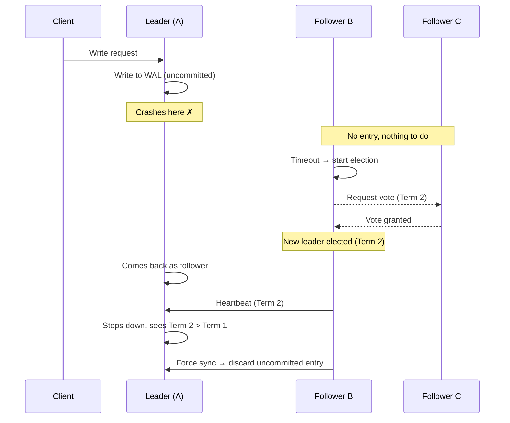
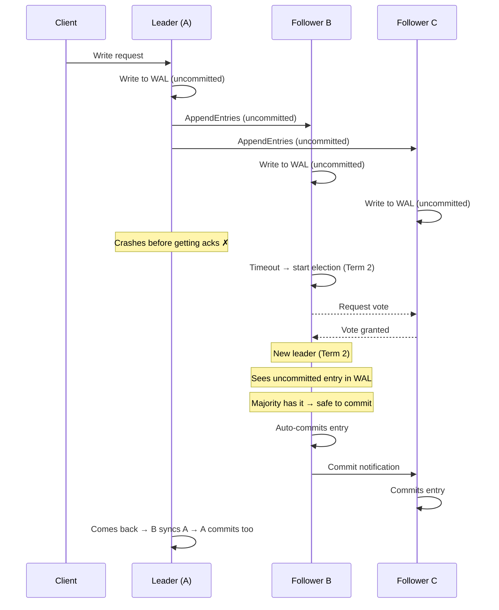

> [!info] The core idea
> Raft only tells the client "success" after a majority of nodes have the write. This single rule is what makes committed data safe across every failure scenario.

---

## How a write works in Raft

Every write goes through exactly these steps before the client gets a response:

```
Step 1 → Leader writes entry to its own WAL (uncommitted)
Step 2 → Leader sends entry to followers via AppendEntries RPC
          Followers write entry to their WAL (uncommitted)
Step 3 → Leader receives majority acks → marks entry committed in its WAL
Step 4 → Leader sends commit notification to followers → they commit too
Step 5 → Leader replies "success" to client
```

The client only hears "success" at Step 5 — after majority has the entry and the leader has committed. This is the guarantee everything else is built on.

---

## Case 1 — Leader crashes before replicating (between Step 1 and Step 2)

Leader wrote to its own WAL but crashed before sending to any follower. No follower has any trace of this entry.



**Result:** Entry discarded. Client got no response, so it will retry. Idempotency handles the duplicate retry.

---

## Case 2 — Leader crashes after replicating but before committing (between Step 2 and Step 3)

Leader sent the entry to followers. Followers wrote it to their WAL as uncommitted. Leader crashes before getting majority acks.



**Result:** Entry is saved. New leader sees the uncommitted entry on majority nodes and auto-commits it. The client retries (got no response) — idempotency handles the duplicate.

> [!important] Why can the new leader auto-commit?
> Because it was elected by majority — meaning majority already has this entry in their WAL. It's safe to commit because the data isn't going to disappear even if another node fails.

---

## Case 3 — Leader crashes after committing but before notifying followers (between Step 3 and Step 4)

Leader committed the entry in its own WAL. Was about to send the commit notification to followers — crashes right here. Followers still have the entry as uncommitted.

```mermaid
sequenceDiagram
    participant C as Client
    participant A as Leader (A)
    participant B as Follower B
    participant C2 as Follower C

    C->>A: Write request
    A->>A: Write to WAL (uncommitted)
    A->>B: AppendEntries
    A->>C2: AppendEntries
    B->>B: Write to WAL (uncommitted)
    C2->>C2: Write to WAL (uncommitted)
    B-->>A: ACK
    C2-->>A: ACK
    A->>A: Majority acks → commits entry
    Note over A: Crashes before sending commit to B and C ✗
    B->>B: Timeout → start election (Term 2)
    Note over B: New leader (Term 2)
    Note over B: Sees uncommitted entry in WAL
    Note over B: Same as Case 2 — auto-commits
    B->>C2: Commit notification
    A->>A: Comes back → B: "Term 2" → A steps down
    B->>A: Sync → A commits entry
```



**Result:** Identical outcome to Case 2. New leader auto-commits the pending entry. Old leader steps down on return.

---

## The pattern across all three cases

| When leader crashes | Followers have | Action |
|---|---|---|
| Before replicating | Nothing | Entry discarded by new leader |
| After replicating, before commit | Uncommitted entry | New leader auto-commits (majority has it) |
| After committing, before notifying | Uncommitted entry | New leader auto-commits (same as above) |

> [!important] Committed data is never lost
> "Committed" in Raft means majority acknowledged the entry. The new leader is always elected from majority. So committed data always survives — it's already sitting on the nodes that elect the new leader.

---

## What if a follower missed some entries?

Say Follower C was down during several writes and just came back. Its log is behind — it has entries up to index 4, but the leader is at index 6.

When C tries to append index 6, it first checks: "do I have index 5?" No — it rejects the request and tells the leader its last index.

The leader then sends entries 5 and 6 in order. C applies 5, then 6, and catches up.

```
Leader: [1, 2, 3, 4, 5, 6]
C:      [1, 2, 3, 4]

C rejects index 6 → "I only have up to index 4"
Leader → sends index 5 → C applies → sends index 6 → C applies
C:      [1, 2, 3, 4, 5, 6] ✓
```

Followers never skip entries. They always catch up sequentially.
