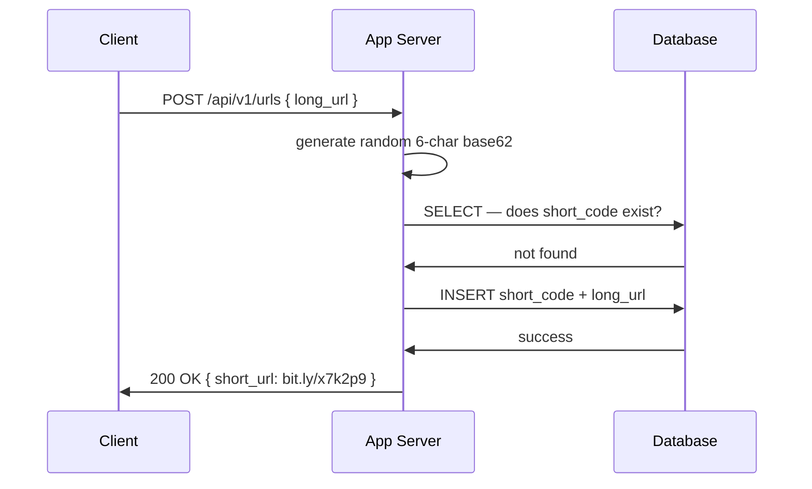
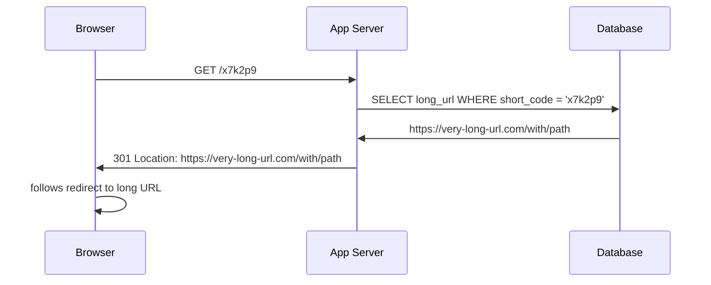
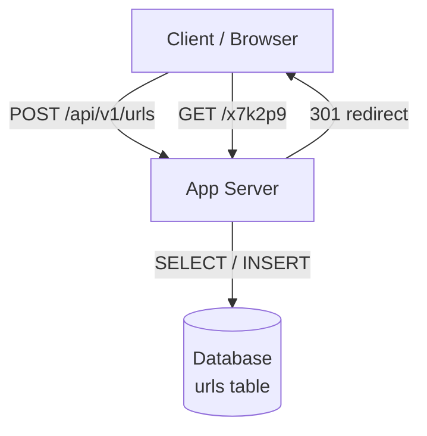

> [!info] The base architecture
> After working through every short code generation approach, we have what we need to build the simplest end-to-end system that actually works. No caching, no sharding, no fancy ID service — just the skeleton. Everything else is a deep dive.

---

## Short code generation decision

For base architecture: **random 6-character base62 string + DB collision check.**

- Random 6-char base62 covers 62^6 = ~56 billion combinations — enough for 10 years
- Unique index on short_code column makes collision check fast (O log n, not full scan)
- Simple to implement, works end to end
- Known weakness: collision rate grows as DB fills up — flagged as a deep dive improvement

---

## The database schema

One table. Everything lives here.

```
urls
-------------------------------
id          BIGINT PRIMARY KEY    ← internal row ID, never exposed
short_code  VARCHAR(6) UNIQUE     ← indexed, the thing users see
long_url    TEXT                  ← what we redirect to
created_at  TIMESTAMP             ← when it was created
```

`short_code` has a unique index. This is what makes collision checks fast and what enforces the uniqueness guarantee at the storage layer.

---

## Creation flow — end to end

```
1. Client sends:
   POST /api/v1/urls
   { "long_url": "https://very-long-url.com/with/path" }

2. App server generates a random 6-char base62 string
   e.g. → x7k2p9

3. App server queries DB:
   SELECT 1 FROM urls WHERE short_code = 'x7k2p9'

4a. Not found → INSERT INTO urls (short_code, long_url, created_at)
                VALUES ('x7k2p9', 'https://...', NOW())
    Return 200: { "data": { "short_url": "bit.ly/x7k2p9" } }

4b. Found (collision) → go back to step 2, generate new code, retry
```



---

## Redirect flow — end to end

```
1. User clicks bit.ly/x7k2p9
   Browser sends: GET /x7k2p9

2. App server extracts short code from path: x7k2p9

3. App server queries DB:
   SELECT long_url FROM urls WHERE short_code = 'x7k2p9'

4a. Found → respond with:
    HTTP 301
    Location: https://very-long-url.com/with/path

4b. Not found → respond with HTTP 404
```



The browser never asks the app server for the destination explicitly. It hits the short URL, gets a 301, and follows the `Location` header directly. The app server is out of the loop after that first request.

---

## Full system diagram



One app server. One database. That's it.

---

## Known limitations — flagged for deep dives

| Limitation | Why it matters | Deep dive fix |
|---|---|---|
| No caching | Every redirect hits DB — 100k reads/sec is too much for one DB | Add Redis cache in front of DB |
| Single DB | 250TB over 10 years cannot fit on one machine | DB sharding |
| Collision retries | Increase as DB fills up | Pre-generated key database |
| No fault isolation | Creation and redirect share the same app server and DB | Separate services |
| Peak traffic | Average 100k/sec, peak 1M+/sec — DB will fall over | Caching + load balancing |

The base architecture is intentionally simple. Every limitation above is a known trade-off, not a mistake. You name them — and that tells the interviewer exactly where the deep dives are going.

---

> [!tip] Interview framing
> "For the base architecture: one app server, one DB with a urls table. Creation flow — generate a random 6-char base62 string, check for collision via unique index, insert. Redirect flow — look up the short code, return a 301. The DB will not scale to 250TB on one machine and 100k reads/sec will need a cache — those are the first two deep dives."
