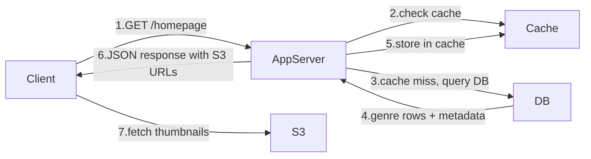

# Base Architecture — Browse & Homepage

When a user opens Netflix, they need to see a homepage with genre rows — Trending, Action, Comedy — each showing around 10 titles with thumbnails. This is a pure read-heavy flow. The data changes rarely — a new title gets added maybe a few times a week. This makes it a perfect candidate for caching.

```
Client → App Server → Cache → DB
```

The app server checks the cache first. If the genre rows and thumbnail metadata are there, it returns immediately. On a cache miss it goes to the DB, fetches the data, stores it in cache, and returns.

The actual thumbnail images are static assets stored in S3. In the naive flow the client fetches them directly from S3 using the URL returned in the JSON response.



> [!info] What the DB stores
> Movie ID, title, description, cast, genre, S3 thumbnail URL — roughly 1 KB per title. No video bytes anywhere near the DB.

