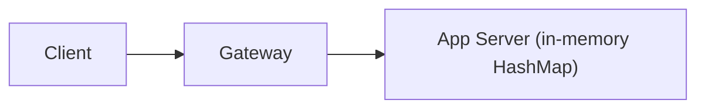
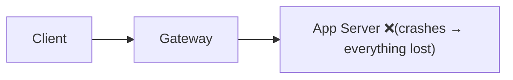
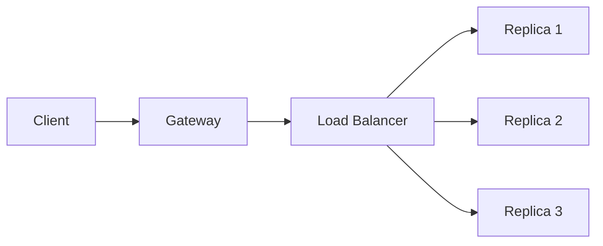
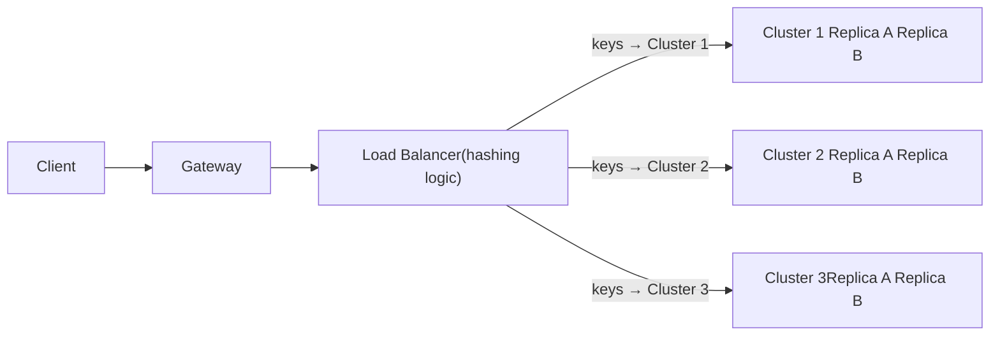
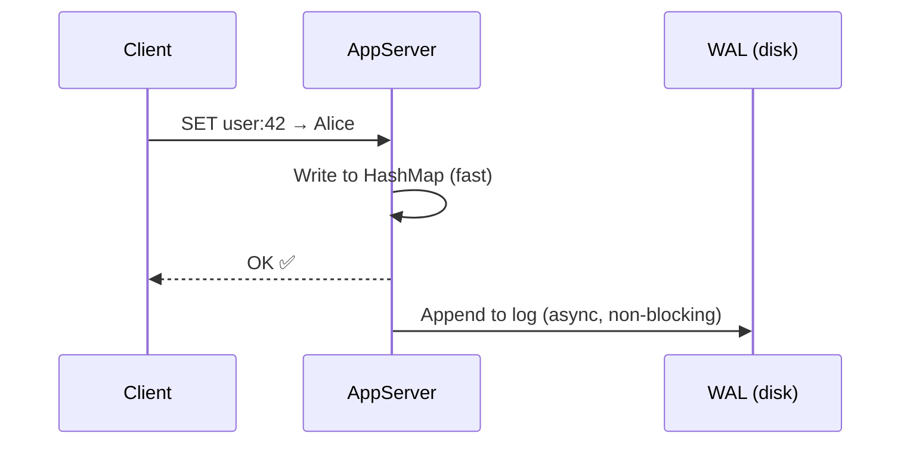
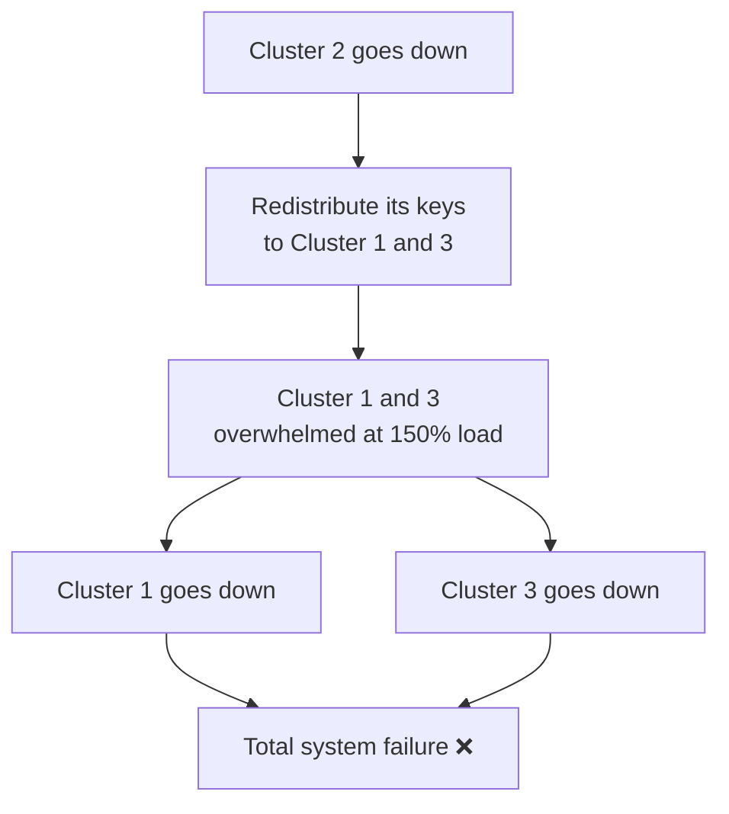

# Key-Value Store — Base Design

> This file builds the architecture from scratch — starting from a single machine and evolving it step by step until we hit the problems that require Consistent Hashing.

---

## Step 1 — The Simplest Possible Design

The core of the store is just an **in-memory HashMap**.

- Key → memory address lookup
- Value → whatever bytes are stored at that address



### The Gateway

The Gateway is the entry point. It handles:
- Authentication — is this caller allowed to use the store?
- Request routing — forward to the right App Server
- Rate limiting — prevent one caller from flooding the system

### The App Server

The App Server holds the HashMap and handles GET / SET / DEL. It also handles **serialization and deserialization** — converting values between the caller's type and raw bytes.

> [!info] Why serialization?
> The store stores everything as bytes internally. If a caller sends a JSON object or a list, the App Server must convert it to bytes before storing, and convert it back when returning.
>
> Two options:
> - **Client-side serialization** — caller converts to bytes before sending, converts back after receiving. Store is completely type-agnostic.
> - **Pre-made type support** — store provides built-in serializers for common types (String, Integer, List, Hash). Caller picks one. This is what Redis does.

---

## Step 2 — Problem: Single Point of Failure

One App Server means one machine holds everything. If it goes down, **the entire store is unavailable**.



**Fix: Horizontal scaling — add replicas.**

Run multiple App Servers, each holding an identical copy of the data. We call one set of identical replicas a **cluster**.



Now if one replica goes down, the other two still serve requests. 

### Keeping Replicas in Sync — R+W>N

When a write comes in, it can't update all replicas instantly. We use the R+W>N rule (from [[03-Optimization-Choices]]) to control consistency:

- We are **optimising for reads** → keep R as low as possible (R=1)
- Writes confirm on W replicas, syncs to the rest in the background

> [!info] What is a cluster?
> From this point on: one **cluster** = one set of replicas that all hold the same data.
> Multiple clusters = partitioned data, each cluster owns a different slice of the keyspace.

---

## Step 3 — Problem: Data Doesn't Fit on One Cluster

Even with replicas, each replica still needs to hold the **full dataset**. And we established in the NFRs that the data is **0.5TB–3TB** — which doesn't fit in one machine's RAM.

So replicas alone don't solve the storage problem. We need to **split the data across multiple clusters**, where each cluster owns a different portion of the keys.

This is called **partitioning** (or sharding).



![[System Design/SDE2/12-Case-Studies/05-Key-Value-Store/Images/01-Base-Architecture.png]]

The Load Balancer applies a **hash function** to the key and uses the result to decide which cluster owns it:

```
hash("user:42") = 7392   →   7392 % 3 = 0   →   send to Cluster 1
hash("user:99") = 9841   →   9841 % 3 = 1   →   send to Cluster 2
```

This is called **modulo hashing** — divide the hash by the number of clusters, the remainder picks the cluster.

---

## Step 4 — Problems With This Architecture

### Problem 1 — What If a Cluster Goes Down?

If Cluster 2 goes down, all keys that hash to Cluster 2 are **completely unreachable**. The data is gone (we're in-memory, no disk).

Two possible responses:

| Response | What it means |
|---|---|
| **Accept data loss** | We decided not to guarantee consistency — so we also don't guarantee durability. Data for Cluster 2 is gone. Acceptable for pure caching. |
| **Require eventual consistency** | Interviewer pushes back — "we need the data to survive a cluster failure." → Need a persistence mechanism. |

---

### Problem 2 — WAL Doesn't Save Us From Cascading Failure

If the interviewer requires durability, we can add a **WAL (Write-Ahead Log)** to each App Server.

> [!info] What is a WAL?
> An append-only file on disk. Every time a key-value pair is written, we append it to this file **asynchronously** (without waiting, so it doesn't slow down the write path).
> If a server restarts or a cluster goes down, we can replay the WAL to recover the data.



So far so good. But now Cluster 2 goes down. We have its WAL. Where do we replay it?

**We redistribute Cluster 2's data to Cluster 1 and Cluster 3.**

```
Cluster 1: was handling 33% of keys  →  now handling 50%  (+17%)
Cluster 3: was handling 33% of keys  →  now handling 50%  (+17%)
```

Cluster 1 and Cluster 3 were already running at **peak load**. Adding 17% more traffic to each overwhelms them. They start failing too. Their failure triggers another redistribution, which overwhelms whatever's left.

**This is a cascading failure** — one cluster going down takes down the whole system.



### Why Does This Happen? — The Root Cause

The root cause is **modulo hashing**. When we use `hash(key) % N` to assign keys to clusters:
- With 3 clusters: `hash(key) % 3`
- When one cluster dies, N becomes 2: `hash(key) % 2`
- Almost every key now maps to a different cluster than before
- **Nearly all keys need to be moved** — a massive redistribution hits surviving clusters all at once

```
key "user:42"  →  hash = 7392
  3 clusters:  7392 % 3 = 0  →  Cluster 1
  2 clusters:  7392 % 2 = 0  →  Cluster 1  (same — lucky)

key "user:99"  →  hash = 9841
  3 clusters:  9841 % 3 = 1  →  Cluster 2
  2 clusters:  9841 % 2 = 1  →  Cluster 2  (gone — data lost)

key "session:abc"  →  hash = 5510
  3 clusters:  5510 % 3 = 2  →  Cluster 3
  2 clusters:  5510 % 2 = 0  →  Cluster 1  (remapped — must move data)
```

When N changes, most keys remap. That's the problem.

---

## What We Need

A smarter routing strategy where:
- When a cluster is added or removed, **only a small fraction of keys need to move**
- The surviving clusters absorb only their fair share — not everything at once

That strategy is **Consistent Hashing** → [[05-Consistent-Hashing]]
