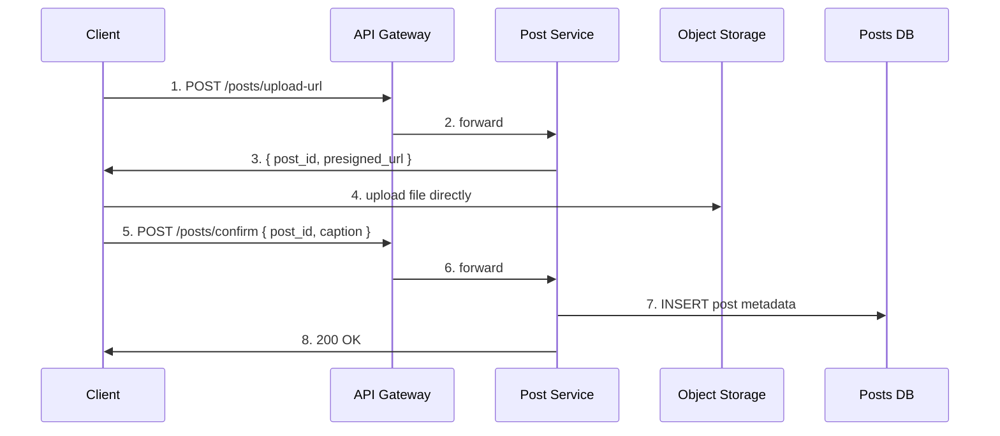
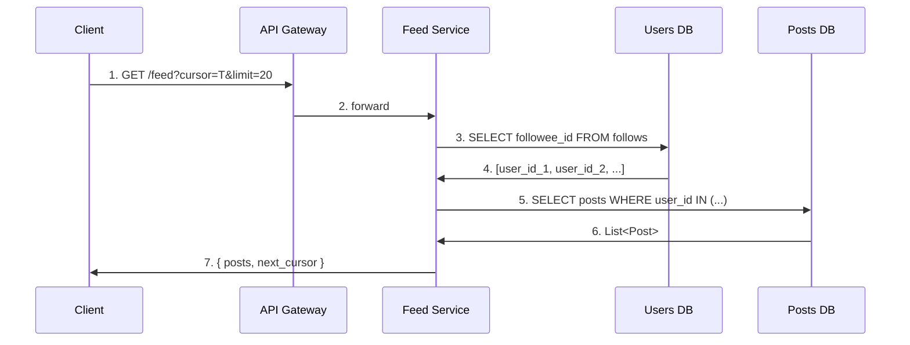
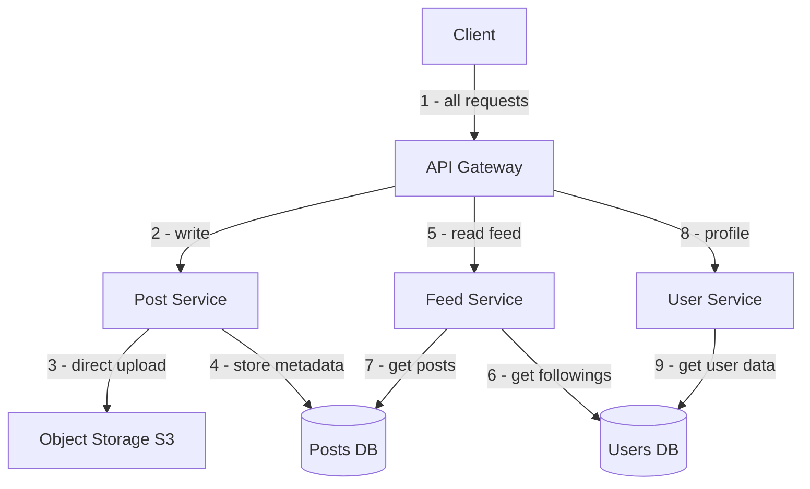

# Instagram Base Architecture

The base architecture is the simplest system that works end to end — no optimisations, no caching, no pre-computation. Just the raw flows that prove the system can function. Every deep dive decision later is a fix for something that breaks here at scale.

---

## Components

- **Client** — mobile or web app
- **API Gateway** — single entry point, handles auth, routes requests to services
- **Post Service** — handles post creation and confirmation
- **Feed Service** — assembles and returns the home feed
- **User Service** — handles profile reads, follow relationships
- **Posts DB** — stores post metadata (post ID, user ID, S3 URL, caption, timestamp)
- **Users DB** — stores user profiles (`users` table) and follow relationships (`follows` table) in the same database
- **Object Storage (S3)** — stores the actual media files (photos, videos)

---

## Write Path — Uploading a Post

The client never sends a 50MB file through the application server. Instead it gets a presigned URL and uploads directly to S3.

```
1. Client → API Gateway → Post Service
   POST /api/v1/posts/upload-url
   Post Service returns: { post_id, presigned_url }

2. Client → S3 (direct upload, no app server in the middle)

3. Client → API Gateway → Post Service
   POST /api/v1/posts/confirm { post_id, caption }
   Post Service writes metadata to Posts DB:
   { post_id, user_id, s3_url, caption, created_at }
```



---

## Read Path — Loading the Home Feed

When a user opens Instagram, the Feed Service needs to find all posts from people the user follows, ordered by recency.

```
1. Client → API Gateway → Feed Service
   GET /api/v1/feed?cursor={timestamp}&limit=20

2. Feed Service → Users DB
   SELECT followee_id FROM follows WHERE follower_id = {user_id}
   → returns list of followings (e.g. 500 user IDs)

3. Feed Service → Posts DB
   SELECT * FROM posts
   WHERE user_id IN (followee_ids)
   AND created_at < cursor
   ORDER BY created_at DESC
   LIMIT 20

4. Feed Service → Client
   returns List<Post>
```



---

## Full System Diagram



---

## What Works

This system is correct. A new user can sign up, upload a post, and another user can load their feed and see it. Every functional requirement is satisfied with these components.

