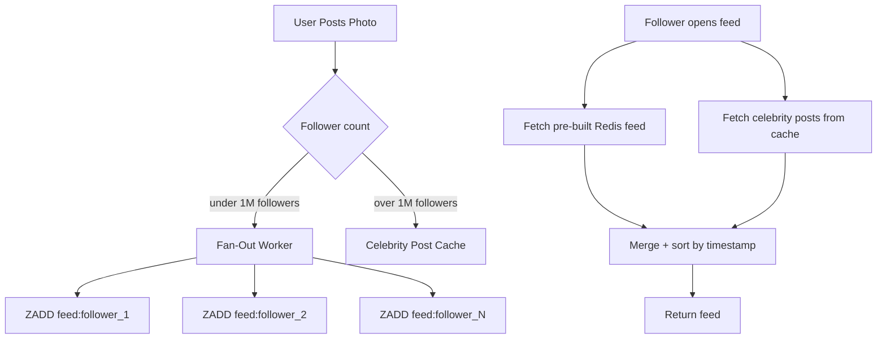

# Instagram Feed Generation — The Celebrity Problem

Fan-out on write works beautifully for normal users. Someone with 500 followers posts a photo — the worker picks up the message, loops through 500 Redis writes, done in under a second. Followers open their feed and the post is there.

But Instagram isn't just normal users. It's Kylie Jenner with 400 million followers.

---

## The math that breaks everything

The fan-out worker is doing one Redis write per follower. A Redis write takes roughly 1ms. Run the numbers:

```
400,000,000 followers × 1ms = 400,000,000ms
                             = 400,000 seconds
                             = 4.6 days
```

Kylie's followers won't see her post in their feed for **4.6 days**. That's not a performance degradation — that's a complete product failure.

---

## The starvation problem

The 4.6 days is bad enough on its own. But there's a second failure hiding behind it.

The fan-out worker is a pool of processes pulling messages off SQS. While every process in that pool is grinding through Kylie's 400 million Redis writes, every other post in the queue is stuck waiting. A normal user with 300 followers posts a photo — their fan-out would take milliseconds. But their message sits behind Kylie's, invisible to all workers, going nowhere.

One celebrity post with 400 million followers starves the entire platform. Every other user's feed update is delayed not because of anything wrong with their post — but because one account consumed every available worker for days.

---

## The fix — hybrid fan-out

The solution is to stop treating all accounts the same. Pick the right strategy per user type:

- **Normal users** (under ~1 million followers) → fan-out on write, exactly as designed. Worker fans out at post time, Redis feeds are pre-built.
- **Celebrities** (over ~1 million followers) → skip the fan-out entirely at post time. Store their posts separately. Fetch at read time.

When a follower opens their feed, the system does two things in parallel:

```
1. Fetch pre-built Redis feed        (posts from normal users you follow)
2. Fetch latest celebrity posts      (direct lookup from celebrity post cache)
3. Merge + sort by timestamp
4. Return
```

This is **hybrid fan-out** — write-time for normal users, read-time for celebrities.



---

## Why this doesn't break reads

Earlier we showed that pure fan-out on read collapses at 1M reads/sec — fetching posts from 500 followees at read time means 500M DB queries/sec, requiring 10,000 DB nodes.

But celebrities are a fundamentally different case:

- There are only a few thousand true celebrity accounts globally
- Celebrities post rarely — twice a week, not continuously
- Their latest posts fit in a tiny Redis key — Kylie's last 50 posts is kilobytes of data
- That key can be cached aggressively and shared across all 400M followers

So the read-time merge is cheap:

```
1 Redis lookup  (your pre-built feed)
+ ~10 Redis lookups  (latest posts from ~10 celebrities you follow)
+ 1 in-memory merge
= done
```

No DB hits. No 500M queries/sec. Just a few extra Redis lookups that are already warm in cache.

---

## The threshold

The cutoff — typically around 1 million followers — is the point where fan-out on write becomes too slow to be acceptable. Below it, fan-out on write completes in under a second. Above it, the fan-out starts taking minutes, then hours, then days.

The exact number is tunable and Instagram likely adjusts it dynamically based on system load. But the principle is fixed: once an account's follower count makes write-time fan-out unacceptably slow, switch it to read-time.

---

> [!important] The core insight
> Fan-out on write and fan-out on read are not competing strategies — they're complementary tools. The right system uses both, routing each account to whichever strategy its follower count makes practical.

> [!tip] Interview framing
> "Fan-out on write breaks for celebrities because 400M Redis writes takes 4.6 days. But switching them to pure fan-out on read would hit reads at 1M/sec — that's too expensive. The answer is hybrid: fan-out on write for normal users, fan-out on read for celebrities. Celebrity posts are cached separately and merged at read time. The merge is cheap because there are very few celebrities and their posts fit in a small Redis key."
