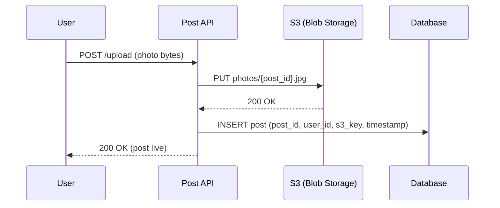

# Instagram Media Storage — Blob Storage

Instagram is a photo and video app. At 100 million uploads per day, the storage destination matters — get it wrong and the system either collapses under write load or becomes impossibly expensive to operate.

---

## Why not a database?

The instinct for many systems is to throw everything into a database. But databases are built for structured rows — small, typed fields like user IDs, timestamps, and strings. A 2MB photo or a 50MB video is raw binary data, and databases handle that badly.

Storing large binary objects in a database causes three problems:

- **Bloat** — the database grows enormous, making backups, replication, and migrations painful
- **Performance** — large blob reads compete with normal query traffic, slowing everything down
- **Cost** — databases are expensive per GB compared to object storage built specifically for this

The right tool is **object storage** — S3 (or equivalent). It's designed for exactly this: store arbitrarily large binary objects, retrieve them by key, scale to exabytes.

---

## Upload flow

When a user uploads a photo, the flow is straightforward:



The `post_id` is the key. The database stores metadata — who posted, when, what the S3 key is. The actual bytes live in S3. The two are linked by `post_id`.

From estimation:
```
100M posts/day × (80% images × 2MB + 20% videos × 50MB)
= 80M × 2MB + 20M × 50MB
= 160 TB + 1,000 TB
= ~1.2 PB/day written to S3
```

Over 5 years with replication, that's roughly **5 EB** of blob storage capacity needed.
