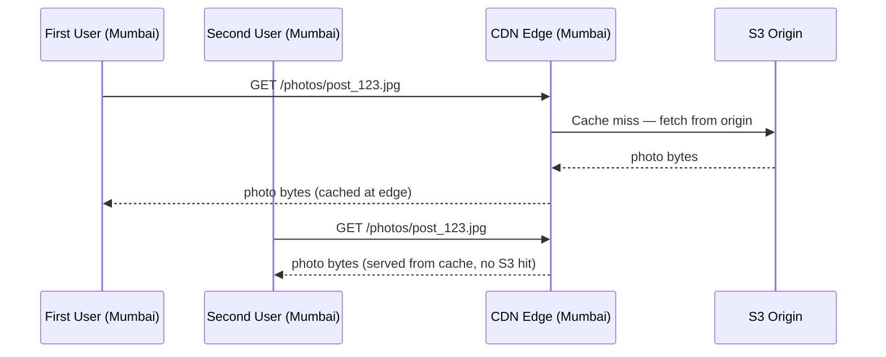

# Instagram Media Storage — CDN

Storing media in S3 solves the write problem. Serving it back to 500 million daily users is a completely different problem.

---

## The bandwidth crisis

From the estimation, Instagram handles 1 million feed reads per second. Each feed load shows 5 posts, each post averaging 12MB (mix of images and videos):

```
1M reads/sec × 5 posts × 12MB = 60 TB/sec of read bandwidth
```

A standard server NIC handles 10 Gbps. To serve 60 TB/sec directly from S3 origin:

```
60 TB/sec = 60,000 GB/sec = 480,000 Gbps
480,000 Gbps ÷ 10 Gbps per server = 48,000 servers
```

48,000 origin servers just to serve media. That's not a real answer.

The fix is to stop serving every request from origin. Most photos and videos are static — they don't change after upload. Static content is exactly what **CDNs** are built for.

---

## How CDN solves it

A CDN is a global network of edge servers sitting close to users. When a user requests a photo, they hit the nearest edge node — not S3. If the edge has the photo cached, it serves it immediately with no origin hit. If not, it fetches from S3, caches it, and serves it.



The first request pays the S3 fetch cost. Every subsequent request in that region is free. For Kylie's photo with 400 million followers, the Mumbai edge node fetches it once and serves it to millions of Indian followers with no further S3 traffic.

---

## Why presigned URLs break CDN caching

The natural instinct for serving S3 content is presigned URLs — time-limited, user-specific URLs that grant temporary access. They look like this:

```
https://s3.amazonaws.com/photos/post_123.jpg
  ?X-Amz-Signature=abc123
  &X-Amz-Expires=3600
  &X-Amz-Credential=user456
```

The problem: every user gets a different URL for the same photo. CDNs cache by URL. Different URL = different cache entry = cache miss every time.

```
User A gets: /photos/post_123.jpg?signature=abc&credential=user_A
User B gets: /photos/post_123.jpg?signature=xyz&credential=user_B
```

The CDN sees two different resources. It fetches from S3 twice. The cache is useless.

The fix is simple — use plain, public CDN URLs:

```
https://cdn.instagram.com/photos/{post_id}.jpg
```

Same URL for every user requesting the same photo. CDN caches it once, serves it to everyone.
