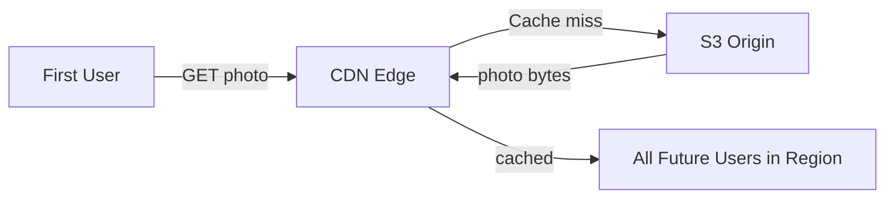
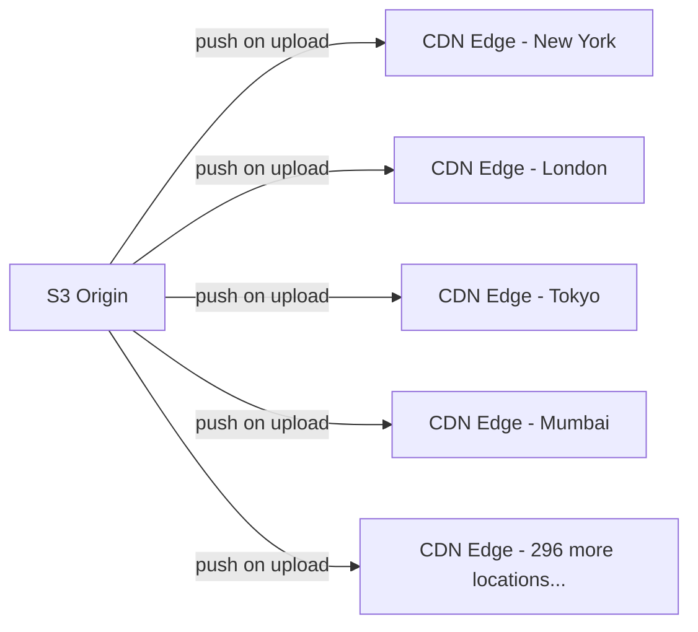

# Instagram Media Storage — Pull vs Push CDN

A CDN can work in two modes: pull or push. They look similar from the outside but have completely different cost and efficiency profiles at scale.

---

## Pull CDN

In pull mode, the CDN edge node has nothing until someone asks for it. The first request for a photo triggers a fetch from S3 origin — the edge pulls it, caches it, and serves it. Every subsequent request in that region is served from cache with no origin hit.



The cache fills itself organically — only content that gets requested gets cached, and only at the edge nodes where users actually are.

---

## Push CDN

In push mode, content is proactively pushed to edge nodes at upload time — before any user requests it. The moment Kylie posts a photo, it gets distributed to every edge location globally.



---

## Why push fails for Instagram

Push sounds appealing for a celebrity like Kylie — she posts, her photo gets pre-loaded everywhere, zero latency for the first request. But run the numbers.

Cloudflare alone has 300+ edge locations. Instagram has millions of posts per day, many from accounts with large followings. Pushing every post to every edge:

```
1,000 posts/sec × 300 edge locations × 2MB average = 600 GB/sec pushed proactively
```

And the waste is enormous. Kylie's followers are concentrated — most are in the US, Brazil, and a handful of other countries. Pushing her photo to edge nodes in rural Kazakhstan means paying S3 transfer costs and edge storage for content that will never be requested from there.

Push makes sense when you know content will be requested everywhere immediately — a Netflix movie release, a live sports event, a product launch. For user-generated content, you cannot predict which edge nodes will see traffic. Pushing to all of them wastes bandwidth and storage on content that mostly goes unrequested.

---

## Pull wins for UGC

Pull CDN is the right choice for Instagram because demand is self-selecting. The cache fills exactly where the audience is. Mumbai users request Kylie's photo → Mumbai edge caches it. The São Paulo edge never gets a request → never pays for the fetch.

The first user in each region pays a small latency penalty for the cache miss. Every subsequent user in that region gets it instantly from the edge. For a photo with 400 million followers, the cache miss happens once per region — after that, the CDN serves it freely.

> [!tip] Interview framing
> Pull CDN for user-generated content — you can't predict demand distribution, so let the cache fill where requests actually come from. Push CDN only makes sense for known high-demand content where you want zero first-request latency everywhere simultaneously (live events, movie releases).
