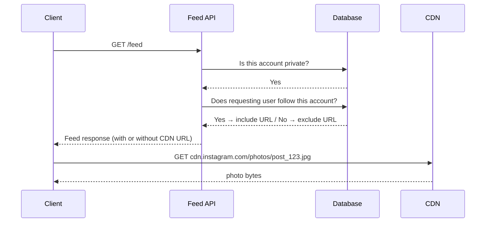

# Instagram Media Storage — Access Control

Plain CDN URLs solve the caching problem — same URL for every user, CDN caches once, serves to all. But removing presigned URLs removes access control. Anyone with the URL can fetch the photo directly.

---

## Public profiles — no problem

For public profiles, that's completely fine. If Kylie's profile is public, anyone should be able to see her photos — followers, non-followers, logged-out users, anyone. The plain CDN URL is the right answer. No access control needed.

This covers the vast majority of Instagram content. Most accounts are public.

---

## Private profiles — the access check

For private accounts, only approved followers should see the photos. The access check happens at the **API layer**, before the URL is ever handed to the client:



If the user doesn't follow the private account, the URL is never included in the feed response. The client never knows the photo exists. No URL means no request to the CDN.

---

## The revocation problem

This works cleanly at feed load time. But the API check only runs when the feed is loaded — it doesn't invalidate URLs that were already issued. A user who was a follower yesterday, got the CDN URL in their feed, and then got removed as a follower today still has that URL cached on their device. The CDN has no idea they were unfollowed — it serves the photo to anyone who presents the URL.

The fix is **TTL** — short expiry on CDN URLs for private content. After the TTL expires (say, 24 hours), the client must request a fresh URL from the API. The API re-checks follow status at that point and either grants or denies the new URL.

```
User unfollowed at 2pm
Their cached URL expires at midnight (24hr TTL)
Next feed load → API checks → no longer a follower → URL not returned
```

The window of exposure is bounded by the TTL. A removed follower can access the photo for at most 24 hours after being unfollowed — a reasonable trade-off between security and performance.

---

> [!important] Public vs private routing
> Public profiles → plain CDN URLs, no access control, maximum cache efficiency.
> Private profiles → API checks follow status before returning URL, short TTL to handle revocation.

> [!tip] Interview framing
> The key insight is that access control for media lives at the API layer, not the CDN layer. The CDN is a dumb cache — it serves whatever URL is requested. Instagram controls access by controlling who receives the URL in the first place. TTL handles the edge case where access is revoked after the URL was already issued.
