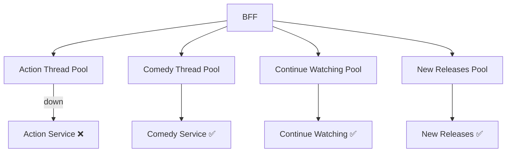
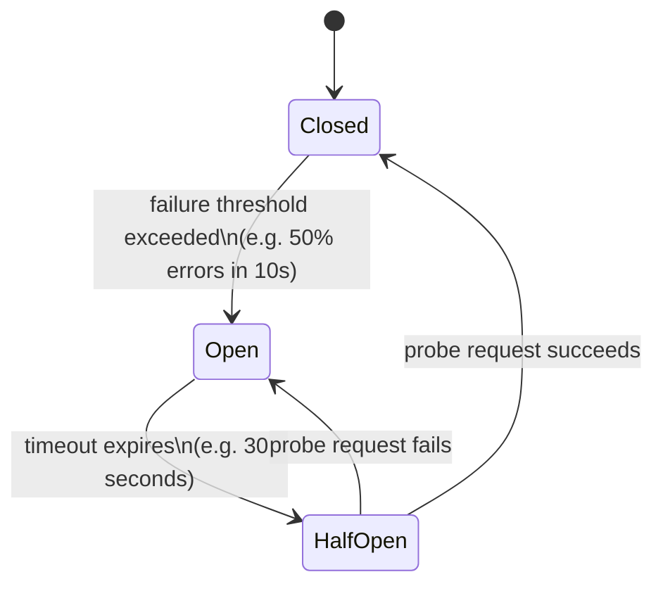
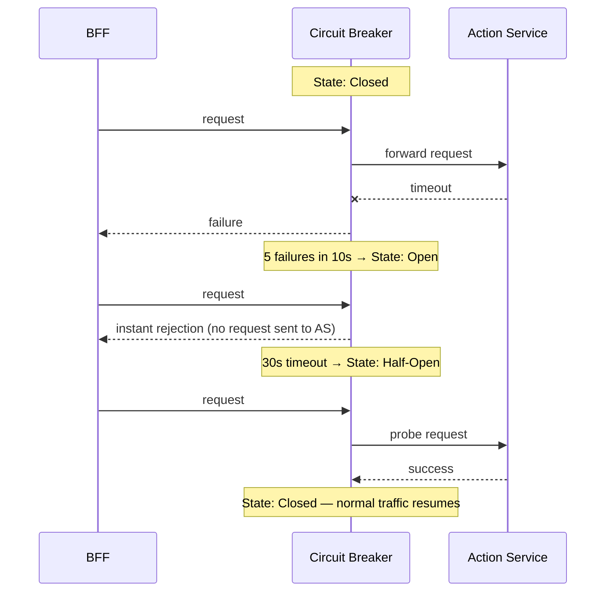
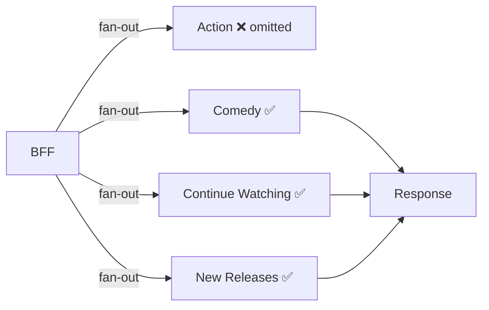

# Fault Isolation — Genre Service Failure

## The Scenario

It is 9pm. Squid Game Season 3 just dropped. Your Action genre service crashes — the pod is down, not responding. Every request the BFF sends to it times out after 30 seconds.

Without any protection, those 30-second timeouts stack up. BFF threads sit waiting for a response that never comes. Thread pool fills up. New requests cannot be processed. The Action service being down has now taken down the entire home feed for every user — not just the Action row.

This is a **cascade failure**. One service dying kills everything upstream of it.

---

## Bulkhead Pattern — Contain the Blast

The first line of defence is the **bulkhead pattern** — isolate each genre service into its own thread pool inside the BFF. The Action service gets its own pool of threads. Comedy gets its own. Continue Watching gets its own.

When the Action service goes down and its thread pool fills up with waiting requests, only those threads are affected. Comedy, Continue Watching, and New Releases are on separate pools — they continue processing normally. The failure is contained to one bulkhead.

---

## Circuit Breaker — Stop Hitting a Dead Service

Bulkheads contain the damage. But the BFF is still sending requests to the Action service, waiting 30 seconds each time, and getting nothing back. This wastes threads and adds latency to every home feed response.

The circuit breaker detects repeated failures and stops sending requests to a dead service entirely.

**Closed** — everything working. All requests go through normally.

**Open** — too many failures detected. The circuit breaker blocks all requests immediately without even attempting to contact the service. No waiting, no timeouts — instant rejection. The Action service gets zero traffic while it recovers.

**Half-Open** — after a timeout (say 30 seconds), the circuit allows one probe request through. If it succeeds, the service has recovered — circuit moves back to Closed and normal traffic resumes. If it fails, the service is still down — circuit moves back to Open and waits another 30 seconds before trying again.

---

## Graceful Degradation — What the User Sees

When the Action service is down and the circuit is Open, the BFF does not return an error to the client. It silently omits the Action row and returns everything else.

The user sees 19 rows instead of 20. No error message. No broken row. No spinner. The home feed loads normally — just without the Action row until the service recovers.

This is **graceful degradation** — the system degrades partially rather than failing completely. A partial home feed is far better than a blank screen.

> [!important] Failure isolation moved server-side
> In Option A of the API design, failure isolation lived on the client — the client made 20 parallel calls and skipped rendering any row that failed. In the BFF approach, the same isolation exists but lives inside the BFF. The client is completely insulated. It makes one call, gets one clean response, and never knows a service was down.

> [!danger] Never let one service timeout kill the whole response
> A 30-second timeout on one genre service, multiplied across 20 genre services, means a home feed that takes 10 minutes to load in the worst case. Circuit breakers and bulkheads exist to prevent this. Without them, a single slow downstream service can make the entire home feed unusable.
