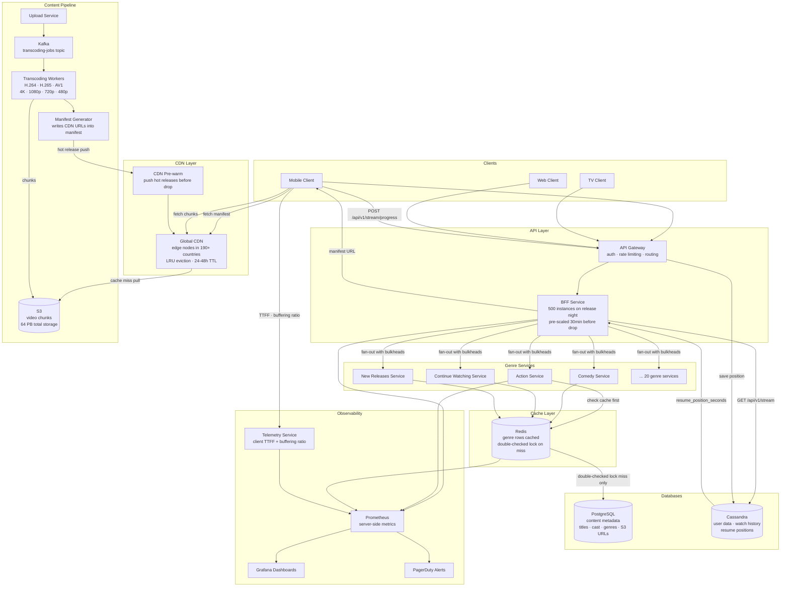
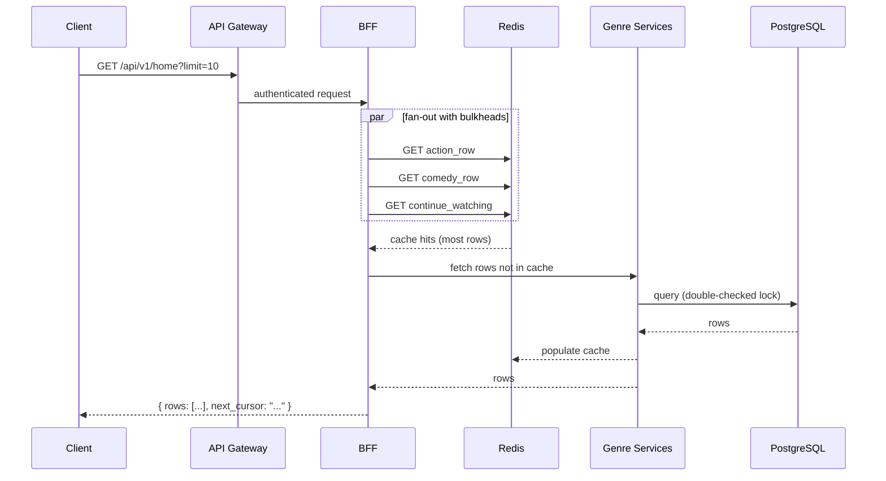
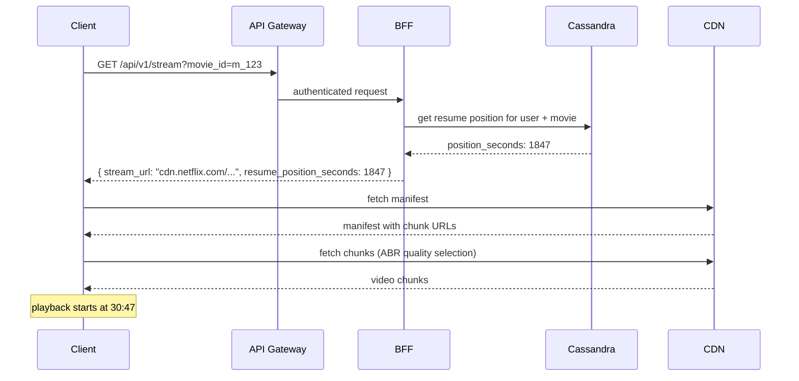
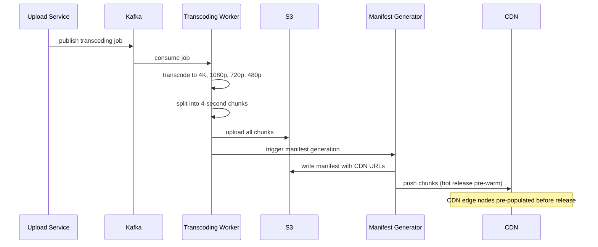

# Final Design — Netflix

> [!info] Final Netflix architecture — all deep dive decisions reflected.
> Every component here was justified through an interview session. Nothing is added speculatively.

---

## What Changed from Base Architecture

The base architecture had a single app server returning a manifest URL, with the client fetching chunks directly from S3. That breaks at scale in three ways: S3 cannot serve 500 Tbps of global traffic, a single server is a SPOF, and there is no failure isolation between services.

Every deep dive added one layer of the final design:

| Deep Dive | What it added |
|---|---|
| Transcoding | Kafka-driven pipeline, S3 chunk storage at multiple resolutions |
| Manifest + HLS | Manifest file with CDN URLs, client-side ABR quality switching |
| Caching | CDN edge layer, push for hot releases, pull + LRU/TTL for catalogue |
| DB | PostgreSQL for content metadata, Cassandra for user data and watch history |
| Peak Traffic | BFF pre-scaling, Redis genre cache, double-checked locking on cache miss |
| Fault Isolation | Circuit breakers + bulkheads on BFF fan-out, load shedding on Redis failure, adaptive bitrate as CDN cascade prevention |

---

## Full Architecture Diagram

---

## Request Flows

### Home Feed

### Stream Start

### Content Ingestion

---

## Component Summary

| Component | Technology | Purpose |
|---|---|---|
| API Gateway | Kong / AWS API GW | Auth, rate limiting, routing |
| BFF | Node.js / Java | Fan-out to genre services, failure isolation |
| Genre Services | Java microservices | Per-genre row fetching |
| Redis | Redis Cluster | Genre row cache, double-checked locking |
| Content DB | PostgreSQL | Titles, metadata, S3 URLs |
| User DB | Cassandra | Watch history, resume positions, user profiles |
| Object Storage | S3 | 64 PB video chunks |
| CDN | Netflix Open Connect | Global edge, push + pull hybrid, LRU + TTL |
| Transcoding | Kafka + Worker Pool | Parallel encoding to all resolutions and codecs |
| Telemetry | Custom ingest service | Client-side TTFF and buffering ratio |
| Observability | Prometheus + Grafana + PagerDuty | SLI measurement, alerting, dashboards |

---

## Key Design Decisions and Their Justifications

**BFF over client-driven fan-out** — 20+ parallel calls from a mobile client on 3G is brutal. BFF absorbs all fan-out server-side, client makes one call. Bulkheads inside BFF provide the same failure isolation.

**Cursor pagination over offset** — Netflix adds content constantly. Offset pagination produces duplicates and gaps under concurrent writes. Cursor is stable regardless of what is added or removed.

**Push + pull hybrid CDN** — pure pull causes cache stampede on hot releases (all CDN nodes cold at 9pm). Pure push wastes 76 TB per CDN server on unpopular content. Hybrid: push for top releases, pull for long tail.

**Double-checked locking on cache miss** — single-check locking allows N waiting requests to all hit DB one by one after the lock is released. Double-check means only the first request ever reaches the DB.

**Adaptive bitrate as load shedding** — when a CDN node fails and users failover to a neighbouring node, that node's bandwidth is 3× its capacity. Dropping all clients to lower quality reduces bandwidth by 5× and prevents cascade failure.

**Cassandra for user data** — watch history and resume positions are write-heavy (every 10 seconds per active viewer) and keyed by user. Cassandra's LSM tree is optimised for write throughput. PostgreSQL would struggle under 20M concurrent streams writing position updates every 10 seconds.
